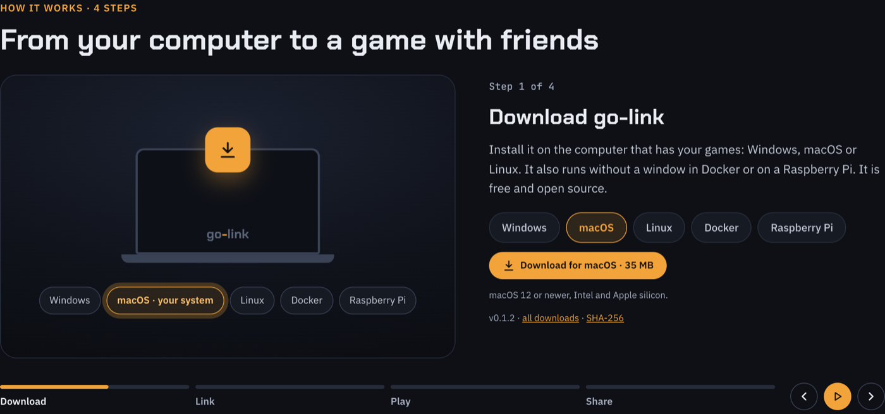
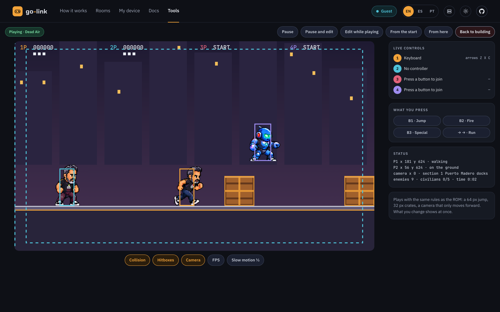

<div align="center">

# go-link

**Play classic arcade games online with your friends, straight from the browser.**

Your computer becomes the arcade: it runs the games and streams them live. Friends join with a link and a PIN, with no install and no ROMs.

[](https://github.com/lordbasex/go-link/actions/workflows/ci.yml)
[](https://github.com/lordbasex/go-link/releases)
[](LICENSE)
[](https://github.com/lordbasex/go-link/pkgs/container/go-link-device)
[](https://github.com/lordbasex/go-link/stargazers)

[**Website**](https://go-link.org) · [**Download**](https://github.com/lordbasex/go-link/releases/latest) · [**User guide**](https://go-link.org/docs) · [**How it works**](https://go-link.org/#how) · [**Contribute**](CONTRIBUTING.md)



</div>

## Why go-link

> *"Come on, the next token's on me."*

go-link started with a simple wish: to get together with friends and play like we did in the arcades of the 80s and 90s. Sitting side by side at the machine, running tournaments, and joking with each other the whole game. Life spread us out, so go-link brings the arcade to us: one friend hosts, sends a link, and everyone is back at the same machine, talking and laughing while they play.

What makes it different:

- **Only the host needs the games.** With classic netplay every player needs the same ROM and emulator setup; with go-link friends only open a link.
- **Nothing to install for players.** A browser is enough, on a computer, a tablet or a phone (or the go-link Player app).
- **It feels like the arcade:** four seats, a queue for the next game, spectators, voice and chat between players.
- **No accounts and no middleman.** The games run on the host's own computer and never touch a server; you can even run your own signaling server.

A **host** runs the go-link app (the **device**) on their own computer, with **their own ROMs**. Friends join from a web browser **without needing the ROM**: they get the game's video and sound over WebRTC and send their controls back, peer to peer.

- Up to **4 players** per room, with voice between them. Everyone else waits **in the queue**, like at an arcade, and can watch and chat meanwhile.
- Based on MAME: the engine is [mame2003-plus](https://github.com/libretro/mame2003-plus-libretro) (MAME 0.78 sets) through libretro.
- Free and open source (MIT), self-hosted, no accounts, no ads.

## Install in a minute

| You have | Do this |
|---|---|
| **macOS 12+** | Download the [`.dmg`](https://github.com/lordbasex/go-link/releases/latest), or `brew tap lordbasex/go-link https://github.com/lordbasex/go-link && brew trust --cask lordbasex/go-link/go-link && brew install --cask go-link` |
| **Windows 10/11** | Download the [`.zip`](https://github.com/lordbasex/go-link/releases/latest), unzip, run `go-link-device.exe` |
| **Linux** | Download the [`.tar.gz`](https://github.com/lordbasex/go-link/releases/latest), unpack, run `./go-link-device` |
| **Raspberry Pi / server** | The `-headless` build: a web panel on port 7373 and a full CLI |
| **Docker** | `docker run -d --name go-link --network host -v go-link:/data -v ~/roms:/data/go-link/roms ghcr.io/lordbasex/go-link-device:latest` (also `lordbasex/go-link-device` on Docker Hub) |

Then open [play.go-link.org/device](https://play.go-link.org/device), type the 9-digit code the app shows, add your ROMs and start a game. The [user guide](https://go-link.org/docs) walks you through every step.

## Features

- **Host streaming:** only the host has the games. ROMs never leave the host's disk and never touch any server.
- **Private rooms:** each room has an invitation (link, QR or 9-digit code), and each invited person gets their own single-use 6-digit PIN.
- **A small game server:** several games running at once, pause, save slots, automatic save and resume, favorites, trash and a game history.
- **Arcade play:** seats P1 to P4, an arcade-style queue, spectators, Start 1P-4P, swap controllers, gamepads (several per browser), keyboard and a touch gamepad on phones. Only the host pauses; players ask for a pause. Each player picks a name (letters, digits and spaces) and can [test their controller](https://go-link.org/test-controller) first: the page recognizes the model, draws it and checks the sticks, triggers and buttons for drift, dead zones and wear. Six [mini-games](https://go-link.org/tools/games) test it while you play.
- **Voice and chat:** voice between seated players (forwarded by the device, with per-player volume), and chat with a typing indicator.
- **Recordings:** the host records a game with everyone's voices (everyone sees REC); the browser exports it to an MP4 ready for WhatsApp, with a preview to set the game and voices volumes. Screenshots in one tap.
- **Phones:** the room becomes a handheld console, a Game Boy upright and a Switch sideways.
- **ROM validation without running the game:** each set is checked against the core's game list with the MAME 0.78 loader rules.
- **Native app:** a window and tray icon on macOS, Windows and Linux; headless mode with a local web panel for a Raspberry Pi, a server or Docker; and a full CLI.
- **Your own infrastructure if you want:** the signaling server is open source, and the website can switch to another one.
- **Willy Maker:** make your own arcade game in the browser, for the real CPS-1 board that MAME runs. Draw the level, bring your characters, play it while you build it, and export everything to turn it into a ROM ([guide](https://go-link.org/docs/willy-maker), [docs](docs/willy-maker/README.md)).



- **Website in English, Spanish and Portuguese**, dark and light themes.

## How it works

```
 browser (players)  ◄──── WebRTC: video, audio, voice, controls, chat ────►  device (host)
        │                                                                      │
        └──────────── wss ────►  signalhub + coturn  ◄──── wss ────────────────┘
                          (pairing, invitations, STUN/TURN)
```

1. The host installs go-link, opens it and types the 9-digit code shown in its window at [play.go-link.org/device](https://play.go-link.org/device).
2. The host downloads the emulator core (one click) and points go-link at their ROM folder.
3. The host starts a game and invites friends with a link, a QR or a code, plus a PIN for each person.
4. Friends open the invitation, type the PIN and play.

## Download

Get the app from the [releases](https://github.com/lordbasex/go-link/releases):

| System | File | Notes |
|---|---|---|
| **macOS 12+** (Intel and Apple silicon) | `go-link-vX.Y.Z-macos-universal.dmg` | Drag go-link to Applications. Since 0.3.0 the app is signed and notarized by Apple, so it opens like any other app (an older version: System Settings › Privacy & Security › Open Anyway). Or with Homebrew from this repository's tap (see [Install in a minute](#install-in-a-minute)) |
| **Windows 10/11** (x64 and ARM) | `go-link-vX.Y.Z-windows-amd64.zip` / `-arm64.zip` | Unzip and run `go-link-device.exe` |
| **Linux desktop** (x64 and ARM64) | `go-link-vX.Y.Z-linux-amd64.tar.gz` / `-arm64.tar.gz` | Window and tray icon |
| **Raspberry Pi and servers** | `go-link-vX.Y.Z-linux-arm64-headless.tar.gz` / `-amd64-headless.tar.gz` | No window: a web panel on port 7373 and a full CLI |
| **Android 8+** (players only) | `go-link-vX.Y.Z-android.apk` | **go-link Player**, the native app to join a game: scan the invitation's QR code or type the code, then the PIN. See [docs/mobile.md](docs/mobile.md) |
| **iPhone and iPad** (players only) | Coming soon | go-link Player for iOS 17+ is in [`mobile/ios/`](mobile/ios/) and not distributed yet; developers can build it and install it on their own iPhone ([mobile/ios/README.md](mobile/ios/README.md)) |
| **Docker** | `ghcr.io/lordbasex/go-link-device` or `lordbasex/go-link-device` on Docker Hub (amd64, arm64) | `docker run … ghcr.io/lordbasex/go-link-device:latest`, see [docs/device.md](docs/device.md#docker); offline: `go-link-vX.Y.Z-docker.oci.tar.gz` and `docker load` |

Every download is listed in `SHA256SUMS`. The emulator core is downloaded by the app on first use; ROMs are never included. Linking a device and joining a game ask you to accept the [terms of use](https://go-link.org/terms).

To see which version you run: the device shows it in its window (System) and with `go-link-device --help`, and the website in its footer (or `curl -s https://go-link.org/ | grep go-link-version`).

## Repository

| Directory | What it is |
|---|---|
| [`backend-device/`](backend-device/) | The device: Go + cgo, libretro, Pion WebRTC, Fyne GUI |
| [`frontend/`](frontend/) | The website: React + TypeScript |
| [`mobile/android/`](mobile/android/) | go-link Player, the native Android app for players (Kotlin, Jetpack Compose, libwebrtc) |
| [`mobile/ios/`](mobile/ios/) | go-link Player for iPhone and iPad (SwiftUI, libwebrtc), not distributed yet |
| [`e2e/`](e2e/) | End-to-end tests (Playwright) |
| [`cores/mame2003-plus/`](cores/mame2003-plus/) | Optional save state patches for the emulator core |
| [`docs/`](docs/) | The documentation |

The signaling server is a separate project: [lordbasex/signalhub](https://github.com/lordbasex/signalhub).

## Quick start (development)

Requirements: Go, Node.js, `pkg-config`, libvpx and Opus (`brew install libvpx opus pkg-config` on macOS; see [building](docs/building.md#requirements)).

```bash
# The device (uses the public signaling server)
cd backend-device
go run ./cmd/device --web-url http://localhost:5180
# or: make device-darwin-universal / make device-dmg (macOS), make help for the rest

# The website
cd frontend
npm install
npm run dev            # http://localhost:5180
```

Open `http://localhost:5180/device` and type the code shown in the device window.

## Deploying

| Piece | How |
|---|---|
| **Signaling server** | Deploy [signalhub](https://github.com/lordbasex/signalhub) on any Linux server with Docker (its README lists the ports and variables). Allow your website's origin and the `go-link` app. |
| **Website** | `SIGNAL_URL=wss://your-signal-domain/ws make web-build`, then upload `frontend/apps/web/dist-site` (the landing, guide and tools) and `dist-play` (the rooms and My device) to two host names of any static host, serving `index.html` for every route and adding the [security headers](docs/security.md#http-headers-for-the-website). `make web-deploy` runs your own upload from the gitignored `deploy/local/hosting.mk` ([example](deploy/hosting.example.mk)). |
| **Device** | `VERSION=x.y.z make release` builds the universal macOS `.dmg` (Intel + Apple silicon, macOS 12+), Windows `.zip`, Linux archives and a Docker image, and publishes a GitHub release. |

Details in [docs/deploy.md](docs/deploy.md).

## Help the project

go-link is built in the open, and every bit of help counts:

- ⭐ **Star the repository** (top right of this page). It is free, it takes one click, and it is the easiest way to help other retro gamers find the project.
- 🕹️ **Install it and play** with your friends, then tell us what worked and what did not.
- 🐛 **Report bugs** and 💡 **suggest ideas** in [Issues](https://github.com/lordbasex/go-link/issues/new/choose), or ask and share in [Discussions](https://github.com/lordbasex/go-link/discussions).
- 🌍 **Translate** the website: English, Spanish and Portuguese today, and more languages are welcome.
- 🧑‍💻 **Contribute code, docs or tests:** read [CONTRIBUTING.md](CONTRIBUTING.md) to get started.
- 📣 **Share it** with your retro gaming community.

## Documentation

How to use go-link (install, link, ROMs, inviting, controls, the app, network, troubleshooting): [go-link.org/docs](https://go-link.org/docs), in English, Spanish and Portuguese.

For developers, start at [docs/README.md](docs/README.md): architecture, flows, the device protocol, the device app, the emulator, the website, the Player apps (Android and iOS), networking, security, building, deploying, the roadmap and the legal texts. Changes are listed in [CHANGELOG.md](CHANGELOG.md).

## ROMs, Copyright and Legal Disclaimers

- **Zero-Content Policy:** `go-link` does **not** host, include, distribute, or download any ROMs, game images, artwork, or system BIOS files. It is strictly a software utility and a streaming engine.
- **User Responsibility:** The application operates under a completely decentralized, self-hosted architecture. Hosts must exclusively use legal backup sets of arcade boards or software they physically own. The creators of `go-link` are not liable for any unauthorized reproduction or streaming of copyrighted material by end-users.
- **Intellectual Property:** All corporate names, game titles, logos, and characters referenced or emulated are trademarks and property of their respective copyright holders (such as Nintendo, Capcom, SEGA, Bandai Namco, etc.). This project is completely independent, non-profit, and does not claim any affiliation with or endorsement by these entities.
- **Trademarks:** MAME® is a registered trademark of Gregory Ember. `go-link` is not affiliated with, endorsed by, or sponsored by MAMEdev or libretro; the name MAME is only used to describe compatibility, and the MAME logo is not used.
- **Licensing:** The source code of `go-link` is distributed under the open-source [MIT license](LICENSE), and the third-party components it includes keep their own licenses ([THIRD_PARTY_NOTICES.md](THIRD_PARTY_NOTICES.md)). However, MAME, libretro, and individual emulator cores carry their own restrictive licenses. The `mame2003-plus` core, which the device downloads at the host's request and never bundles, is strictly for **non-commercial use only**: any commercial distribution or monetization of `go-link` together with that core is prohibited under its upstream license terms.

Full terms of use, privacy policy and licenses: [docs/legal.md](docs/legal.md) (also at [go-link.org/terms](https://go-link.org/terms) and [go-link.org/privacy](https://go-link.org/privacy)).
