# Case B: how to redo it (the AI pack, then the blind ROM)

Case B of [experiment 1](../README.md) as a copy-and-paste guide, from a clean checkout at `23806b8` to the finished `slammast.zip` playing in a go-link room. **Part 1** builds Game Spec v1's level in Willy Maker as a user would (every click, with its screenshot) and downloads the AI pack. **Part 2** gives the pack to an AI and replays every command and patch the blind builder applied, up to the ROM, the acceptance and a room.

The records behind it: step 1 [decisions.md](decisions.md), [journal.md](journal.md), [metrics.json](metrics.json), [trace.md](trace.md); step 2 [rom/decisions.md](rom/decisions.md), [rom/journal.md](rom/journal.md), [rom/metrics.json](rom/metrics.json), [rom/trace.md](rom/trace.md). Long patches and helper files are in [howto/](howto/).

**Verified.** This guide was followed in a fresh worktree at `23806b8` on 2026-10-01 (22:40-22:55, Intel Mac, macOS 15, Node 22.23.2): part 1 gave an AI pack whose `project.json` equals the case's except for the project id and times, and part 2 built from that new pack a `slammast.zip` whose 28 files have **exactly** the SHA-256s listed in [The finished ROM](#the-finished-rom). Level 3, level 4, the scripted clear and a go-link room passed.

## Time each part took

| Part | The case (2026-10-01, the agents' wall time) | Following this guide |
|---|---|---|
| Part 1: Willy Maker to the AI pack | **27 min** (18:06:21-18:33:03): 9 driver runs, 5 failed; the recorded session itself 163 s, 107 actions | `npm ci` 2 s; the session 72 s with `NOTE_MS=60` (163 s with 900 ms notes); the MP4 about 20 s |
| Part 2: pack to ROM | **75 min** (18:33:49-19:49:00): first build at 18:44 (11 min), first scripted clear at 18:48 (15 min), then 54 min waiting for Laya | applying the patches under 1 s; the build 2.6 s; level 3 0.2 s; scripted run 1.2 s; level 4 3.2 s |
| Acceptance | first run 18:50-19:35 (stopped in Laya game 2), final run 11 min 21 s | 11 min with `--laya-frames 900`; 2-3 min without Laya (`--skip laya`) |
| go-link room | not run by the case (D-115) | 33 s (`room-test.mjs`, builds signalhub and the headless device, then plays) |

## 0. What you need

- macOS (the case ran on an Intel Mac) with Homebrew; Linux works with the same packages.
- `brew install m68k-elf-binutils m68k-elf-gcc z80asm ffmpeg` (the ROM toolchain and the MP4s).
- Node 22.18 or newer (`source ~/.nvm/nvm.sh && nvm use 22.23.2`; the tools import TypeScript).
- Go, `pkg-config`, libvpx and opus for the go-link room (`brew install go pkg-config libvpx opus`), and the signalhub repository next to go-link (`../signaling`) or `SIGNALING_DIR`.
- The device CLI with `romtest --input` (`make device-darwin-universal`, or a release's `go-link.app/Contents/MacOS/go-link-device`) and the core: `go-link-device core download` (it goes to `~/go-link/cores`).
- Optional, for the Laya games: the venv and the model of [harness.md › Setup](../harness.md#setup).
- Free ports: the guide uses **5401** for Willy Maker and **5408-5409** for the room test. Pick others if they are taken.

```sh
git clone https://github.com/lordbasex/go-link.git go-link && cd go-link   # or: git worktree add --detach ../case-b 23806b8
git checkout --detach 23806b8
git log --oneline -1
```

Expected: `23806b8 rom/tools/lab: the route bot, the Laya player, script expectations, …`. Then get this guide's files from the case's branch (or copy `docs/experiments/case-b/howto/` by hand):

```sh
B=exp1/case-b-rom                     # the branch with this guide (git fetch it first in a clone)
mkdir -p /tmp/case-b-howto
for f in 01-willy-maker-session-tools.patch 02-rom-pack-build.patch 03-scripts-and-helpers.patch \
         inspect-pack.mjs slammast-zip.sha256 prompt-for-the-ai.md; do
  git show $B:docs/experiments/case-b/howto/$f > /tmp/case-b-howto/$f
done
```

# Part 1: the level in Willy Maker, to the AI pack

Step 1 writes no game code and changes nothing in Willy Maker: a Playwright script plays the user. The same clicks by hand are in [1.7](#17-every-click).

## 1.1 The session script

```sh
git apply /tmp/case-b-howto/01-willy-maker-session-tools.patch
git status --short
```

Expected: `?? docs/experiments/case-b/` holding `tools/build-level.mjs` (558 lines, the user session) and `tools/make-mp4.mjs` (27 lines, the video). The patch is [howto/01-willy-maker-session-tools.patch](howto/01-willy-maker-session-tools.patch) (commits `44d121b` and `3e48f13`, decisions D-003, D-004, D-016).

## 1.2 Willy Maker

```sh
(cd frontend && npm ci)                                   # 129 packages, 2-4 s with a warm cache
(cd frontend && npm run dev -w apps/web -- --port 5401 --strictPort)    # leave it running
```

Expected: `VITE v8.3.1 ready` and `Local: http://localhost:5401/` (the case used port 5301; any free port works, pass its URL in 1.4). In another terminal, `curl -s -o /dev/null -w "%{http_code}\n" http://localhost:5401/tools/willy-maker` prints `200`. The browser console shows `WebSocket connection to 'wss://signal.go-link.org/ws?v=1' failed: … 403`: the production signaling refuses a localhost origin. Willy Maker does not use it (18 such lines in the recorded run, no page error).

## 1.3 Playwright

The script imports Playwright from `e2e/` (or from `PLAYWRIGHT=<path to playwright/index.mjs>`):

```sh
(cd e2e && npm ci && npx playwright install chromium)
export PLAYWRIGHT=$PWD/e2e/node_modules/playwright/index.mjs
```

## 1.4 Run the user session

```sh
NOTE_MS=900 node docs/experiments/case-b/tools/build-level.mjs /tmp/case-b-run http://localhost:5401/tools/willy-maker
```

Expected, in about 165 s (72 s with `NOTE_MS=60`):

```
calibration {"vx":-64.19512195121952,"vy":-64.97560975609758,"zoom":0.82,"left":260,"top":219,"w":1320,"h":750}
not ok: ["Note: No hero of your own yet: the game uses the built-in Willy. Go"]
{"ok":true,"steps":107,"ms":163202}
```

The `not ok` line is the Export review's single note, expected. `/tmp/case-b-run` then holds `downloads/willy-gorklingo.ai-pack.zip` (76 402 bytes) and `willy-gorklingo.willy.zip`, `shots/` (one per action plus the milestones), `timeline.json`, `review-ui.json`, `console.json`, `prompt-copied.md` (the clipboard after **Copy prompt**) and `video/session.webm`. The window is 1920 × 1080 (fixed in the script); `zoom` must be `0.82` and the run must end `"ok":true`.

`NOTE_MS` is how long each note stays on screen before its action (900 for a watchable video, 60 to go fast). A third argument stops after that many actions, to look at the page at that point.

## 1.5 The video

```sh
node docs/experiments/case-b/tools/make-mp4.mjs /tmp/case-b-run /tmp/case-b-run/builder.mp4
```

Expected: `{"out":"/tmp/case-b-run/builder.mp4","chapters":24,"durationMs":…}`, an H.264 MP4 of about 8 MB with one chapter per milestone ([evidence/video-chapters.txt](evidence/video-chapters.txt)). The case's own video is `builder.mp4` in the shared folder, SHA-256 `530866000f2d2c9274e351a9e0bcb1736ce74e91c2d97bb1c7215d48cdbf7eb0`, 163.2 s.

## 1.6 Check the pack

```sh
unzip -l /tmp/case-b-run/downloads/willy-gorklingo.ai-pack.zip | tail -1
unzip -p /tmp/case-b-run/downloads/willy-gorklingo.ai-pack.zip project.json | python3 -c "
import json,sys; p=json.load(sys.stdin); l=p['levels'][0]
print(l['size'], [ (o['name'],o['x'],o['y']) for L in l['layers'] if L['kind']=='objects' for o in L['items'] ])"
unzip -p /tmp/case-b-run/downloads/willy-gorklingo.ai-pack.zip PROMPT.md | shasum -a 256
```

Expected:

```
  8544839                     15 files
{'w': 1536, 'h': 448} [('p1_start', 32, 416), ('p2_start', 48, 416), ('p3_start', 64, 416), ('p4_start', 80, 416), ('exit', 1440, 416), ('crate_single', 192, 384), ('crate_stack_low', 224, 384), ('crate_stack_top', 224, 352), ('trooper_lower', 720, 416), ('trooper_upper', 864, 256), ('trooper_exit', 1344, 416), ('civ_ledge', 400, 352), ('civ_upper', 1088, 256)]
b26a266facc17cab2b2274a86e34b5ccffdbb2da2a1ecf1f1c340e901cd25654  -
```

The 15 entries: `PROMPT.md`, `docs/` (5 files), `levels/level-1.tmj`, `levels/level-1/{collision,far,play}.png`, `project.json`, `review.json`, `tilesets/{collision,ts-city,ts-sky}.png`. Every file but `project.json` and `review.json` is byte for byte the case's; those two differ only in the project's random id and its times (`id`, `createdAt`, `updatedAt` in `project.json`, `project` in `review.json`). The case's pack is `ai-pack.zip` in the shared folder and [evidence/willy-gorklingo.ai-pack.zip](evidence/willy-gorklingo.ai-pack.zip), SHA-256 `23cdc296bc8a61879d5efbb4fe8e5ce60fa192327f61660f4f7f93698ea5d0fa`. To compare:

```sh
python3 - /tmp/case-b-run/downloads/willy-gorklingo.ai-pack.zip docs/experiments/case-b/evidence/willy-gorklingo.ai-pack.zip <<'PY'
import json, sys, zipfile
def strip(o):
    if isinstance(o, dict): return {k: strip(v) for k, v in o.items() if k not in ("id", "createdAt", "updatedAt")}
    if isinstance(o, list): return [strip(x) for x in o]
    return o
a, b = (strip(json.loads(zipfile.ZipFile(z).read("project.json"))) for z in sys.argv[1:])
print("project.json the same:", a == b)
PY
```

Expected: `project.json the same: True` (the case's zip is on the branch `exp1/case-b`; in a clone use `git show exp1/case-b:docs/experiments/case-b/evidence/willy-gorklingo.ai-pack.zip > case.zip`).

## 1.7 Every click

The level, in cells of 16 px (cell c, r is x 16c, y 16r; the floor's top is y 416, row 26), as the pack's collision layer has it (`.` air, `#` solid, `=` one-way, `H` ladder, `C` crate):

```
16 ....................................H===================================........................
17-21                                  H  (the ladder, x 576)
22 ..............CC....========........H...........................................................
23 ..............CC....................H...........................................................
24 ............CCCC....................H...........................................................
25 ............CCCC....................H...........................................................
26 ################################################################################################
27 ################################################################################################
```

By hand, in short (the step numbers are the table's below):

| Steps | Where | What |
|---|---|---|
| 1-12 | Home › New game | CPS-1; **4 players · 3 buttons**; **Empty**; Next; title `Willy Gorklingo`, author `go-link`, **4 players**; Next; level name `Puerto Madero docks`, **4 screens**, **448 px**; **Create the game** |
| 13-17 | Build | Zoom out four times (82 %); with the select tool, click an empty cell and read "cell c,r" in the Inspector to line up the grid |
| 18-25 | Build, select tool | Click P2's, P3's and P4's starts and type X 48, 64, 80; click the exit (x 1488) and type X 1440 |
| 26-32 | Parts › Terrain › Crate, pencil | Cells (12, 24), (14, 24) and (14, 22); name them `crate_single`, `crate_stack_low`, `crate_stack_top` |
| 33-38 | Toolbar | **Platform**, Fill: drag row 22 from column 20 to 27 (the ledge), then row 16 from column 37 to 71 (the upper dock); **Ladder**, Fill: column 36 from row 16 to 25 |
| 39-59 | Parts › Enemies › Trooper, **then the pencil** | Three times: click, then Name, X, Y and Patrol 96 in the Inspector: `trooper_lower` 720, 416; `trooper_upper` 864, 256; `trooper_exit` 1344, 416 |
| 60-71 | Parts › Civilians, pencil | Woman `civ_ledge` 400, 352; Child `civ_upper` 1088, 256 |
| 72-86 | Layers › Far background; Parts › Tiles; Fill | Tiles 1, 2, 3, 4 on rows 0-3, 4-7, 8-11, 12-15; tile 10 on rows 16-17; tile 12 on rows 18-27, all 96 columns; then Layers › Collision |
| 87-93 | Play | Right (push up the crates), right + Z (jump), down + Z (drop), right, X (fire); Back to building |
| 94 | Game tab | Look only: the defaults are the spec's |
| 95-101 | Menus tab | Title: subtitle `THE LAG PROTOCOL`, prompt `PUSH START`, credits line `(C) 2026 GO-LINK`; HUD › Level clear `SECTION CLEAR`; Game over as it is |
| 102-104 | Export tab | The review: "Ready to export", one note (built-in Willy); **Go** shows the Characters tab; back to Export |
| 105-107 | Export tab | **Download project (.zip)**, **Download AI pack**, **Copy prompt** |

The milestones:

| | |
|---|---|
| 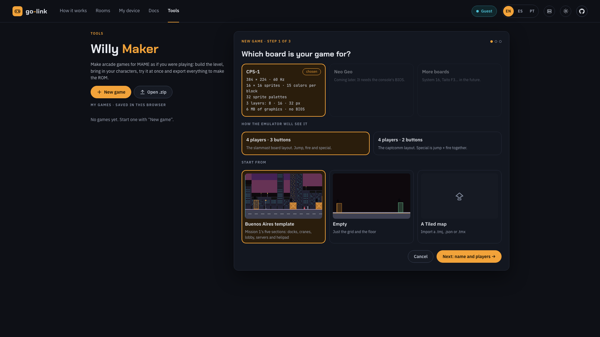 Home, the New game wizard | 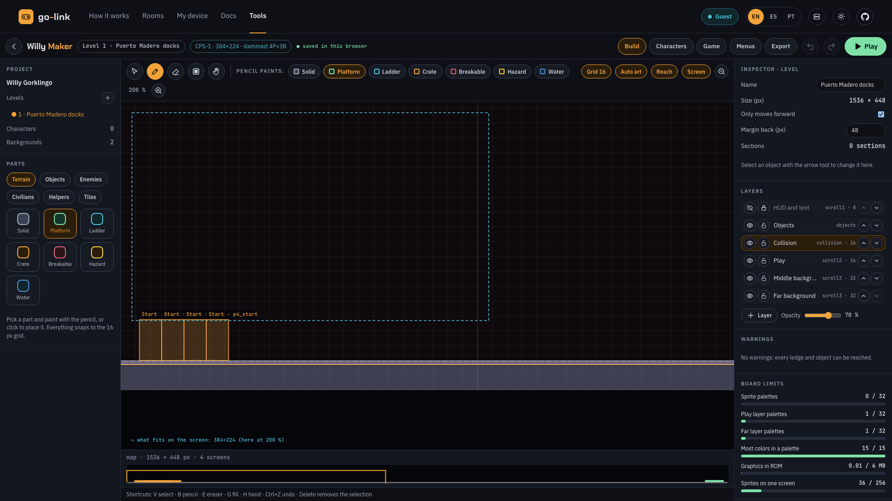 The IDE on the new level (step 12) |
| 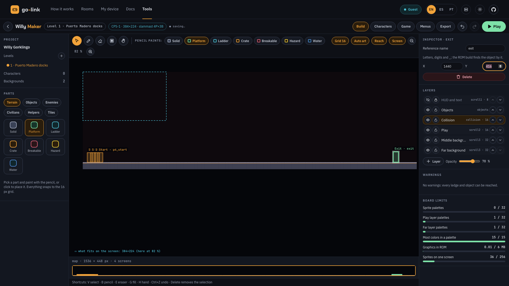 Starts at x 32-80, the exit at x 1440 (step 25) | 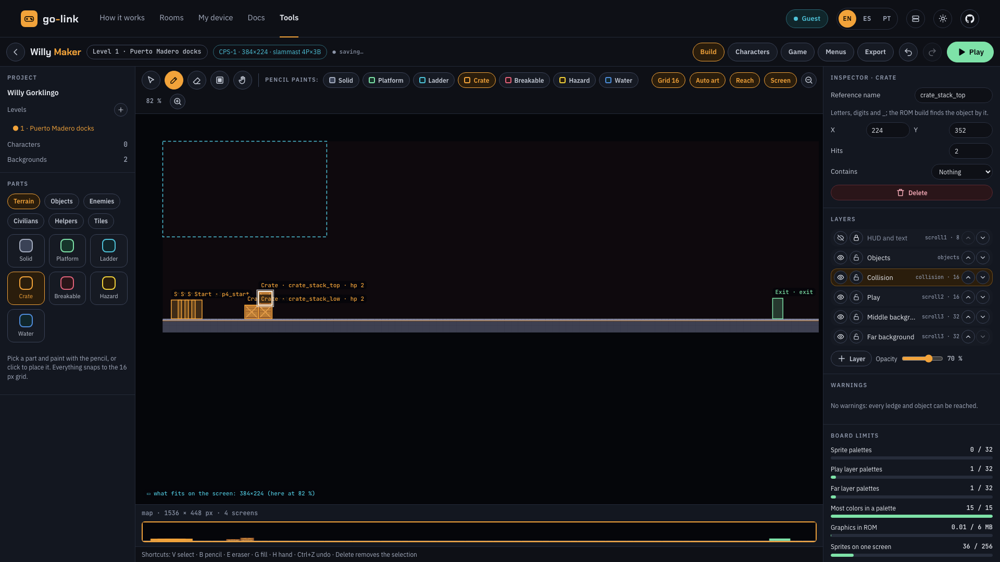 The crates (step 32) |
| 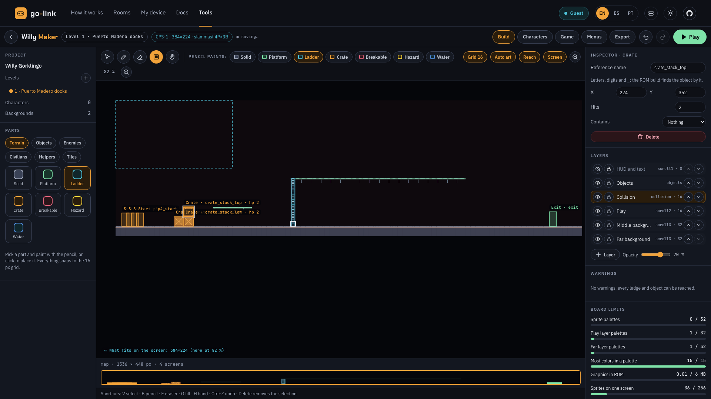 Ledge, ladder, upper dock (step 38) | 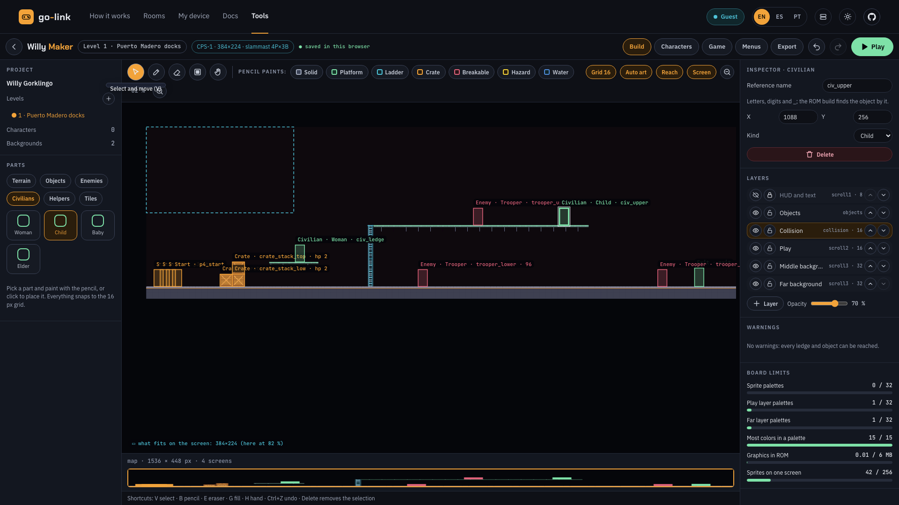 Troopers, civilians, exit (step 71) |
| 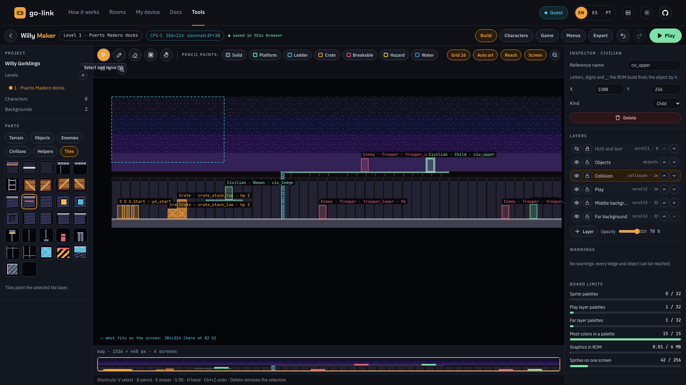 The level with its night sky (step 86) | 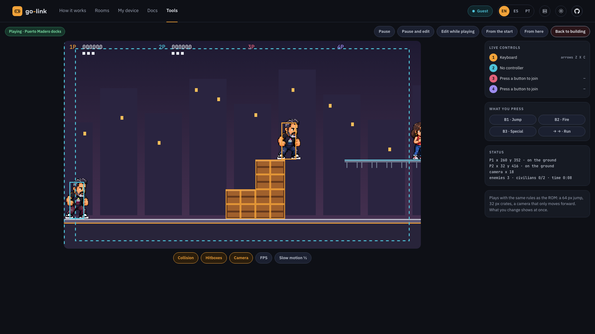 Play mode: P1 on the stack (step 89) |
| 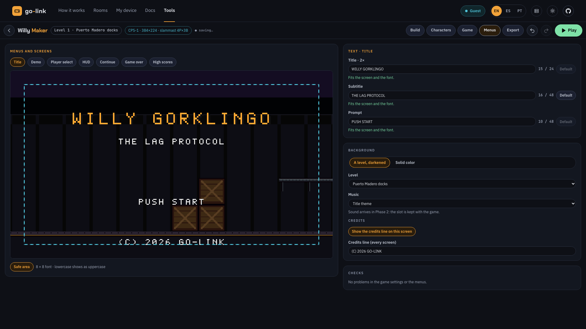 The title screen (step 98) | 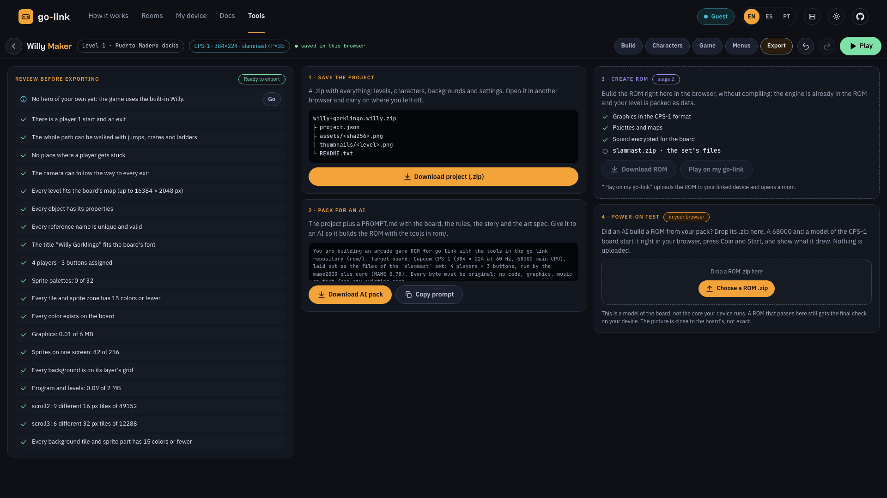 The Export review (step 102) |
| 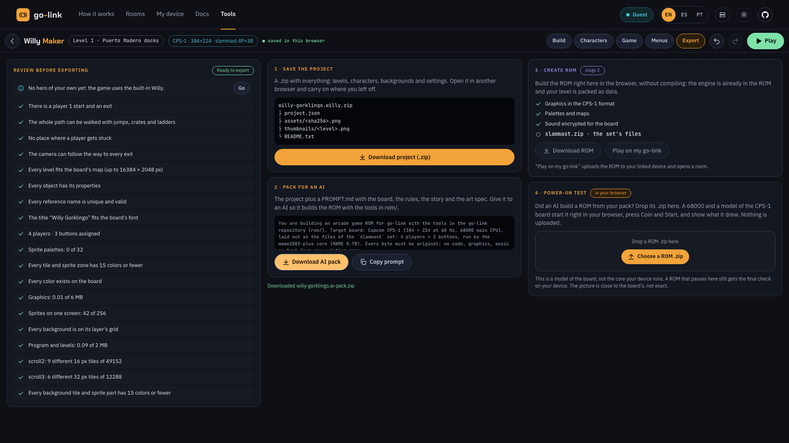 Both files downloaded (step 106) | 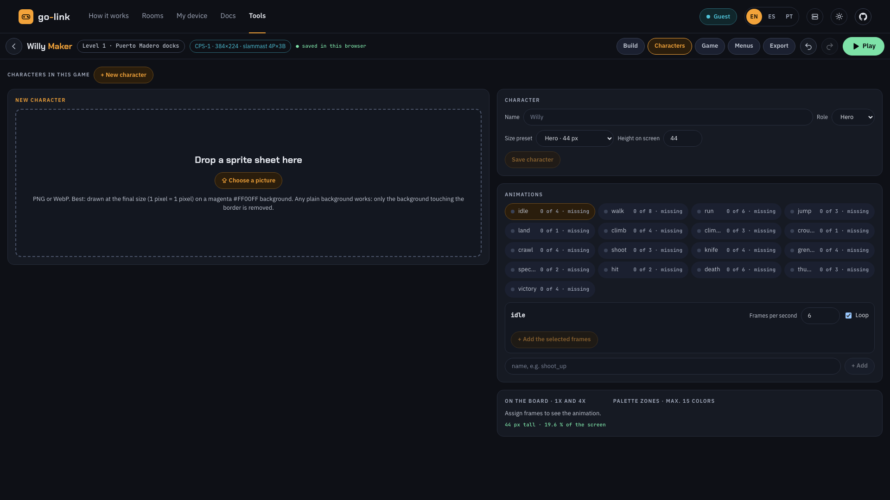 Where the note's Go leads (step 103) |

Every action of the recorded session, from [evidence/timeline.json](evidence/timeline.json): the time in seconds from the start, the note shown before it, the control (the script's Playwright locator, or the page box of a click on the level canvas in the 1920 × 1080 window) and its screenshot. Rows without a number are milestones (a full-size screenshot) and downloads.

| # | s | What and why | Control | Screenshot |
|---|---|---|---|---|
| | 3.9 | **Milestone:** Willy Maker's home: no games yet, the New game wizard open | | [000-home.png](evidence/shots/000-home.png) |
| 1 | 4.9 | New game, step 1: the board is CPS-1 (the only one offered) | `.wm-wizard .wm-choice.is-on >> nth=0` | [001.jpg](evidence/shots/001.jpg) |
| 2 | 6.0 | Layout: 4 players × 3 buttons (slammast), as Game Spec v1 asks | `getByRole('radio', { name: /4 players · 3 buttons/ })` | [002.jpg](evidence/shots/002.jpg) |
| 3 | 7.3 | Start from Empty: the spec's level is 1536 × 448, not the 8192 × 672 template | `getByRole('radio', { name: /^Empty/ })` | [003.jpg](evidence/shots/003.jpg) |
| 4 | 8.4 | Next: name and players | `getByRole('button', { name: 'Next: name and players →', exact: true })` | [004.jpg](evidence/shots/004.jpg) |
| 5 | 9.6 | Game title: WILLY GORKLINGO (the spec's title line) | `getByLabel('Game title')` | [005.jpg](evidence/shots/005.jpg) |
| 6 | 10.8 | Author: go-link (the spec's (C) 2026 GO-LINK) | `getByLabel('Author (optional)')` | [006.jpg](evidence/shots/006.jpg) |
| 7 | 12.0 | Players: 4, so P3 and P4 can join later on the 4-port board | `getByRole('radio', { name: '4 players' })` | [007.jpg](evidence/shots/007.jpg) |
| 8 | 13.1 | Next: the first level | `getByRole('button', { name: 'Next: the first level →', exact: true })` | [008.jpg](evidence/shots/008.jpg) |
| 9 | 14.3 | Level name: Puerto Madero docks (Section 1 of Mission 1) | `getByLabel('Level name')` | [009.jpg](evidence/shots/009.jpg) |
| 10 | 15.5 | Length: 4 screens = 1536 px wide | `getByRole('radio', { name: '4 screens' })` | [010.jpg](evidence/shots/010.jpg) |
| 11 | 16.6 | Height: 448 px = 2 screens tall | `getByRole('radio', { name: /^448 px/ })` | [011.jpg](evidence/shots/011.jpg) |
| 12 | 17.8 | Create the game | `getByRole('button', { name: 'Create the game', exact: true })` | [012.jpg](evidence/shots/012.jpg) |
| | 18.9 | **Milestone:** The IDE opened on the new level | | [010-ide.png](evidence/shots/010-ide.png) |
| 13 | 19.9 | Zoom out (1/4) until the whole 1536 px level fits the canvas | `getByRole('button', { name: 'Zoom out (−)' })` | [013.jpg](evidence/shots/013.jpg) |
| 14 | 21.2 | Zoom out (2/4) until the whole 1536 px level fits the canvas | `getByRole('button', { name: 'Zoom out (−)' })` | [014.jpg](evidence/shots/014.jpg) |
| 15 | 22.4 | Zoom out (3/4) until the whole 1536 px level fits the canvas | `getByRole('button', { name: 'Zoom out (−)' })` | [015.jpg](evidence/shots/015.jpg) |
| 16 | 23.7 | Zoom out (4/4) until the whole 1536 px level fits the canvas | `getByRole('button', { name: 'Zoom out (−)' })` | [016.jpg](evidence/shots/016.jpg) |
| 17 | 24.9 | Line the grid up: click empty cells with the select tool and read the cell the Inspector names | `locator('.wm-inspector').first()` | [017.jpg](evidence/shots/017.jpg) |
| | 25.8 | **Milestone:** View at 82 % | | [020-calibrated.png](evidence/shots/020-calibrated.png) |
| 18 | 26.9 | Select player 2's start | on the level canvas, page box x 352 y 587, 20 × 20 px | [018.jpg](evidence/shots/018.jpg) |
| 19 | 28.1 | Player 2's start: X = 48 so every start is inside x 32-96 | `locator('.wm-inspector input[aria-label="X"]')` | [019.jpg](evidence/shots/019.jpg) |
| 20 | 29.3 | Select player 3's start | on the level canvas, page box x 372 y 587, 20 × 20 px | [020.jpg](evidence/shots/020.jpg) |
| 21 | 30.6 | Player 3's start: X = 64 so every start is inside x 32-96 | `locator('.wm-inspector input[aria-label="X"]')` | [021.jpg](evidence/shots/021.jpg) |
| 22 | 31.8 | Select player 4's start | on the level canvas, page box x 391 y 587, 20 × 20 px | [022.jpg](evidence/shots/022.jpg) |
| 23 | 33.0 | Player 4's start: X = 80 so every start is inside x 32-96 | `locator('.wm-inspector input[aria-label="X"]')` | [023.jpg](evidence/shots/023.jpg) |
| 24 | 34.3 | Select the exit (the wizard put it at x 1488) | on the level canvas, page box x 1526 y 587, 20 × 20 px | [024.jpg](evidence/shots/024.jpg) |
| 25 | 35.5 | Exit: X = 1440, the left end of the spec's exit zone x 1440-1504 | `locator('.wm-inspector input[aria-label="X"]')` | [025.jpg](evidence/shots/025.jpg) |
| | 35.8 | **Milestone:** Starts at x 32-80 and the exit at x 1440 | | [030-starts-exit.png](evidence/shots/030-starts-exit.png) |
| 26 | 36.9 | Parts › Terrain › Crate: a 32 px crate, climbed by pushing | `locator('.wm-parts [role=tab]').filter({ hasText: 'Terrain' })` | [026.jpg](evidence/shots/026.jpg) |
| 27 | 38.2 | Click to place the first 32 px crate (x 192) | on the level canvas, page box x 470 y 587, 26 × 26 px | [027.jpg](evidence/shots/027.jpg) |
| 28 | 39.5 | Name it crate_single, so the AI pack says what each crate is for | `locator('.wm-inspector input.wm-mono').first()` | [028.jpg](evidence/shots/028.jpg) |
| 29 | 40.7 | Click to place the stack's lower crate (x 224) | on the level canvas, page box x 496 y 587, 26 × 26 px | [029.jpg](evidence/shots/029.jpg) |
| 30 | 41.9 | Name it crate_stack_low, so the AI pack says what each crate is for | `locator('.wm-inspector input.wm-mono').first()` | [030.jpg](evidence/shots/030.jpg) |
| 31 | 43.1 | Click to place the stack's upper crate: 64 px in all | on the level canvas, page box x 496 y 561, 26 × 26 px | [031.jpg](evidence/shots/031.jpg) |
| 32 | 44.4 | Name it crate_stack_top, so the AI pack says what each crate is for | `locator('.wm-inspector input.wm-mono').first()` | [032.jpg](evidence/shots/032.jpg) |
| | 44.7 | **Milestone:** The crates: 32 px, then a 64 px stack | | [040-crates.png](evidence/shots/040-crates.png) |
| 33 | 45.7 | Toolbar: the Platform tag (one-way: stand on it, jump through from below, down + jump drops) | `locator('.wm-toolbar .wm-chips button').filter({ hasText: 'Platform' })` | [033.jpg](evidence/shots/033.jpg) |
| 34 | 47.0 | Fill tool (G): drag a rectangle | `locator('button[aria-label="Fill a rectangle (G)"]')` | [034.jpg](evidence/shots/034.jpg) |
| 35 | 48.2 | Drag the one-way ledge: 64 px above the dock, x 320-447 | on the level canvas, page box x 575 y 561, 105 × 13 px | [035.jpg](evidence/shots/035.jpg) |
| 36 | 49.7 | Drag the upper dock (the second floor): a one-way floor 160 px up, x 592-1151 | on the level canvas, page box x 798 y 482, 459 × 13 px | [036.jpg](evidence/shots/036.jpg) |
| 37 | 51.2 | Toolbar: the Ladder tag | `locator('.wm-toolbar .wm-chips button').filter({ hasText: 'Ladder' })` | [037.jpg](evidence/shots/037.jpg) |
| 38 | 52.4 | Drag the ladder from the dock floor up to the upper dock (x 576) | on the level canvas, page box x 785 y 482, 13 × 131 px | [038.jpg](evidence/shots/038.jpg) |
| | 53.0 | **Milestone:** Terrain: crates, the one-way ledge, the ladder and the upper dock | | [050-terrain.png](evidence/shots/050-terrain.png) |
| 39 | 54.0 | Parts › Enemies › Trooper: pick the stamp | `locator('.wm-parts [role=tab]').filter({ hasText: 'Enemies' })` | [039.jpg](evidence/shots/039.jpg) |
| 40 | 55.3 | Pencil tool (B): stamps are placed with the pencil | `locator('button[aria-label="Pencil: paint the part (B)"]')` | [040.jpg](evidence/shots/040.jpg) |
| 41 | 56.6 | Place the Trooper the lower dock, under the upper one (x 720, feet y 416) | on the level canvas, page box x 891 y 580, 24 × 30 px | [041.jpg](evidence/shots/041.jpg) |
| 42 | 57.8 | Name it trooper_lower (the AI pack and the warnings use the reference name) | `locator('.wm-inspector input.wm-mono').first()` | [042.jpg](evidence/shots/042.jpg) |
| 43 | 59.0 | X = 720 | `locator('.wm-inspector input[aria-label="X"]')` | [043.jpg](evidence/shots/043.jpg) |
| 44 | 60.2 | Y = 416 (feet on the floor) | `locator('.wm-inspector input[aria-label="Y"]')` | [044.jpg](evidence/shots/044.jpg) |
| 45 | 61.4 | Patrol: 96 px, as the spec asks | `locator('.wm-inspector input[aria-label="Patrol (px)"]')` | [045.jpg](evidence/shots/045.jpg) |
| 46 | 62.6 | Parts › Enemies › Trooper: pick the stamp | `locator('.wm-parts [role=tab]').filter({ hasText: 'Enemies' })` | [046.jpg](evidence/shots/046.jpg) |
| 47 | 63.9 | Pencil tool (B): stamps are placed with the pencil | `locator('button[aria-label="Pencil: paint the part (B)"]')` | [047.jpg](evidence/shots/047.jpg) |
| 48 | 65.1 | Place the Trooper the upper dock (x 864, feet y 256) | on the level canvas, page box x 1009 y 449, 24 × 30 px | [048.jpg](evidence/shots/048.jpg) |
| 49 | 66.4 | Name it trooper_upper (the AI pack and the warnings use the reference name) | `locator('.wm-inspector input.wm-mono').first()` | [049.jpg](evidence/shots/049.jpg) |
| 50 | 67.6 | X = 864 | `locator('.wm-inspector input[aria-label="X"]')` | [050.jpg](evidence/shots/050.jpg) |
| 51 | 68.8 | Y = 256 (feet on the floor) | `locator('.wm-inspector input[aria-label="Y"]')` | [051.jpg](evidence/shots/051.jpg) |
| 52 | 70.0 | Patrol: 96 px, as the spec asks | `locator('.wm-inspector input[aria-label="Patrol (px)"]')` | [052.jpg](evidence/shots/052.jpg) |
| 53 | 71.2 | Parts › Enemies › Trooper: pick the stamp | `locator('.wm-parts [role=tab]').filter({ hasText: 'Enemies' })` | [053.jpg](evidence/shots/053.jpg) |
| 54 | 72.5 | Pencil tool (B): stamps are placed with the pencil | `locator('button[aria-label="Pencil: paint the part (B)"]')` | [054.jpg](evidence/shots/054.jpg) |
| 55 | 73.7 | Place the Trooper guarding the exit (x 1344, feet y 416) | on the level canvas, page box x 1403 y 580, 24 × 30 px | [055.jpg](evidence/shots/055.jpg) |
| 56 | 75.0 | Name it trooper_exit (the AI pack and the warnings use the reference name) | `locator('.wm-inspector input.wm-mono').first()` | [056.jpg](evidence/shots/056.jpg) |
| 57 | 76.2 | X = 1344 | `locator('.wm-inspector input[aria-label="X"]')` | [057.jpg](evidence/shots/057.jpg) |
| 58 | 77.3 | Y = 416 (feet on the floor) | `locator('.wm-inspector input[aria-label="Y"]')` | [058.jpg](evidence/shots/058.jpg) |
| 59 | 78.5 | Patrol: 96 px, as the spec asks | `locator('.wm-inspector input[aria-label="Patrol (px)"]')` | [059.jpg](evidence/shots/059.jpg) |
| 60 | 79.7 | Parts › Civilians › Woman: pick the stamp | `locator('.wm-parts [role=tab]').filter({ hasText: 'Civilians' })` | [060.jpg](evidence/shots/060.jpg) |
| 61 | 81.0 | Pencil tool (B): stamps are placed with the pencil | `locator('button[aria-label="Pencil: paint the part (B)"]')` | [061.jpg](evidence/shots/061.jpg) |
| 62 | 82.2 | Place the Woman on the one-way ledge (x 400, feet y 352) | on the level canvas, page box x 629 y 528, 24 × 30 px | [062.jpg](evidence/shots/062.jpg) |
| 63 | 83.5 | Name it civ_ledge | `locator('.wm-inspector input.wm-mono').first()` | [063.jpg](evidence/shots/063.jpg) |
| 64 | 84.7 | X = 400 | `locator('.wm-inspector input[aria-label="X"]')` | [064.jpg](evidence/shots/064.jpg) |
| 65 | 85.9 | Y = 352 | `locator('.wm-inspector input[aria-label="Y"]')` | [065.jpg](evidence/shots/065.jpg) |
| 66 | 87.1 | Parts › Civilians › Child: pick the stamp | `locator('.wm-parts [role=tab]').filter({ hasText: 'Civilians' })` | [066.jpg](evidence/shots/066.jpg) |
| 67 | 88.4 | Pencil tool (B): stamps are placed with the pencil | `locator('button[aria-label="Pencil: paint the part (B)"]')` | [067.jpg](evidence/shots/067.jpg) |
| 68 | 89.6 | Place the Child at the end of the upper dock (x 1088, feet y 256) | on the level canvas, page box x 1193 y 449, 24 × 30 px | [068.jpg](evidence/shots/068.jpg) |
| 69 | 90.9 | Name it civ_upper | `locator('.wm-inspector input.wm-mono').first()` | [069.jpg](evidence/shots/069.jpg) |
| 70 | 92.1 | X = 1088 | `locator('.wm-inspector input[aria-label="X"]')` | [070.jpg](evidence/shots/070.jpg) |
| 71 | 93.3 | Y = 256 | `locator('.wm-inspector input[aria-label="Y"]')` | [071.jpg](evidence/shots/071.jpg) |
| | 93.6 | **Milestone:** Three Troopers, two civilians, the exit | | [060-objects.png](evidence/shots/060-objects.png) |
| 72 | 94.6 | Layers: make Far background the active layer, to paint the night sky | `locator('.wm-layers li').filter({ hasText: 'Far background' })` | [072.jpg](evidence/shots/072.jpg) |
| 73 | 95.9 | Parts › Tiles: the sky tileset's tiles | `locator('.wm-parts [role=tab]').filter({ hasText: 'Tiles' })` | [073.jpg](evidence/shots/073.jpg) |
| | 96.2 | **Milestone:** The sky tileset | | [070-sky-tiles.png](evidence/shots/070-sky-tiles.png) |
| 74 | 97.3 | Tile 1: the darkest sky at the top | `getByRole('button', { name: 'Tile 1', exact: true })` | [074.jpg](evidence/shots/074.jpg) |
| 75 | 98.6 | Fill rows 0-63 px across the level | on the level canvas, page box x 313 y 272, 1260 × 52 px | [075.jpg](evidence/shots/075.jpg) |
| 76 | 100.1 | Tile 2: night sky | `getByRole('button', { name: 'Tile 2', exact: true })` | [076.jpg](evidence/shots/076.jpg) |
| 77 | 101.4 | Fill rows 64-127 px across the level | on the level canvas, page box x 313 y 325, 1260 × 52 px | [077.jpg](evidence/shots/077.jpg) |
| 78 | 102.9 | Tile 3: night sky, lower | `getByRole('button', { name: 'Tile 3', exact: true })` | [078.jpg](evidence/shots/078.jpg) |
| 79 | 104.2 | Fill rows 128-191 px across the level | on the level canvas, page box x 313 y 377, 1260 × 52 px | [079.jpg](evidence/shots/079.jpg) |
| 80 | 105.7 | Tile 4: the haze over the city | `getByRole('button', { name: 'Tile 4', exact: true })` | [080.jpg](evidence/shots/080.jpg) |
| 81 | 107.0 | Fill rows 192-255 px across the level | on the level canvas, page box x 313 y 430, 1260 × 52 px | [081.jpg](evidence/shots/081.jpg) |
| 82 | 108.5 | Tile 10: the skyline's roofs | `getByRole('button', { name: 'Tile 10', exact: true })` | [082.jpg](evidence/shots/082.jpg) |
| 83 | 109.8 | Fill rows 256-287 px across the level | on the level canvas, page box x 313 y 482, 1260 × 26 px | [083.jpg](evidence/shots/083.jpg) |
| 84 | 111.3 | Tile 12: dark buildings behind the docks | `getByRole('button', { name: 'Tile 12', exact: true })` | [084.jpg](evidence/shots/084.jpg) |
| 85 | 112.6 | Fill rows 288-447 px across the level | on the level canvas, page box x 313 y 508, 1260 × 131 px | [085.jpg](evidence/shots/085.jpg) |
| 86 | 114.1 | Layers: back to Collision | `locator('.wm-layers li').filter({ hasText: 'Collision' })` | [086.jpg](evidence/shots/086.jpg) |
| | 115.0 | **Milestone:** The level, done: night sky, dock, crates, ledge, ladder, upper dock, enemies, civilians, exit | | [080-level.png](evidence/shots/080-level.png) |
| 87 | 116.0 | Play (P): test the level with the ROM's rules while building | `locator('.wm-top button.is-play')` | [087.jpg](evidence/shots/087.jpg) |
| | 118.4 | **Milestone:** Play mode: P1 x 32 y 416 · on the ground \| P2 x 32 y 416 · on the ground | | [090-play-start.png](evidence/shots/090-play-start.png) |
| 88 | 119.5 | Walk right to the first crate and push against it (a 32 px crate is climbed by pushing) | `locator('.wm-play-layer canvas').first()` | [088.jpg](evidence/shots/088.jpg) |
| | 122.4 | **Milestone:** After pushing: P1 x 186 y 416 · on the ground \| P2 x 32 y 416 · on the ground | | [091-play-crate.png](evidence/shots/091-play-crate.png) |
| 89 | 123.5 | Keep pushing right: up onto the 64 px stack | `locator('.wm-play-layer canvas').first()` | [089.jpg](evidence/shots/089.jpg) |
| | 125.3 | **Milestone:** On the stack: P1 x 260 y 352 · on the ground \| P2 x 32 y 416 · on the ground | | [092-play-stack.png](evidence/shots/092-play-stack.png) |
| 90 | 126.4 | Jump right (Z) from the stack toward the one-way ledge | `locator('.wm-play-layer canvas').first()` | [090.jpg](evidence/shots/090.jpg) |
| | 128.0 | **Milestone:** After the jump: P1 x 302 y 416 · on the ground \| P2 x 69 y 416 · on the ground | | [093-play-ledge.png](evidence/shots/093-play-ledge.png) |
| 91 | 129.1 | Down + jump: drop through the one-way ledge | `locator('.wm-play-layer canvas').first()` | [091.jpg](evidence/shots/091.jpg) |
| | 130.5 | **Milestone:** After dropping: P1 x 302 y 416 · on the ground \| P2 x 69 y 416 · on the ground | | [094-play-drop.png](evidence/shots/094-play-drop.png) |
| 92 | 131.6 | Walk right to the ladder and fire (X) at the lower Trooper | `locator('.wm-play-layer canvas').first()` | [092.jpg](evidence/shots/092.jpg) |
| | 135.2 | **Milestone:** Firing: P1 x 410 y 416 · on the ground \| P2 x 177 y 416 · on the ground | | [095-play-fire.png](evidence/shots/095-play-fire.png) |
| 93 | 136.3 | Back to building | `getByRole('button', { name: 'Back to building' }).first()` | [093.jpg](evidence/shots/093.jpg) |
| 94 | 138.1 | Game tab: players, actions, each player's character and the DIP switches | `locator('.wm-tabs button').filter({ hasText: 'Game' })` | [094.jpg](evidence/shots/094.jpg) |
| | 139.2 | **Milestone:** The Game tab: 4 players, B1 jump, B2 fire, B3 special, run 250 ms, P1 Willy, P2-P4 recruit shirts (all as the spec asks) | | [100-game.png](evidence/shots/100-game.png) |
| 95 | 140.4 | Menus tab: the title and the other screens | `locator('.wm-tabs button').filter({ hasText: 'Menus' })` | [095.jpg](evidence/shots/095.jpg) |
| | 141.5 | **Milestone:** The Menus tab: the title screen | | [110-menus.png](evidence/shots/110-menus.png) |
| 96 | 142.5 | Title screen subtitle: THE LAG PROTOCOL | `locator('#wm-menu-field-subtitle')` | [096.jpg](evidence/shots/096.jpg) |
| 97 | 143.7 | Title screen prompt: PUSH START | `locator('#wm-menu-field-prompt')` | [097.jpg](evidence/shots/097.jpg) |
| 98 | 144.9 | Credits line: (C) 2026 GO-LINK (every screen) | `locator('#wm-menu-field-credits')` | [098.jpg](evidence/shots/098.jpg) |
| | 145.1 | **Milestone:** The title screen: WILLY GORKLINGO, THE LAG PROTOCOL, PUSH START, (C) 2026 GO-LINK. There is no field for CREDITS n. | | [111-title.png](evidence/shots/111-title.png) |
| 99 | 146.2 | HUD screen | `getByRole('tab', { name: 'HUD' })` | [099.jpg](evidence/shots/099.jpg) |
| 100 | 147.5 | HUD › Level clear: SECTION CLEAR, as the spec asks | `locator('#wm-menu-field-cleared')` | [100.jpg](evidence/shots/100.jpg) |
| | 147.8 | **Milestone:** The HUD screen | | [112-hud.png](evidence/shots/112-hud.png) |
| 101 | 149.0 | Game over screen: the heading stays GAME OVER | `getByRole('tab', { name: 'Game over' })` | [101.jpg](evidence/shots/101.jpg) |
| | 149.3 | **Milestone:** The Game over screen | | [113-gameover.png](evidence/shots/113-gameover.png) |
| 102 | 150.3 | Export tab: the review before exporting | `locator('.wm-tabs button').filter({ hasText: 'Export' })` | [102.jpg](evidence/shots/102.jpg) |
| | 151.8 | **Milestone:** The Export review: Ready to export | | [200-export.png](evidence/shots/200-export.png) |
| 103 | 152.9 | Review: “Note: No hero of your own yet: the game uses the built-in Willy.” → Go, to see what it points at | `locator('.wm-checks li:not(.is-ok)').filter({ hasText: 'Note: No hero of your own yet:' }).first()` | [103.jpg](evidence/shots/103.jpg) |
| | 154.4 | **Milestone:** Where “Note: No hero of your own yet: the game uses the built-in Willy.” leads | | [210-go-0.png](evidence/shots/210-go-0.png) |
| 104 | 155.5 | Back to Export | `locator('.wm-tabs button').filter({ hasText: 'Export' })` | [104.jpg](evidence/shots/104.jpg) |
| | 156.8 | **Milestone:** The final review: Ready to export | | [220-export-final.png](evidence/shots/220-export-final.png) |
| 105 | 157.8 | Download project (.zip) | `getByRole('button', { name: 'Download project (.zip)' })` | [105.jpg](evidence/shots/105.jpg) |
| | 157.9 | downloaded willy-gorklingo.willy.zip (project) | |  |
| 106 | 159.8 | Download AI pack | `getByRole('button', { name: 'Download AI pack' })` | [106.jpg](evidence/shots/106.jpg) |
| | 160.3 | downloaded willy-gorklingo.ai-pack.zip (ai-pack) | |  |
| | 161.3 | **Milestone:** Both files downloaded | | [230-downloaded.png](evidence/shots/230-downloaded.png) |
| 107 | 162.3 | Copy prompt (the pack's PROMPT.md) | `getByRole('button', { name: 'Copy prompt' })` | [107.jpg](evidence/shots/107.jpg) |

# Part 2: the pack to an AI, then the ROM

## 2.1 Give the pack to an AI

The builder must be **blind**: it gets the pack and the repository's `rom/` tools, nothing about Willy Maker's session, the other cases or this guide.

1. Start a fresh coding agent in a checkout at `23806b8` (a new worktree, not the one you used for part 1, so `docs/experiments/case-b/` is not there to read).
2. Unzip the pack where the agent can read it:
   ```sh
   mkdir -p /tmp/case-b-pack && unzip -q /tmp/case-b-run/downloads/willy-gorklingo.ai-pack.zip -d /tmp/case-b-pack
   ```
3. Paste, as the whole first message, the prompt in [howto/prompt-for-the-ai.md](howto/prompt-for-the-ai.md): a short frame (the pack's folder, what to read and not to read, the records, where the set goes, the ports) followed by the pack's `PROMPT.md` exactly as Willy Maker's **Copy prompt** gives it (SHA-256 `b26a266f…5654`, 104 lines). The frame is what the 2026-10-01 builder was held to, as its records state (the paragraph before D-101 in [rom/decisions.md](rom/decisions.md), D-101, D-102).

What an AI does with it varies from run to run. To get **this case's** ROM, follow 2.2 to 2.10 literally: they are the commands and the patches the blind builder applied, in its order, with what each printed.

## 2.2 Start: the branch and the toolchain (18:33-18:36)

```sh
git switch -c case-b-redo 23806b8              # any new branch; the case used exp1/case-b-rom on top of exp1/case-b (D-101), the same code
(cd frontend && npm ci)                        # the lab tools need frontend/node_modules
node rom/tools/build.mjs                       # the prototype, to prove the toolchain (PROMPT step 2)
unzip -p rom/build/slammast.zip mbe_23e.rom | shasum -a 256
node rom/tools/lab/validate.mjs rom/build/slammast.zip
```

Expected: `68000 program: 24100 bytes`, `built …/rom/build/slammast.zip (28 files)`, `own set list: slammast (28 files), unchanged -> backend-device/pkg/ownsets/sets.json`; the program's hash `ed49771956392530262b4b113cb90dcb52eba223904e52ebdfd40277acdb3c0a`; level 3 `PASSED: 300 frames in … ms` with `The program ROMs join into 24100 bytes` ([rom/evidence/prototype-level3.txt](rom/evidence/prototype-level3.txt)).

`validate.mjs` needs `frontend/node_modules` (`npm ci` in `frontend/`, done in 1.2). The case's worktree had none and ran the lab tools from the main checkout on its own zip (D-102); with `node_modules` in place they run anywhere.

## 2.3 Read the pack (18:37-18:38)

```sh
node /tmp/case-b-howto/inspect-pack.mjs /tmp/case-b-pack | less
```

[howto/inspect-pack.mjs](howto/inspect-pack.mjs) prints `level-1.tmj`'s layers and objects and each tile layer as text. In the `collision` layer the tag gids print as `w` solid, `x` one-way, `y` ladder, `z` crate (gids 32-35): the picture in [1.7](#17-every-click). The builder then read `rom/src/main.c`, `rom/tools/{art,level,build}.mjs`, `rom/src/lab_state.h` and the pack's `docs/hardware.md`, and found the first gaps (P-01 to P-26, at the end of [rom/journal.md](rom/journal.md)): a 96-column level for a 64-column map, crates `hp` 2 against "3 hits" in the table, no rule for what clears the level, lives against the lab state's energy, no trooper art, no grenade numbers.

## 2.4 The code: a pack reader, a pack mode and a game of its own (18:40-18:44)

```sh
git apply /tmp/case-b-howto/02-rom-pack-build.patch
git status --short
```

Expected: ` M rom/tools/art.mjs`, ` M rom/tools/build.mjs`, `?? rom/src/game_pack.c`, `?? rom/tools/pack.mjs`. The patch is [howto/02-rom-pack-build.patch](howto/02-rom-pack-build.patch), 2 012 lines, the builder's only code commit (`293db49`, D-103 to D-112):

| File | Lines | What | When |
|---|---|---|---|
| `rom/tools/pack.mjs` | +157 (new) | Reads `project.json` and `level-1.tmj` (collision by the tag tileset's `type`, objects by `type` and properties), refuses what the engine lacks, cuts `play.png` (16 px) and `far.png` (32 px) into deduplicated tiles with their own colors (D-104) | 18:40 |
| `rom/tools/art.mjs` | +142 / -10 | `addArt(gfx, defs, gen, pack)`: three recruit shirts, the troopers' shot palette, the grenade and its 32 × 32 blast, the pack's level and texts as `#define`s (`TXT_TITLE`, `DIP_LIVES`, `EXIT_X0`…) (D-104, D-110, D-111) | 18:41 |
| `rom/tools/build.mjs` | +24 / -5 | `--pack DIR`, `--out DIR`, `game_pack.c` instead of `main.c`, the device's set list left alone for packs (D-103, D-114) | 18:41 |
| `rom/src/game_pack.c` | +1575 (new) | Started as a copy of `main.c`: four players, column streaming into scroll2 (D-105), troopers that fire, lives as energy (D-108), grenades (D-110), the exit (D-107), title/demo/high scores/select/continue/game over (D-112) | 18:42 |

The builder edited `art.mjs` and `build.mjs` with two small throwaway Python edit scripts and wrote the two new files whole; the patch is their net result. `diff rom/src/main.c rom/src/game_pack.c` shows what the pack added to the prototype's game.

## 2.5 Build the pack's set (18:44)

```sh
node rom/tools/build.mjs slammast --pack /tmp/case-b-pack --out docs/experiments/case-b/build
```

Expected, in about 3 s:

```
art: willy {"palettes":4,"tiles":147,"meanDeltaE":2.94,"maxDeltaE":13.5,"snapMeanDeltaE":0.62,"snapMaxDeltaE":1.56}
art: woman {"palettes":2,"tiles":30,"meanDeltaE":2.71,"maxDeltaE":12.1,"snapMeanDeltaE":0.69,"snapMaxDeltaE":1.46}
art: child {"palettes":2,"tiles":21,"meanDeltaE":3.53,"maxDeltaE":11.5,"snapMeanDeltaE":0.75,"snapMaxDeltaE":2.08}
art: robot {"palettes":3,"tiles":90,"meanDeltaE":4.08,"maxDeltaE":19.6,"snapMeanDeltaE":0.64,"snapMaxDeltaE":1.5}
art: pack level 96x28 cells, play 10 tiles (9 colors), far 7 tiles (8 colors)
art: sprites up to tile 0x1142, 27 sprite palettes
lab_state at 0xff0000 (200 bytes)
68000 program: 31194 bytes
built …/docs/experiments/case-b/build/slammast.zip (28 files)
```

No compiler warning. The folder also gets `symbols.json` and `slammast.symbols.json` (SHA-256 `f43b7f995c0ead5d3ff46f32885b8eabe8634650bdb80cbb9911da409ab61ce9`, the same as the case's), `program.map`, `gen/` and `obj/`. Check the set against the case's, file by file:

```sh
R=$PWD; rm -rf /tmp/case-b-zip && mkdir /tmp/case-b-zip
(cd /tmp/case-b-zip && unzip -q "$R/docs/experiments/case-b/build/slammast.zip" && shasum -a 256 -c /tmp/case-b-howto/slammast-zip.sha256 | grep -vc ': OK$')
```

Expected: `0` (all 28 files `OK`). The zip itself differs from the case's (`fb3ff818…eacb`) only in its timestamps.

Then level 3 on the new set, and the prototype once more to prove it kept its bytes (D-103):

```sh
node rom/tools/lab/validate.mjs docs/experiments/case-b/build/slammast.zip
node rom/tools/build.mjs && unzip -p rom/build/slammast.zip mbe_23e.rom | shasum -a 256
```

Expected: level 3 `PASSED` with `The program ROMs join into 31194 bytes`, `Palettes written from frame 10, 346 colors set`, `11 sprites in the table`; the prototype's hash `ed497719…3c0a` again.

## 2.6 The route bot plays it (18:45)

```sh
node rom/tools/lab/run.mjs docs/experiments/case-b/build/slammast.zip --out /tmp/case-b-bot1 --player "node rom/tools/lab/bot.mjs"
python3 -c "import json;d=json.load(open('/tmp/case-b-bot1/summary.json'));print(d['cleared'],d['clearFrame'],d['final'])"
```

Expected: `True 1297 {'mode': 'clear', 'scores': [2500, 0, 0, 0], 'rescued': 1, 'civilians': 2, 'enemiesDown': 3, 'enemies': 3, 'p1': {'x': 1443, 'y': 416, 'energy': 3}}`. The bot skips the woman on the ledge (P-01).

## 2.7 The scripts: clear, damage, four players (18:46-18:52)

```sh
git apply /tmp/case-b-howto/03-scripts-and-helpers.patch
```

It adds [runs/clear.json](runs/clear.json) (2100 frames, 11 checkpoints, 18 expectations, D-113), [runs/damage.json](runs/damage.json) (D-108), [runs/four-players.json](runs/four-players.json) (D-111), `build/.gitignore` (`obj/`, `gen/`) and the evidence helpers `rom/tools/trace.mjs` and `colors.mjs`. The patch is [howto/03-scripts-and-helpers.patch](howto/03-scripts-and-helpers.patch).

The clear script took four drafts. The first walked to the ledge and jumped from the street: the jump peaks at y 354 under a ledge at 352 (the engine's jump is 62 px, not 64; [rom/evidence/straight-jump-trace.txt](rom/evidence/straight-jump-trace.txt)). The second runs on the stack's top (double tap right, frames 453-456) and jumps while running (457-459), landing on the ledge at x 327 ([ledge-jump-trace.txt](rom/evidence/ledge-jump-trace.txt)). The full script's first expectation run failed at frame 700 (trooper 1 down only at 705) and the check moved to 720.

```sh
Z=docs/experiments/case-b/build/slammast.zip
node rom/tools/lab/run.mjs $Z --out /tmp/case-b-clear --script docs/experiments/case-b/runs/clear.json
node docs/experiments/case-b/rom/tools/trace.mjs /tmp/case-b-clear 30 0 2100 | tail -3
node rom/tools/lab/run.mjs $Z --out /tmp/case-b-damage --script docs/experiments/case-b/runs/damage.json
node rom/tools/lab/run.mjs $Z --out /tmp/case-b-four --script docs/experiments/case-b/runs/four-players.json --mp4
```

Expected: the clear run prints `frame 600: playing, P1 x 484 y 416`, `frame 1200: playing, P1 x 844 y 256`, `frame 1800: playing, P1 x 1384 y 416`, then a summary with `"cleared": true`, `"clearFrame": 1856`, `"expectOk": true`, score 3500, P1 at x 1451 with energy 3, every one of the 18 expectations `"ok": true` ([rom/evidence/clear-trace.txt](rom/evidence/clear-trace.txt)). The damage run: hits at about 811, 991 and 1171, continue, game over, the title again at 2040 ([damage-trace.txt](rom/evidence/damage-trace.txt)). Four players: 6 of 6 expectations, four Willys in white, green, blue and red ([four-players-select.png](rom/evidence/four-players-select.png), [four-players-play.png](rom/evidence/four-players-play.png)).

## 2.8 The core, as PROMPT step 4 asks (18:51)

```sh
(cd backend-device && go build -o /tmp/framelab ./cmd/framelab)          # about 25 s
/tmp/framelab capture -log -core ~/go-link/cores/mame2003_plus_libretro.dylib \
  -rom docs/experiments/case-b/build/slammast.zip -out /tmp/case-b-framelab -frames 860 \
  -script "60-63:coin 110-113:start 140-400:right" 2> /tmp/case-b-framelab.log
grep -c "WRONG CHECKSUMS" /tmp/case-b-framelab.log; grep -c -E "NOT FOUND|INCORRECT LENGTH" /tmp/case-b-framelab.log
```

Expected: `28` and `0`. The pack says there must be no `WRONG CHECKSUMS` line; any set of our own bytes gets one per file and the core runs it anyway (P-03, [rom/evidence/framelab-core-log.txt](rom/evidence/framelab-core-log.txt)). The core is a `.so` on Linux.

## 2.9 Level 4 and the acceptance (18:50-19:47)

```sh
DEV=/path/to/go-link.app/Contents/MacOS/go-link-device       # e.g. dist/device/darwin-universal/… of a built checkout
$DEV romtest docs/experiments/case-b/build/slammast.zip
```

Expected (3 s):

```
  ok    zip             28 files
  ok    set             the core's slammast (… layout)
  ok    identity        not a go-link set: it shows as the core's original game
  ok    core.loaded     MAME 2003-Plus 3141930, 384x224 at 60.00 Hz
  ok    core.files      28 files differ from the original set (the core warns, and runs them)
  ok    video.picture   first picture at frame 10
  ok    video.alive     46 different pictures in the last 300 frames (at least 10)
  ok    audio           sound runs, silent in these 900 frames
  ok    input.reacts    the picture changed at frame 301, after Coin at frame 300 (the run without input stayed the same until then)
  ok    time.realtime   900 frames in 1.5 s: 10.0x real time
PASSED: the set powers on in this core. 900 frames in 3.2 s.
```

"Not a go-link set" is expected: the pack mode leaves the device's list of go-link sets alone (D-103, P-20). Then the whole acceptance, as the case's final run:

```sh
node rom/tools/lab/acceptance.mjs docs/experiments/case-b/build/slammast.zip \
  --script docs/experiments/case-b/runs/clear.json --out /tmp/case-b-acceptance \
  --bot-games 5 --laya-games 3 --laya-frames 900 --device "$DEV"
```

Expected (`acceptance.json` `summary`): `level3` true, `level4` true, `scripted` true, `sameAsCore` true (11 checkpoints, worst difference 0 %), `bot` `5/5 cleared` (frames 1297, 1414, 1491, 1727, 1393; 0 lives lost), `laya` `0/3 cleared` (nearly every decision `fire`). The case's copy: [rom/evidence/acceptance/](rom/evidence/acceptance/). Without the Laya venv add `--skip laya`. The case's first run used the default 3600-frame Laya games and was stopped after 45 minutes (D-116).

## 2.10 A go-link room

The case skipped this (D-115: `room-test.mjs` uses the fixed ports 8192 and 7392 and the run had no port assigned). This guide ran it on the same bytes. It starts its own signalhub and headless device with a throwaway HOME whose ROM folder holds only the set (the core is copied from `~/go-link/cores`), opens the device's local panel in Chromium, starts a New game, and plays through the room's keyboard; it never touches a running go-link app, its `device.json` or your ROM folder.

```sh
cp docs/experiments/case-b/build/slammast.zip rom/build/slammast.zip       # room-test plays rom/build/<set>.zip
[ -f backend-device/web/panel/dist/index.html ] || make panel              # the panel website, embedded in the device
(cd e2e && npm ci)                                                         # Playwright, if 1.3 was skipped
# only if 8192 or 7392 is taken: a copy on other ports
sed 's/signal: 8192, panel: 7392/signal: 5408, panel: 5409/' rom/tools/room-test.mjs > rom/tools/room-test-5408.mjs
SIGNALING_DIR=../signaling node rom/tools/room-test-5408.mjs slammast       # or rom/tools/room-test.mjs
```

Expected, in about 35 s ([howto/room/room-test.log](howto/room/room-test.log)):

```
2-attract: 768x448
3-credit: 768x448
4-run: 768x448
5-machine-gun: 768x448
6-bazooka: 768x448
7-jump: 768x448
8-later: 768x448
video frames { decoded: 930, dropped: 20 }
pictures in …/rom/build/room/shots
```

and in `rom/build/room/device.log`: `game running … rom=slammast.zip core="MAME 2003-Plus" size="[384 224]" fps=60`. The pictures are frames of the room's WebRTC video, as a guest receives them:

| | |
|---|---|
| 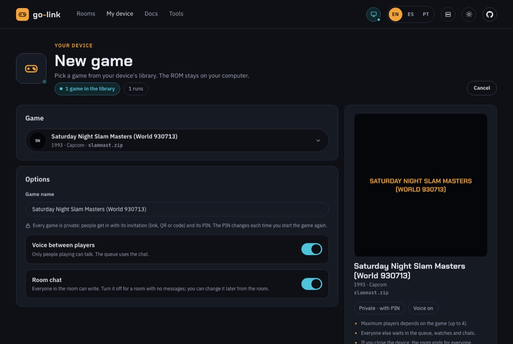 New game on the device's panel | 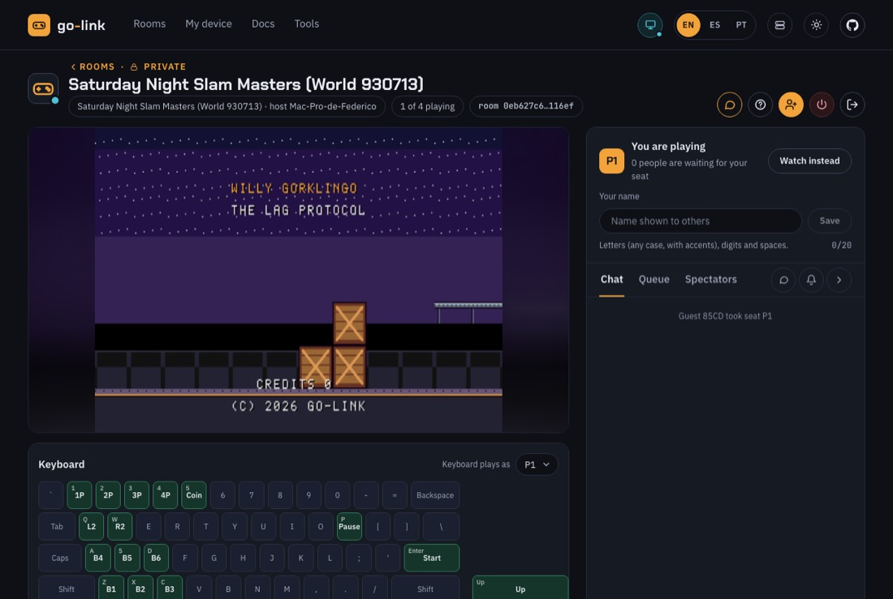 The room |
| 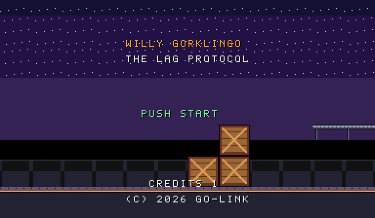 The title after a coin: `WILLY GORKLINGO`, `THE LAG PROTOCOL`, `PUSH START`, `CREDITS 1`, `(C) 2026 GO-LINK` | 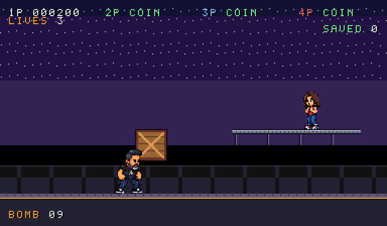 Playing: the 4-player HUD, `LIVES 3`, `BOMB 09`, the woman on the ledge |

To play it yourself instead, put `slammast.zip` in a go-link device's ROM folder (My device › ROMs on the website, or `go-link-device roms dir`) and start a New game with it. The device shows it as the core's original title (it is not in the device's list of go-link sets).

# The finished ROM

`slammast.zip`, 28 files, 52 527 bytes as committed (`docs/experiments/case-b/build/slammast.zip` and the shared folder's `slammast.zip`, SHA-256 `fb3ff818d6f15ba54f917b59820be8ac743d5cdb482788266414bafa58f9eacb`; a rebuild differs only in the zip's timestamps). Compare the **files inside** it:

```sh
cd <unzipped set> && shasum -a 256 -c /tmp/case-b-howto/slammast-zip.sha256
```

([howto/slammast-zip.sha256](howto/slammast-zip.sha256) is this table in `shasum` format.)

| File | Bytes | SHA-256 |
|---|---|---|
| `mb_05.bin` | 524288 | `b525b6f504db347b424710ef5e73decc1ee655bdc6ac8882a72a7e586c8b7cce` |
| `mb_06.bin` | 524288 | `05f00b296c1ecc66a273668210b050cf1c0087dc5adbcacf66b7ba3ae4ecd02a` |
| `mb_07.bin` | 524288 | `2cd74ec3c591865056ab30a515a669f54b00fa353655080377c7abe74f8b0e70` |
| `mb_08.bin` | 524288 | `a2b510bcb175cce9840b3f694f3438a02fdb600426204b7ae69e1d4850c8d0ee` |
| `mb_10.bin` | 524288 | `043e238a765f7cfbc62596a50e53c8ffb6b188a99357b0ebede251725d67589f` |
| `mb_11.bin` | 524288 | `043e238a765f7cfbc62596a50e53c8ffb6b188a99357b0ebede251725d67589f` |
| `mb_12.bin` | 524288 | `043e238a765f7cfbc62596a50e53c8ffb6b188a99357b0ebede251725d67589f` |
| `mb_13.bin` | 524288 | `043e238a765f7cfbc62596a50e53c8ffb6b188a99357b0ebede251725d67589f` |
| `mb_gfx01.rom` | 524288 | `e0f5d5553beca49c63eacd05b771d76a341461cdb38a0119298cf89b42d81c3c` |
| `mb_gfx02.rom` | 524288 | `3845e59014210e5d66de9472f7e06bb61b2d819fbe3abbd866e19d3d1e19de78` |
| `mb_gfx03.rom` | 524288 | `8d9c17d05052d833dc59177f5a48908873dbc702d19352a45bdcd1cbb3e8b67d` |
| `mb_gfx04.rom` | 524288 | `09955f100f24c8afe54beaa1e07090615aaba1a7efe5189f9f30df47c04838aa` |
| `mb_q1.bin` | 524288 | `07854d2fef297a06ba81685e660c332de36d5d18d546927d30daad6d7fda1541` |
| `mb_q2.bin` | 524288 | `07854d2fef297a06ba81685e660c332de36d5d18d546927d30daad6d7fda1541` |
| `mb_q3.bin` | 524288 | `07854d2fef297a06ba81685e660c332de36d5d18d546927d30daad6d7fda1541` |
| `mb_q4.bin` | 524288 | `07854d2fef297a06ba81685e660c332de36d5d18d546927d30daad6d7fda1541` |
| `mb_q5.bin` | 524288 | `07854d2fef297a06ba81685e660c332de36d5d18d546927d30daad6d7fda1541` |
| `mb_q6.bin` | 524288 | `07854d2fef297a06ba81685e660c332de36d5d18d546927d30daad6d7fda1541` |
| `mb_q7.bin` | 524288 | `07854d2fef297a06ba81685e660c332de36d5d18d546927d30daad6d7fda1541` |
| `mb_q8.bin` | 524288 | `07854d2fef297a06ba81685e660c332de36d5d18d546927d30daad6d7fda1541` |
| `mb_qa.rom` | 131072 | `97aa20f433373110eb6c1a4cad8b2fa80eeaf275578c40326a5fca073abd4cb1` |
| `mbe_20a.rom` | 524288 | `043e238a765f7cfbc62596a50e53c8ffb6b188a99357b0ebede251725d67589f` |
| `mbe_21a.rom` | 524288 | `043e238a765f7cfbc62596a50e53c8ffb6b188a99357b0ebede251725d67589f` |
| `mbe_23e.rom` | 524288 | `32ae33faf9f695579608e8a7146b5765e512000430233a6bdd81eb281f17eba5` |
| `mbe_24b.rom` | 131072 | `b5a41c3758763bbec72769fab4a2533bf2db0b6312d93d25a695f9e4b9e02260` |
| `mbe_25b.rom` | 131072 | `b5a41c3758763bbec72769fab4a2533bf2db0b6312d93d25a695f9e4b9e02260` |
| `mbe_28b.rom` | 131072 | `b5a41c3758763bbec72769fab4a2533bf2db0b6312d93d25a695f9e4b9e02260` |
| `mbe_29b.rom` | 131072 | `b5a41c3758763bbec72769fab4a2533bf2db0b6312d93d25a695f9e4b9e02260` |

# When it goes wrong

The rows marked **seen** happened in this case (the step 1 and step 2 journals) or while verifying this guide; the rows marked *foreseen* are what a fresh checkout lacks, found while preparing the verification run and avoided there.

| Where | What you see | Why | What to do |
|---|---|---|---|
| 0, 1.2 | **seen** `source ~/.nvm/nvm.sh` refused | An agent's sandbox may refuse `source` (step 1 journal 18:07, D-002, D-102); Node older than 22.18 cannot import the tools' `.ts` files | Call Node by its full path (`~/.nvm/versions/node/v22.23.2/bin/node`) or put that folder first on `PATH` in a small wrapper script |
| 1.2 | **seen** Console: `WebSocket connection to 'wss://signal.go-link.org/ws?v=1' failed … 403` | The site's header tries the production signaling, which refuses a localhost origin | Nothing: Willy Maker does not use it (18 lines in the recorded run) |
| 1.4 | **seen** The first screenshot shows "INSERT COIN" | The go-link splash stays at least 3 s | The script waits for `#splash` to go; by hand, wait |
| 1.4 | **seen** `calibrate()` finds no cell (run r1) | The Inspector's title is uppercased by CSS (`INSPECTOR · AIR · CELL 0,9`) and `innerText` returns it uppercased | Fixed in the script (case-insensitive match); [evidence/dead-ends/r1-calibrate-uppercase.png](evidence/dead-ends/r1-calibrate-uppercase.png) |
| 1.4 | **seen** The Inspector says `CELL -3,-1` | A click outside the level selects a cell outside it (finding F-09) | Click inside the level; the script's probe is inside it |
| 1.4 | **seen** A Trooper is never placed, and the last crate is renamed `trooper_lower` and moved to (720, 416) (run r2) | Picking an object stamp while the **Fill** tool is on keeps Fill; a Fill click with an object does nothing, silently, and the Inspector still edits the previous object (F-03) | **Press the pencil after picking a stamp.** [evidence/dead-ends/r2-fill-tool-kept.png](evidence/dead-ends/r2-fill-tool-kept.png) |
| 1.4 | **seen** A locator matches two elements (runs r3 and r5a) | The Collision layer's row text has both its name and its kind (`collision · 16`); the top bar's Play button and the "Play" layer's name are both "Play" | The script uses the layer's name button and `.wm-top button.is-play`; by hand, use the top bar's Play. [evidence/dead-ends/r3-layer-locator.png](evidence/dead-ends/r3-layer-locator.png) |
| 1.4 | *foreseen* Calibration numbers other than the ones above | They depend on the window and the site's layout | Fine as long as `zoom` is `0.82` and the run ends `"ok":true`; on failure `shots/error.png` shows the page and the error names the step |
| 1.4 | **seen** In play mode the jump from the crate stack lands at x 302, short of the ledge (x 320); P2 appears at P1's x 32 | A short hold of the jump; play mode ignores P2-P4's starts (F-11) | Not needed for the pack: the play test only looks; the ROM's ledge needs a running jump (2.7) |
| 1.4 | **seen** After typing Patrol, focus is on the Inspector's **Delete** button | Tab moves there | Do not press Enter after Tab, it deletes the enemy |
| 1.6 | **seen** The pack's SHA-256 is not `23cdc296…` | Every new project gets a random id and its creation time | Compare `project.json` without `id`, `createdAt`, `updatedAt` (1.6); `PROMPT.md` and the level files must match byte for byte |
| 2.2 | **seen** `Cannot find package '@go-link/cps1'` from `rom/tools/lab/*.mjs` (18:36) | No `frontend/node_modules` in that checkout | `(cd frontend && npm ci)`, or run the lab tools from a checkout that has it on your zip (D-102) |
| 2.7 | **seen** The clear script falls back to the street around frame 550-570 | The engine's jump is **62 px**; the ledge is 64 px up. The pack says "about 64" and its review says every path can be walked with jumps (P-01) | Jump from the crate stack's top while running (`runs/clear.json` frames 453-459) |
| 2.7 | **seen** Expectation at frame 700 fails, `enemies.0.alive` still true | Trooper 1 goes down at 705 | The check is at 720 in the final script |
| 2.7 | **seen** Shooting the low crate of the stack leaves the top crate in the air | The prototype's crates never fall | Expected; an engine finding, not the pack's |
| 2.8 | **seen** 28 `WRONG CHECKSUMS` lines in the core's log | Our bytes are not the original set's; the core warns and runs them (P-03) | Expected. Only `NOT FOUND` or `INCORRECT LENGTH` lines are errors |
| 2.9 | **seen** Level 4 says `not a go-link set: it shows as the core's original game` | The pack mode does not add the set's hashes to the device's list (D-103, P-20) | Expected; adding them would replace the prototype's and need a device rebuild |
| 2.9 | **seen** Laya takes seconds per decision; a 3600-frame game runs for 40+ minutes | Other Laya runs on the same Mac (4.4 s per decision against 0.32 s alone) (D-116) | `--laya-frames 900`, or `--skip laya` and run Laya later |
| 2.9 | *foreseen* The level 4 step fails (the device is not found) | The device CLI is not at `dist/device/darwin-universal/…` of this checkout | Pass `--device` with its path |
| 2.10 | **seen** Ports 8192 and 7392 not allowed or taken | `room-test.mjs` has fixed ports (the case skipped the room for this, D-115) | Use the `sed` copy on free ports (2.10); the verification ran on 5408-5409 |
| 2.10 | *foreseen* `timed out waiting for …` at "Panel token" | The device was built without the panel website (`backend-device/web/panel/dist` missing in a fresh checkout: it serves a fallback page) | `make panel` (or copy `backend-device/web/panel/dist` from a built checkout) before running it |
| 2.10 | *foreseen* `Cannot find module …/e2e/node_modules/playwright/index.mjs` | No `e2e/node_modules` | `(cd e2e && npm ci)` |
| 2.10 | *foreseen* `go build` fails in `../signaling` | The signalhub repository is not next to go-link | `git clone https://github.com/lordbasex/signalhub ../signaling`, or set `SIGNALING_DIR` |

# This guide's files

| File | What |
|---|---|
| [howto/01-willy-maker-session-tools.patch](howto/01-willy-maker-session-tools.patch) | Part 1: `tools/build-level.mjs` (the Playwright user session) and `tools/make-mp4.mjs`, against `23806b8` |
| [howto/02-rom-pack-build.patch](howto/02-rom-pack-build.patch) | Part 2: `rom/tools/pack.mjs`, `art.mjs`, `build.mjs`, `rom/src/game_pack.c` (commit `293db49`), against `23806b8` |
| [howto/03-scripts-and-helpers.patch](howto/03-scripts-and-helpers.patch) | Part 2: `runs/clear.json`, `damage.json`, `four-players.json`, `build/.gitignore`, `rom/tools/trace.mjs`, `colors.mjs` |
| [howto/prompt-for-the-ai.md](howto/prompt-for-the-ai.md) | The prompt for the blind builder |
| [howto/inspect-pack.mjs](howto/inspect-pack.mjs) | Prints the pack's level as text |
| [howto/slammast-zip.sha256](howto/slammast-zip.sha256) | The SHA-256 of every file inside the finished zip, for `shasum -c` |
| [howto/room/](howto/room/) | The go-link room test of this guide's verification: its log and five pictures |
