# Case C: how to do it again

Experiment 1, case C ([contract](../README.md), [harness](../harness.md)): Willy Maker gets **Create ROM** (stage 2: a prebuilt data-driven engine plus a packer in the browser), then Game Spec v1 is made in the browser as a user would, from **New game** to the downloaded `slammast.zip`.

This guide has two parts, and each one can be copied and pasted:

- **[Part 1, developer](#part-1-developer-get-the-create-rom-build):** get the build that has Create ROM, check the engine, run the site.
- **[Part 2, user](#part-2-user-from-new-game-to-the-download-and-a-room):** every click of the recorded session with its screenshot and its place in the video, then the ROM on a go-link device.

The step-by-step guide made from the same recording is [evidence/session/guide.html](evidence/session/guide.html) (open it from a checkout: it reads the screenshots next to it). The end result to compare with is at the bottom: [the SHA-256 of every file inside the zip](#what-you-should-get).

| Target | Value |
|---|---|
| Base commit | `23806b8` (main, with the experiment harness) |
| Case branch | `exp1/case-c`, results at `7da8ccb` |
| The ROM | `slammast.zip`, 55 854 bytes, 28 files, SHA-256 `b1742aac038263f5f8323bdb64a99ce2c579c98192c699abab2f87c94f45d990` |
| Its symbol map | `slammast.symbols.json` (also downloaded as `symbols.json`), SHA-256 `1d19fccea0423c986bd5e16d3af64b26755a9a36c5844dd53ff492713c45b243` |
| Verified | 2026-10-01 22:42-22:50 (-03), by applying the patches on `23806b8` in a clean worktree and replaying the session: the same zip, byte for byte |

## Time each part took

| Part | In the case (journal, 2026-10-01) | Reproduced from this guide (Intel i9 Mac, warm npm cache) |
|---|---|---|
| 1. Build Create ROM (engine, packer, rules, the Export card, tests) | 18:06-18:36, **30 min**; later fixes (D-016, D-017, D-021, D-022) about 20 min more | apply the patches 0.2 s, `npm ci` 1.5 s, engine check 2.4 s, the ROM test 4.2 s: **under 1 min** |
| 2a. The session, rehearsals | 18:36-18:48, **12 min**, 4 trials (two found real problems, see [When it goes wrong](#when-it-goes-wrong)) | none needed |
| 2b. The session, recorded | **227 s** for 82 steps (each step has 1.5 s of note card before it, so about 100 s are actions) | **192 s** (`session.mjs`), MP4 and guide 21 s |
| 2c. Play on my go-link (level 4) | ran inside the acceptance | `device romtest` **3 s** |
| 3. Acceptance | 19:30-19:48, **18 min**, almost all of it Laya (1.6-2.0 s per decision on a loaded machine) | without Laya **76 s** (levels 3 and 4, script, core compare, bot 5/5); damage and odd-input scripts 1 s each |
| Whole case | 18:06-19:49, **103 min** ([metrics.json](metrics.json)) | about **8 min** of wall time |

## Part 1, developer: get the Create ROM build

### 1.1 Tools (macOS, Homebrew)

```sh
brew install m68k-elf-binutils m68k-elf-gcc z80asm ffmpeg
source ~/.nvm/nvm.sh && nvm use 22.23.2      # Node 22.18 or newer: the tools import TypeScript
```

The device CLI is only needed for level 4, the real-core replay and a room: `make device-darwin-universal` builds `dist/device/darwin-universal/go-link.app`, and `go-link.app/Contents/MacOS/go-link-device core download` fetches the core once (it lives in `~/go-link/cores/`).

### 1.2 The code: the branch, or the patches on `23806b8`

Either check out the case's branch:

```sh
cd go-link                           # your clone
git fetch origin exp1/case-c         # when it is published; locally it already exists
git switch exp1/case-c
```

or apply the case's 15 commits on the base commit. [howto/exp1-case-c.mbox](howto/exp1-case-c.mbox) is `git format-patch --binary 23806b8..7da8ccb` without `docs/experiments/case-c/evidence/` (the screenshots and reports stay on the branch); it carries the engine binary, so keep `--binary` patches whole:

```sh
git show exp1/case-c:docs/experiments/case-c/howto/exp1-case-c.mbox > /tmp/exp1-case-c.mbox   # or download the file
git worktree add --detach ../go-link-case-c 23806b8
cd ../go-link-case-c
git am --committer-date-is-author-date /tmp/exp1-case-c.mbox      # 15 commits, no conflicts
git diff --stat exp1/case-c -- . ':(exclude)docs/experiments/case-c/evidence' ':(exclude)docs/experiments/case-c/HOWTO.md' ':(exclude)docs/experiments/case-c/howto'
# prints nothing: the tree is the branch's, the evidence aside
```

What the patches add, commit by commit (each message names its decisions, [decisions.md](decisions.md); file to commit map in [trace.md](trace.md)):

| Commit | What |
|---|---|
| `c4febdd` | `rom/tools/art.mjs`: the level art optional, the recruits a list (the prototype's 28 files unchanged) |
| `825fed6` | `rom/engine/` (the data-driven engine, `wmdata.h`) and `rom/tools/engine.mjs`, which builds it into `frontend/apps/web/public/willy-maker/engine/` |
| `72b08b2` | `GameRules`: game rules as data, read by play mode and packed for the engine |
| `b0745ad` | the packer (`willy-maker/rom/pack.ts`, `createRom.ts`), `@go-link/cps1` `splitProgram`, the spec level as a test fixture |
| `35573e7` | **Create ROM** in the Export tab, the Rules card, enemy hits and the exit's width in the inspector; en, es, pt |
| `bda1433` | number fields keep what is typed until it is in range (the 164 bug, D-017) |
| `a6de8c3` | the session scripts (`session/session.mjs`, `publish.mjs`), the route player and the first `clear.json` |
| `5167fbb` | the engine source put back to its committed build (D-016) |
| `528e392` | `docs/willy-maker/engine.md` and the docs |
| `4cd6830`, `9985e6e`, `a86add3` | the reach check climbs 48 px, not 64 (D-021) |
| `091cc4c` | the title clears both prompts (the stray "I", D-022); engine rebuilt |
| `b8cbbdf`, `7da8ccb` | the final ROM, its runs, the records and the acceptance |

### 1.3 The engine asset

The engine is C for the 68000, built once and shipped with the site as `frontend/apps/web/public/willy-maker/engine/engine.bin` plus `engine.json` (sizes, SHA-256, symbol map). It is committed, so you only check it; rebuild only after changing `rom/engine/` or the art:

```sh
node rom/tools/engine.mjs --check    # must print: engine: the committed engine matches this build
node rom/tools/engine.mjs            # only after a change: rewrites public/willy-maker/engine/
```

### 1.4 Tests

```sh
cd frontend
npm ci
CI=true WM_ROM_OUT=/tmp/wm npx vitest run apps/web/src/willy-maker/rom/rom.test.tsx   # 5 passed
npm run typecheck && CI=true npx vitest run && npm run build                             # 622 passed, 2 skipped
```

`WM_ROM_OUT` keeps the spec fixture's ROM (built by code, not by clicks): its `slammast.zip` is `5e3800db2a9aadc2e1b0127f54d96cf93f24d4c970f7aeb85cf8de11e90485d4`. It is a different level layout from the session's (the fixture places things by code), so its hash is not the session's.

### 1.5 Run the site

```sh
cd frontend
npm run dev -w apps/web -- --port 5401 --strictPort      # leave it running
```

Open <http://localhost:5401/tools/willy-maker>. Use a free port of your own; the scripts default to 5302 and take `WM_URL`. The signaling server refuses unknown origins, which only matters for linking a device (Part 2, step 81 and after): use the site's normal port for that.

### 1.6 Replay the session by script (optional, gives the same zip)

```sh
# from the repository root, with the site of 1.5 running
WM_URL=http://localhost:5401 \
PLAYWRIGHT=$PWD/e2e/node_modules/playwright/index.mjs \
  node docs/experiments/case-c/session/session.mjs /tmp/session        # ends with: 82 steps, 0 errors
FFMPEG=$(command -v ffmpeg) \
  node docs/experiments/case-c/session/publish.mjs /tmp/session --mp4 /tmp/session/session.mp4   # 82 chapters
shasum -a 256 /tmp/session/slammast.zip       # b1742aac038263f5f8323bdb64a99ce2c579c98192c699abab2f87c94f45d990
```

`e2e/node_modules` must exist (`cd e2e && npm ci && npx playwright install chromium`); a worktree has none, so point `PLAYWRIGHT` at another checkout's copy.

## Part 2, user: from New game to the download and a room

Everything here is clicks in the site of 1.5, in the order the recording made them. The video is `session.mp4` (1920 × 1080, 227 s, one chapter per step, titled `NN · what`), kept outside git in the experiment's shared folder `exp1/case-c/`; 1.6 makes it again. The **Video** column is the chapter's start, so you can jump to it. Screenshots are taken 1.5 s before each action, with the control outlined and a note card saying what and why. Full size originals: `exp1/case-c/session-final/shots/`.

### The values, in one place

| Where | Value |
|---|---|
| New game | board CPS-1, layout **4 players · 3 buttons** (slammast), template **Empty** |
| Name and players | title `Willy Gorklingo`, author `go-link · experiment 1, case C`, **2 players** |
| First level | name `Dead Air`, **4 screens** (1536 px), height **448 px** |
| View | **Zoom out** 4 times (about 82 %), then click the middle of the **Level map** strip |
| Far background, Tiles, Fill | tile 1 over rows 0-4, tile 3 over rows 5-9, tile 5 over rows 10-13, columns 0-47 (32 px cells) |
| Collision, Terrain | Pencil + **Crate** at cells (10,24), (12,24), (12,22); Fill + **Platform** (16,22)-(22,22); **Ladder** (30,16)-(30,25); **Solid** (31,16)-(63,16) (16 px cells: cell × 16 = world px) |
| Enemies | Pencil + **Trooper** at world (640,416), (800,256), (1360,416) |
| Civilians | **Woman** at (320,352), **Child** at (960,256) |
| Helpers | **Exit** at (1440,416), inspector **Width 64** |
| Game tab, Rules | hits **3**, points per enemy **100**, per rescue **500**, touching hurts **Yes**, chase **No**, shoot **No**, the exit needs every enemy down **Yes**, after a hit **Blink in place**, blinking **60 frames** (focus the slider, 6 × Left arrow), lives **3** |
| Menus | title `WILLY GORKLINGO`, subtitle `THE LAG PROTOCOL`, prompt `PUSH START` (default), HUD › Level clear `SECTION CLEAR` |
| Export | **Create ROM**, wait for the power-on result, **Download ROM**, **Symbol map** |

The canvas tells its view in its `data-view` attribute (`x,y,zoom`), which is how the script turns world pixels into page pixels: page = canvas box + (world − view) × zoom. A click by hand on another cell changes the level and so the hash: compare with each screenshot.

#### A. New game: the wizard (steps 1-12, video 0:00-0:34, 35 s)

| # | Video | Do this | Control | Screenshot |
|---|---|---|---|---|
| 1 | 0:00 | **Open Willy Maker and start a new game**<br>Game Spec v1 is built from "New game", the way any user starts. | `role=button[name="New game"]` | <a href="evidence/session/shots/01.jpg">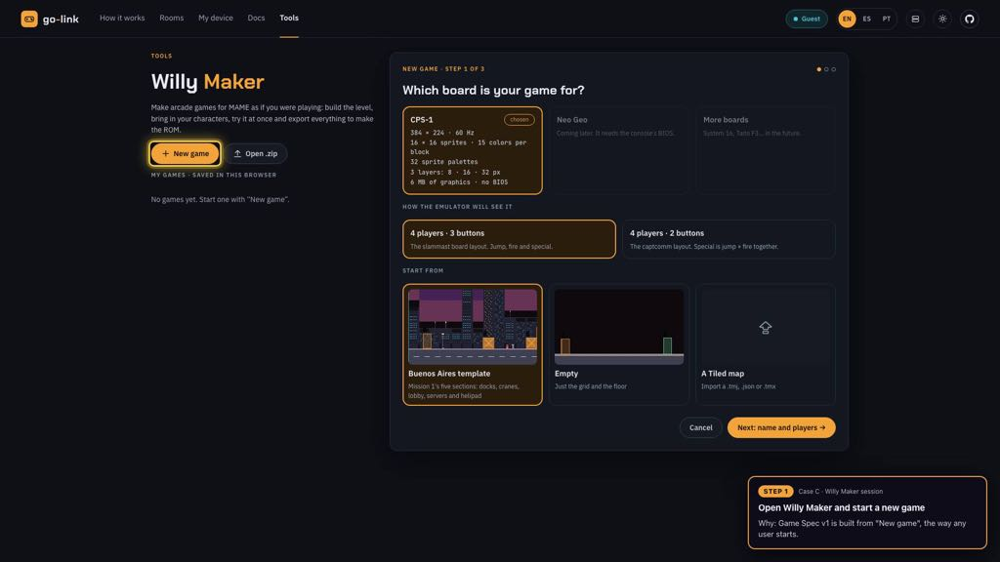</a> |
| 2 | 0:05 | **Keep the CPS-1 board with the slammast layout (4 players × 3 buttons)**<br>The spec's set is slammast: B1 jump, B2 fire, B3 special. | `role=radio[name~="4 players · 3 buttons"]` | <a href="evidence/session/shots/02.jpg">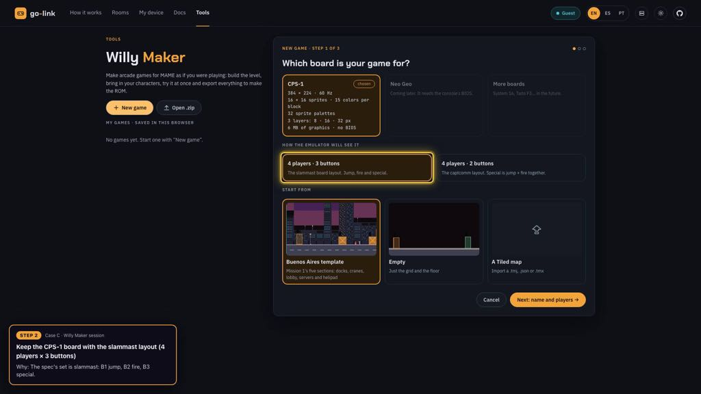</a> |
| 3 | 0:08 | **Start from the Empty template**<br>The spec's level is small (4 screens × 2) and its own; the Buenos Aires template is the whole mission. | `role=radio[name~="Empty"]` | <a href="evidence/session/shots/03.jpg">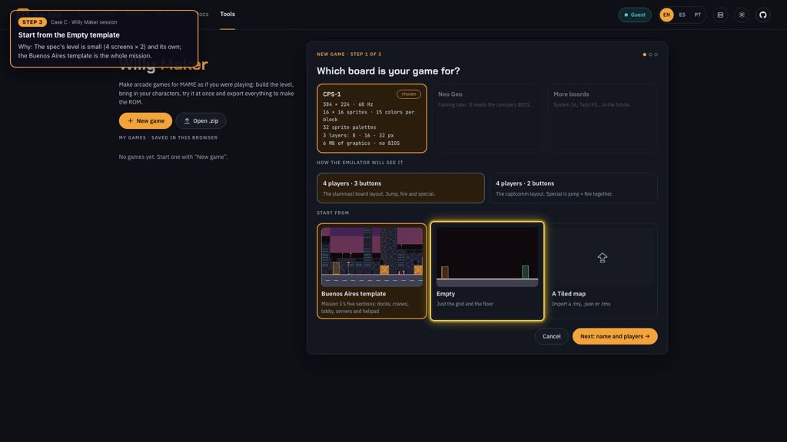</a> |
| 4 | 0:10 | **Next: name and players**<br>The wizard's second step. | `role=button[name~="Next: name and players"]` | <a href="evidence/session/shots/04.jpg">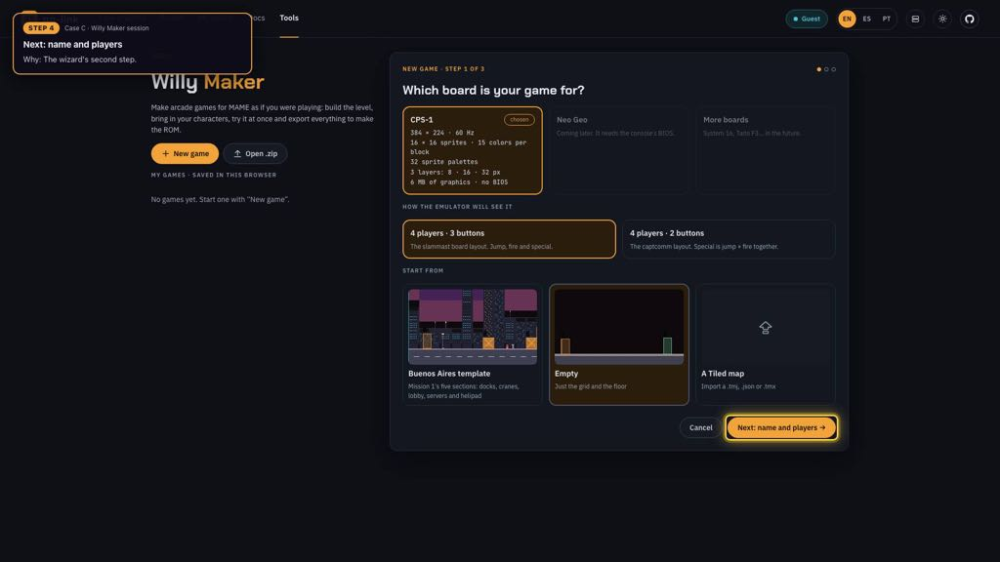</a> |
| 5 | 0:12 | **Type the game's title: Willy Gorklingo**<br>The title screen shows it (WILLY GORKLINGO, the board's font is uppercase). | `label="Game title"` | <a href="evidence/session/shots/05.jpg">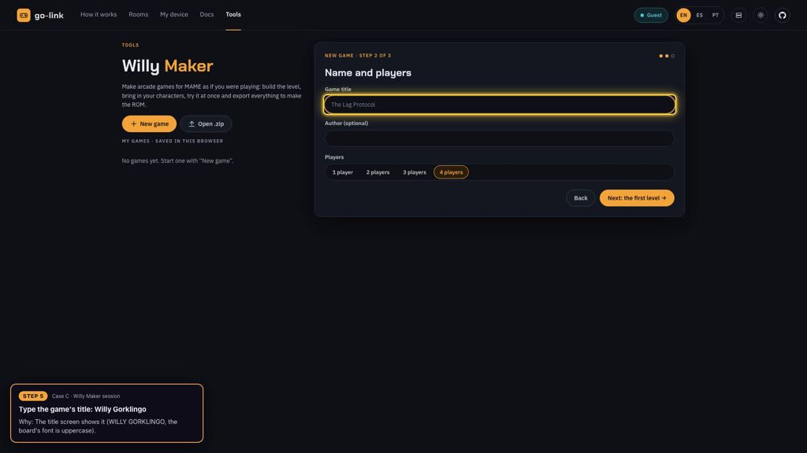</a> |
| 6 | 0:15 | **Type the author**<br>Recorded with the project. | `label="Author (optional)"` | <a href="evidence/session/shots/06.jpg">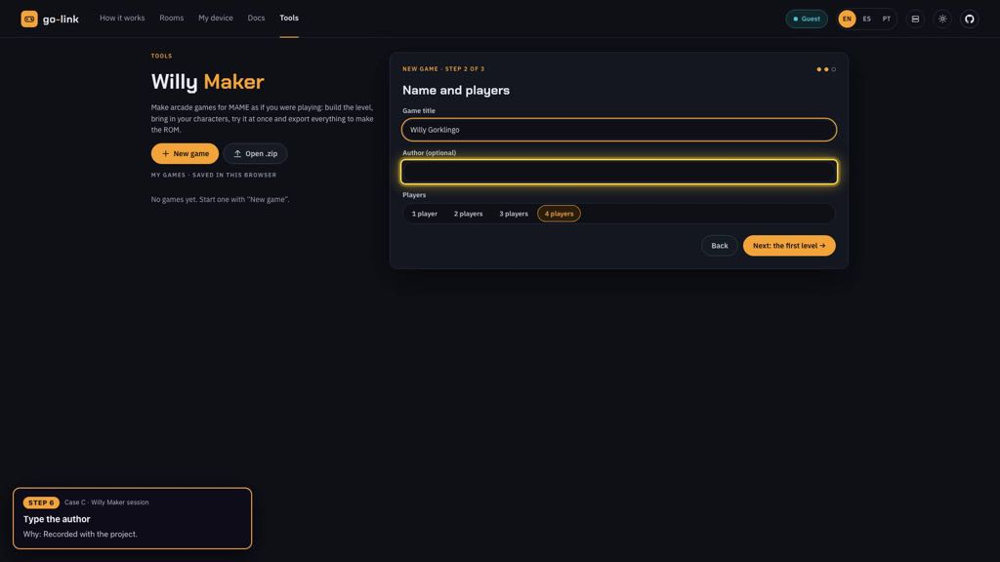</a> |
| 7 | 0:19 | **Choose 2 players**<br>The spec: P1 Willy and P2 a recruit play at once. | `role=radio[name="2 players"]` | <a href="evidence/session/shots/07.jpg">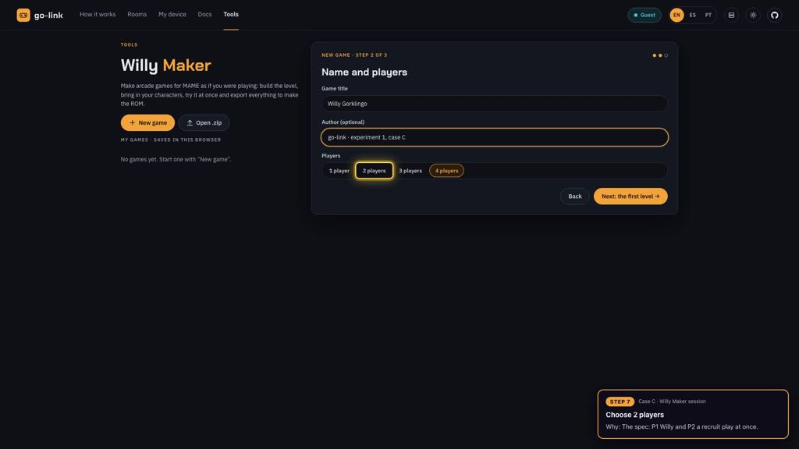</a> |
| 8 | 0:21 | **Next: the first level**<br>Its name and size come next. | `role=button[name~="Next: the first level"]` | <a href="evidence/session/shots/08.jpg">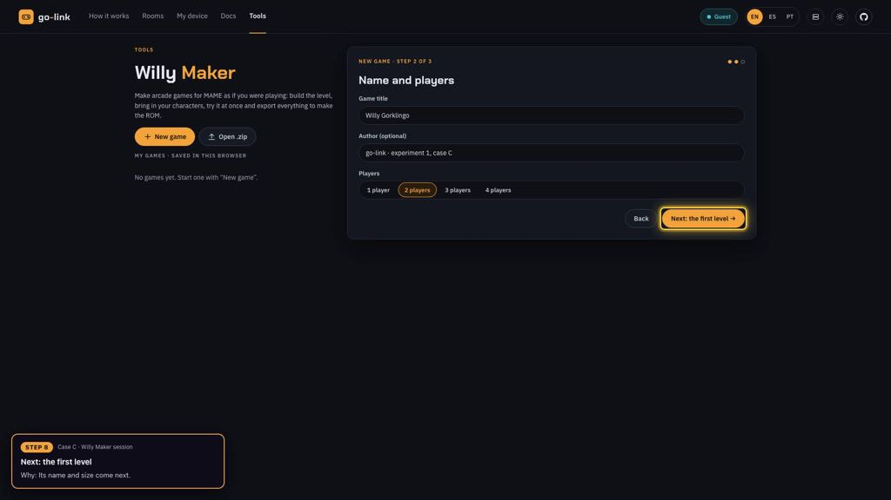</a> |
| 9 | 0:24 | **Name the level Dead Air**<br>Mission 1, section 1: the Puerto Madero docks. | `label="Level name"` | <a href="evidence/session/shots/09.jpg">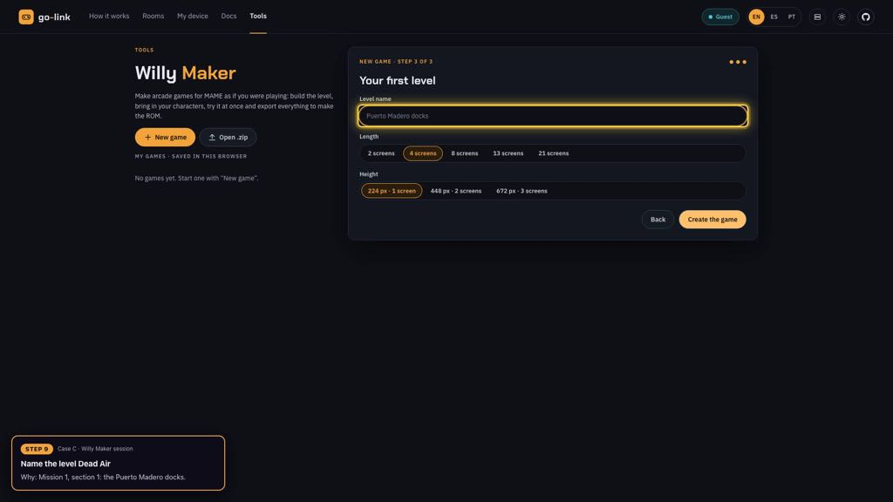</a> |
| 10 | 0:26 | **Length: 4 screens (1536 px)**<br>The spec's level is 1536 px wide. | `role=radio[name="4 screens"]` | <a href="evidence/session/shots/10.jpg">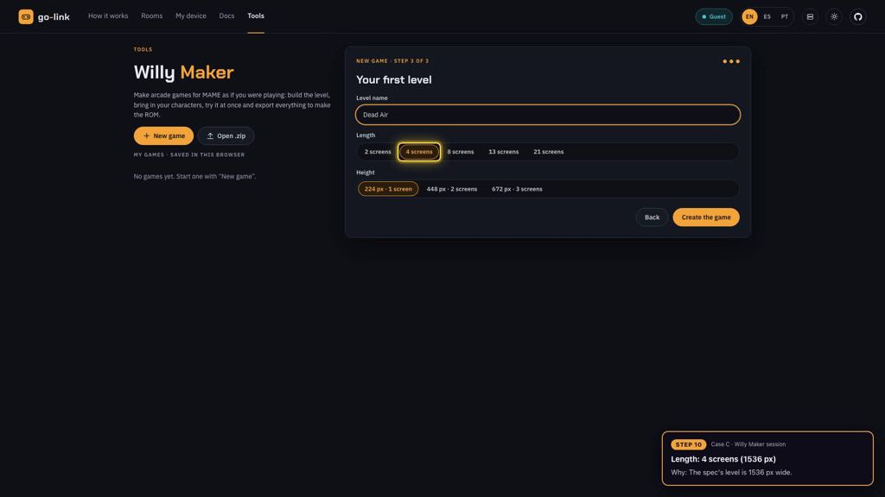</a> |
| 11 | 0:29 | **Height: 448 px (2 screens)**<br>The spec's level is 448 px tall, for the upper dock. | `role=radio[name~="448 px"]` | <a href="evidence/session/shots/11.jpg">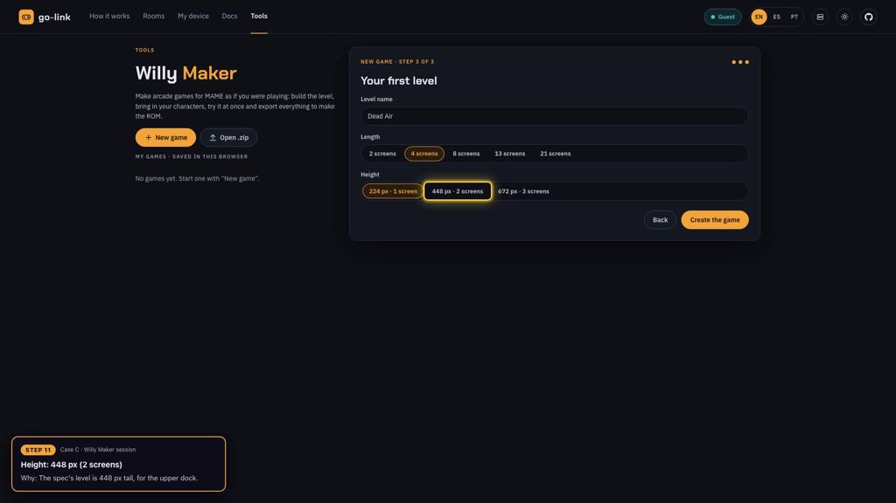</a> |
| 12 | 0:31 | **Create the game**<br>Willy Maker makes the level with its dock floor, the two players' starts and an exit. | `role=button[name="Create the game"]` | <a href="evidence/session/shots/12.jpg">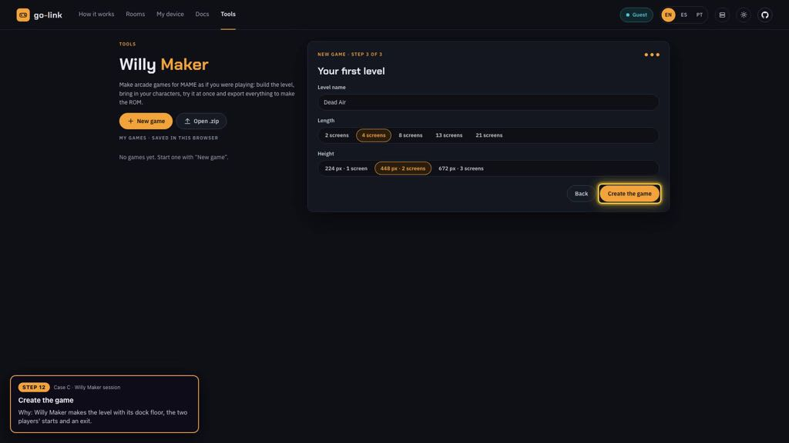</a> |

#### B. The night sky on the far layer (steps 13-23, video 0:34-1:07, 33 s)

| # | Video | Do this | Control | Screenshot |
|---|---|---|---|---|
| 13 | 0:34 | **Zoom out to see the whole level**<br>The 1536 × 448 level fits the canvas at about 80 %. | `role=button[name="Zoom out (−)"]` | <a href="evidence/session/shots/13.jpg">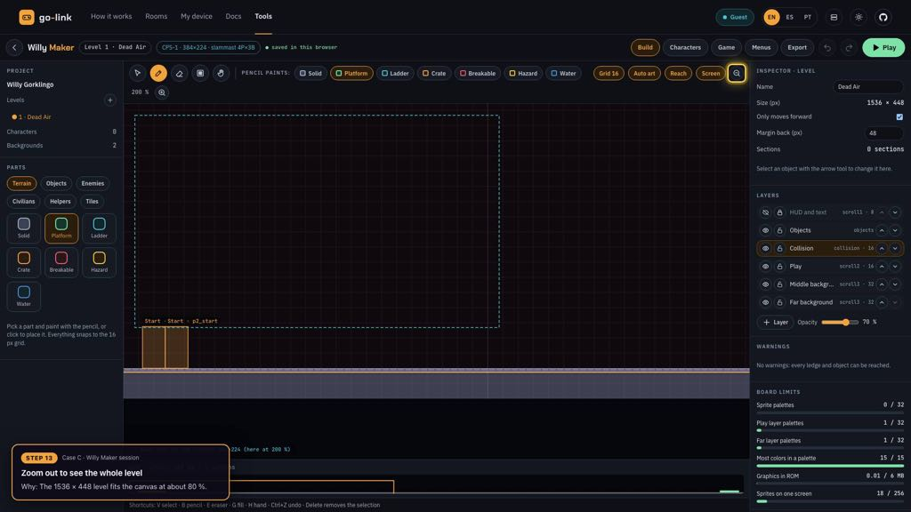</a> |
| 14 | 0:37 | **Center the view on the level with the map strip**<br>So every cell of the level is on the canvas. | `role=slider[name~="Level map"]` | <a href="evidence/session/shots/14.jpg">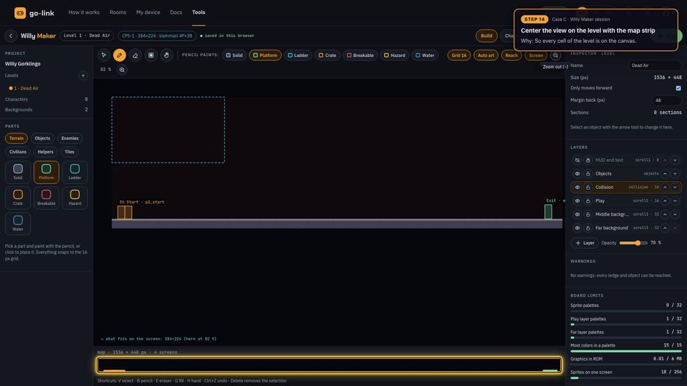</a> |
| 15 | 0:40 | **Select the Far background layer**<br>The spec's night palette and dark sky go on the far layer (scroll3, 32 px tiles). | `.wm-layer-name:has-text("Far background")` | <a href="evidence/session/shots/15.jpg">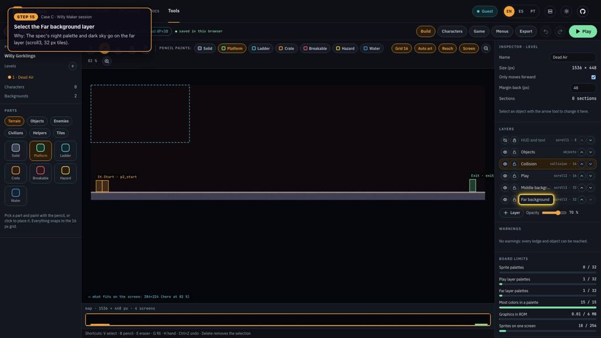</a> |
| 16 | 0:42 | **Open the Tiles parts**<br>The far layer's tileset is the starter night sky. | `button:has-text("Tiles")` | <a href="evidence/session/shots/16.jpg">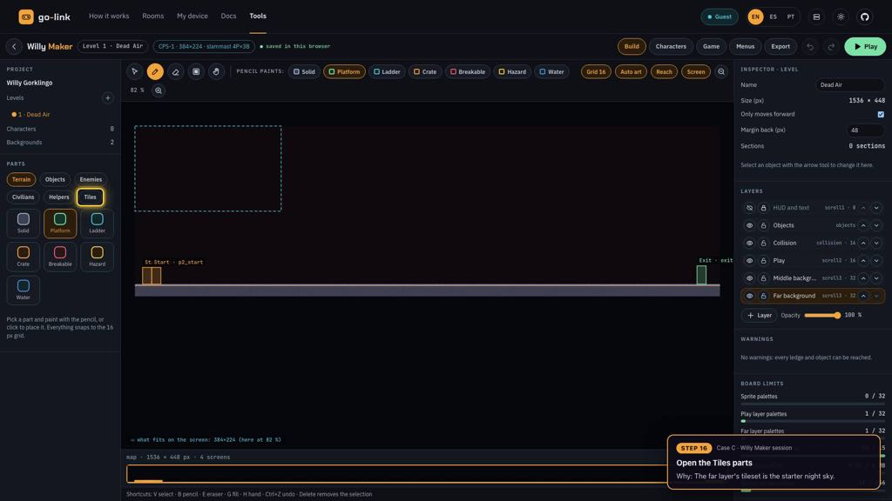</a> |
| 17 | 0:44 | **Pick the Fill tool**<br>A rectangle of tiles in one stroke. | `role=button[name="Fill a rectangle (G)"]` | <a href="evidence/session/shots/17.jpg">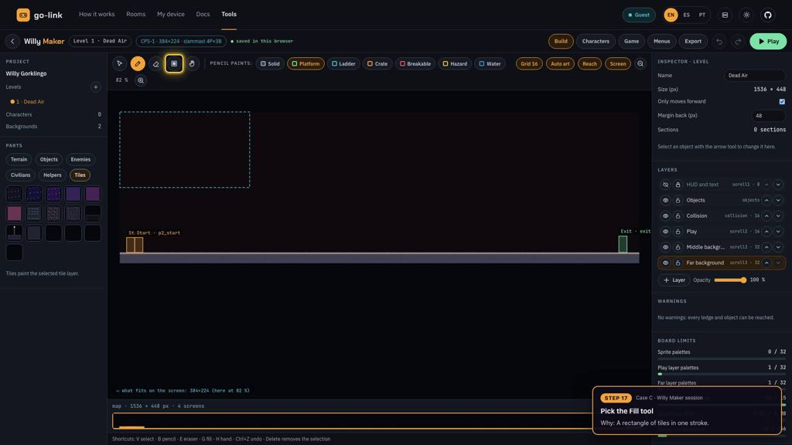</a> |
| 18 | 0:47 | **Pick sky tile 1**<br>Tile 1 of the night sky: the darkest sky at the top. | `role=button[name="Tile 1"]` | <a href="evidence/session/shots/18.jpg">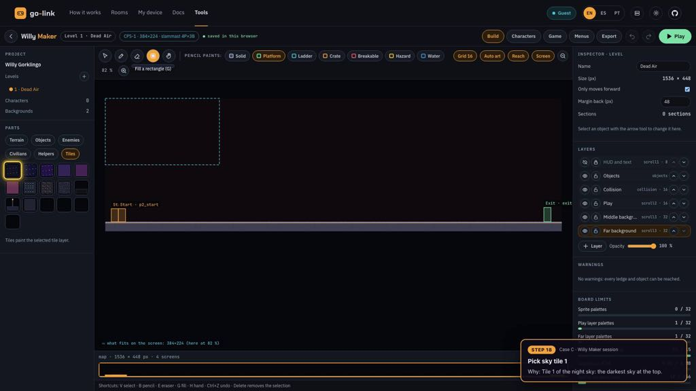</a> |
| 19 | 0:49 | **Fill the far layer's rows 0-4 with it**<br>A banded night sky, like the prototype's. | `canvas cells 32px (0,0)-(47,4)` | <a href="evidence/session/shots/19.jpg">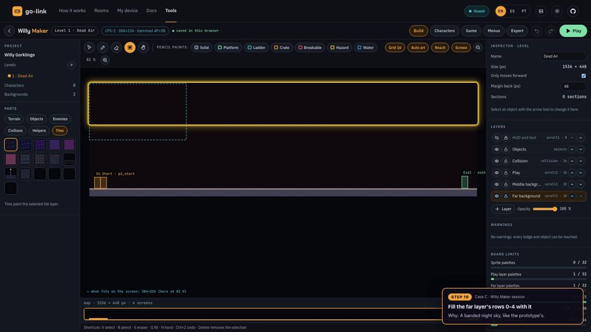</a> |
| 20 | 0:54 | **Pick sky tile 3**<br>Tile 3 of the night sky: a lighter band in the middle. | `role=button[name="Tile 3"]` | <a href="evidence/session/shots/20.jpg">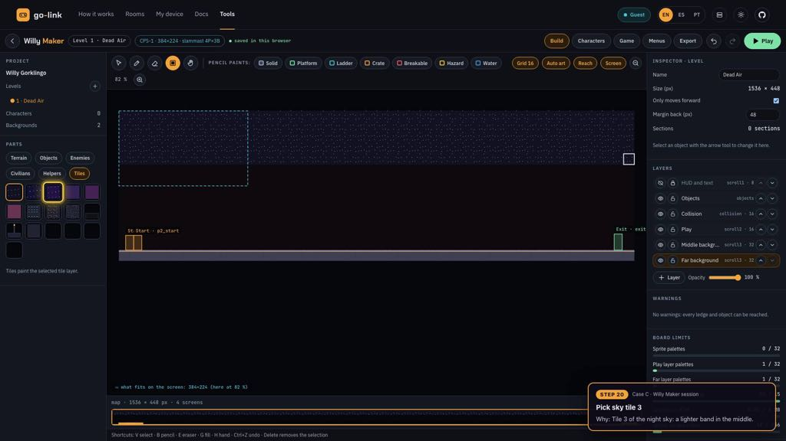</a> |
| 21 | 0:56 | **Fill the far layer's rows 5-9 with it**<br>A banded night sky, like the prototype's. | `canvas cells 32px (0,5)-(47,9)` | <a href="evidence/session/shots/21.jpg">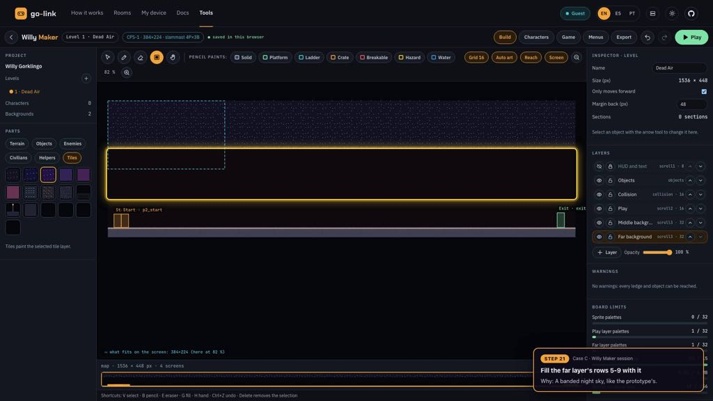</a> |
| 22 | 1:01 | **Pick sky tile 5**<br>Tile 5 of the night sky: the city glow near the horizon. | `role=button[name="Tile 5"]` | <a href="evidence/session/shots/22.jpg">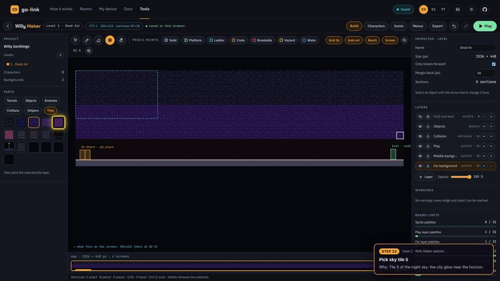</a> |
| 23 | 1:03 | **Fill the far layer's rows 10-13 with it**<br>A banded night sky, like the prototype's. | `canvas cells 32px (0,10)-(47,13)` | <a href="evidence/session/shots/23.jpg">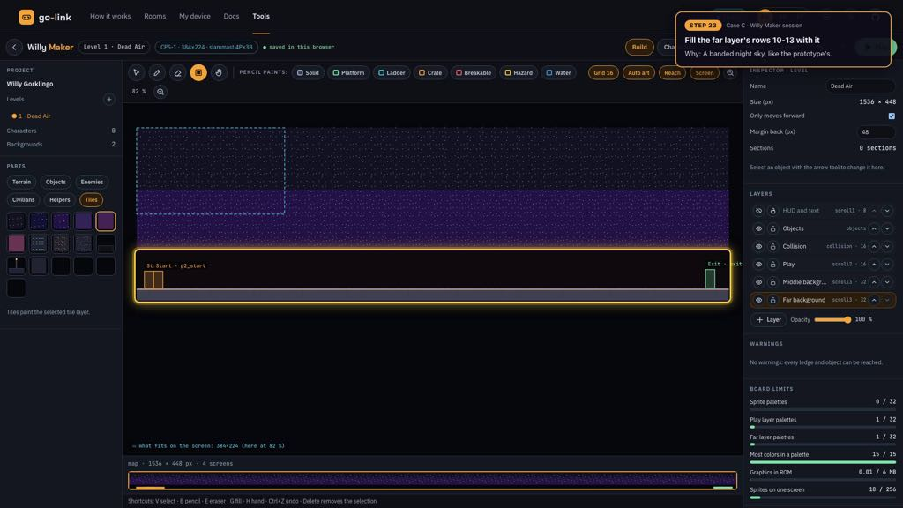</a> |

#### C. The level's shape: crates, ledge, ladder, upper dock (steps 24-37, video 1:07-1:46, 39 s)

| # | Video | Do this | Control | Screenshot |
|---|---|---|---|---|
| 24 | 1:07 | **Back to the Collision layer**<br>The level's shape is painted as collision tags; the street art follows them (Auto art). | `.wm-layer-name:has-text("Collision")` | <a href="evidence/session/shots/24.jpg">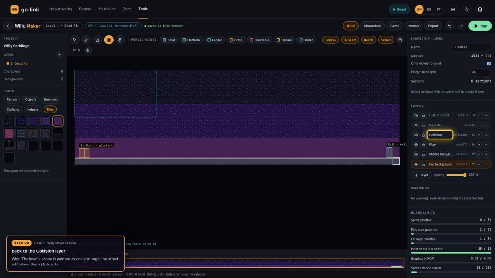</a> |
| 25 | 1:10 | **Open the Terrain parts**<br>Solid, platform, ladder and crate. | `button:has-text("Terrain")` | <a href="evidence/session/shots/25.jpg">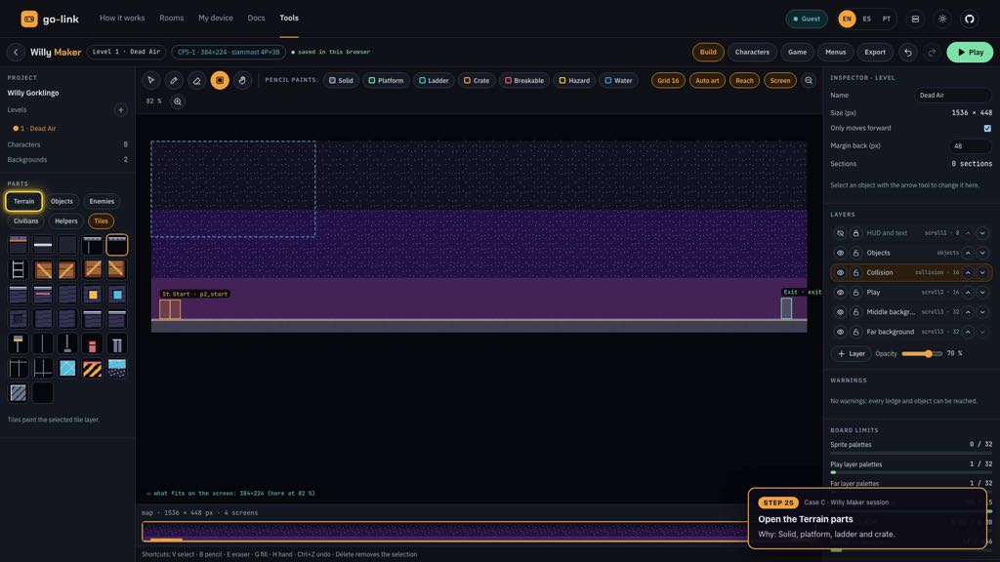</a> |
| 26 | 1:12 | **Pick the Pencil**<br>Crates are placed with one click each. | `role=button[name="Pencil: paint the part (B)"]` | <a href="evidence/session/shots/26.jpg">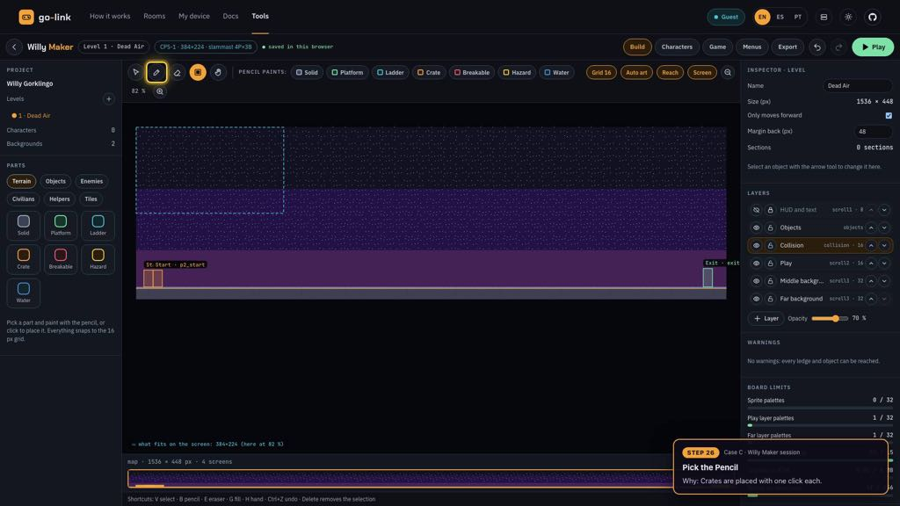</a> |
| 27 | 1:14 | **Pick the Crate part**<br>32 px crates, climbed by pushing. | `.wm-part:has-text("Crate")` | <a href="evidence/session/shots/27.jpg">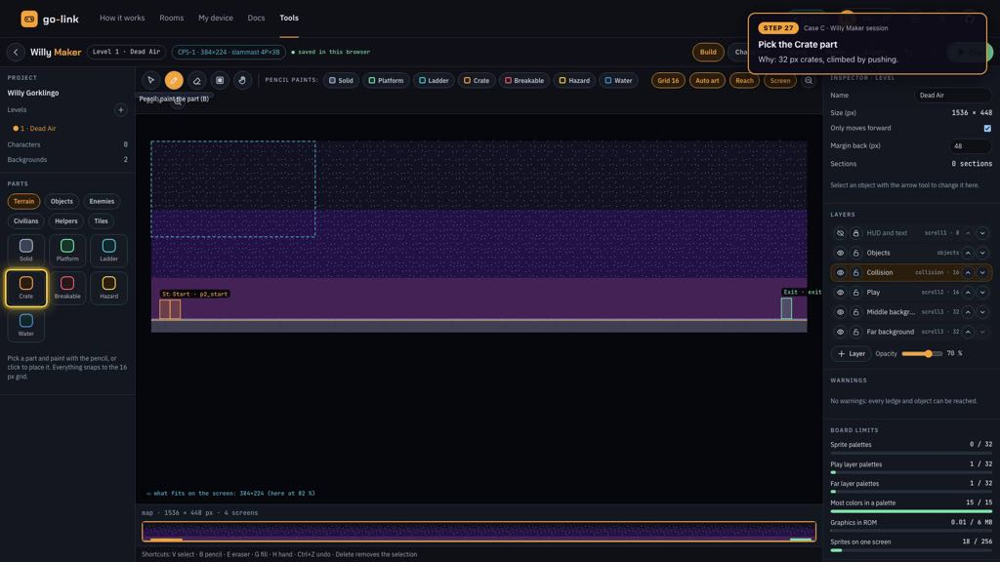</a> |
| 28 | 1:17 | **Place a crate on the dock at x 160**<br>The first step of the stack: 32 px. | `canvas cell (10,24)` | <a href="evidence/session/shots/28.jpg">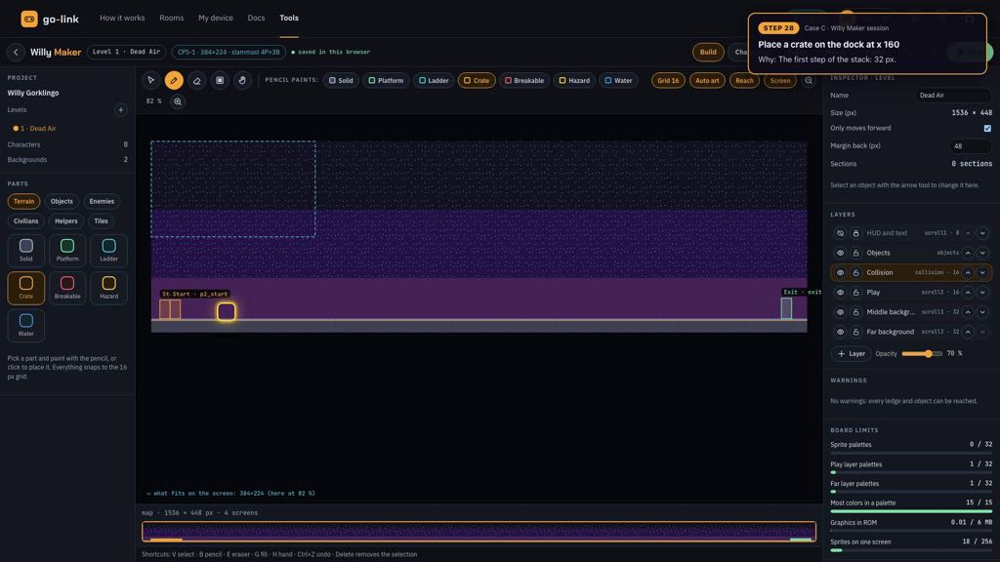</a> |
| 29 | 1:19 | **Place a crate next to it at x 192**<br>The bottom of the 64 px stack. | `canvas cell (12,24)` | <a href="evidence/session/shots/29.jpg">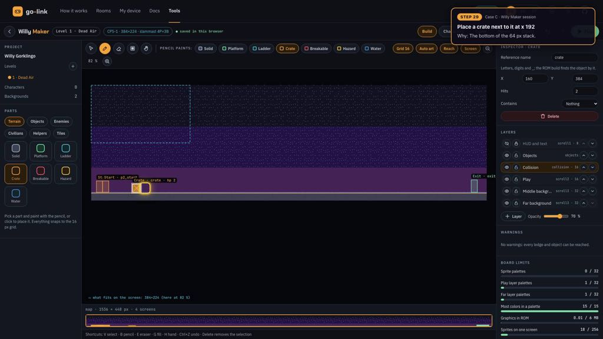</a> |
| 30 | 1:21 | **Stack a crate on top of it**<br>The stack is now 64 px: pushed up from the 32 px crate, then a jump. | `canvas cell (12,22)` | <a href="evidence/session/shots/30.jpg">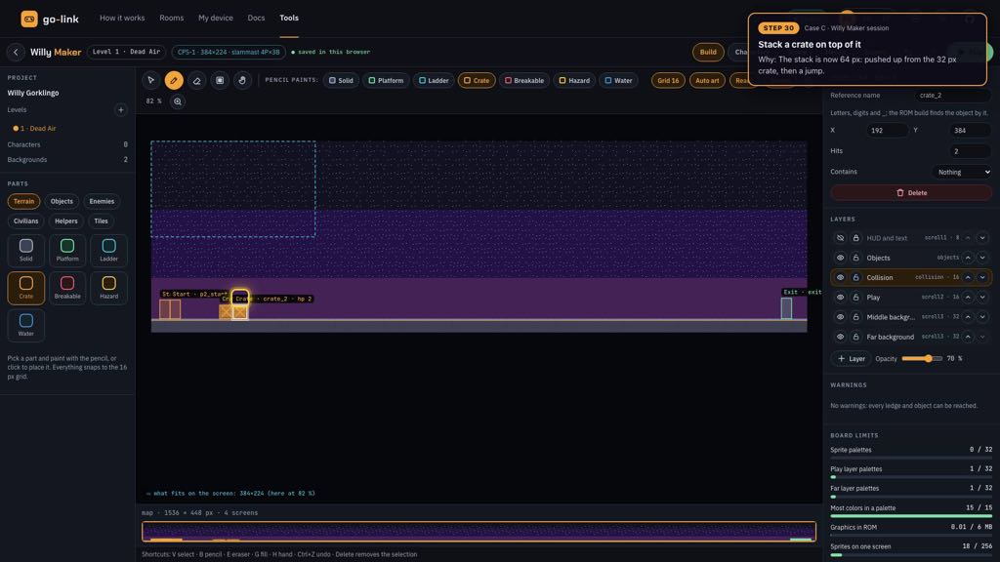</a> |
| 31 | 1:24 | **Pick the Fill tool again**<br>Ledges, ladders and docks are rectangles of tags. | `role=button[name="Fill a rectangle (G)"]` | <a href="evidence/session/shots/31.jpg">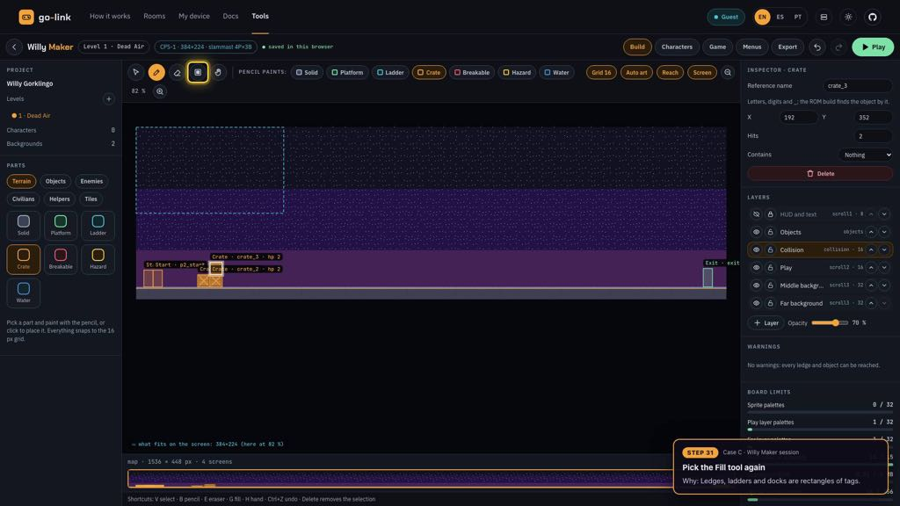</a> |
| 32 | 1:26 | **Pick the Platform part (one-way)**<br>Stood on, jumped up through, and down + B1 drops through it. | `.wm-part:has-text("Platform")` | <a href="evidence/session/shots/32.jpg">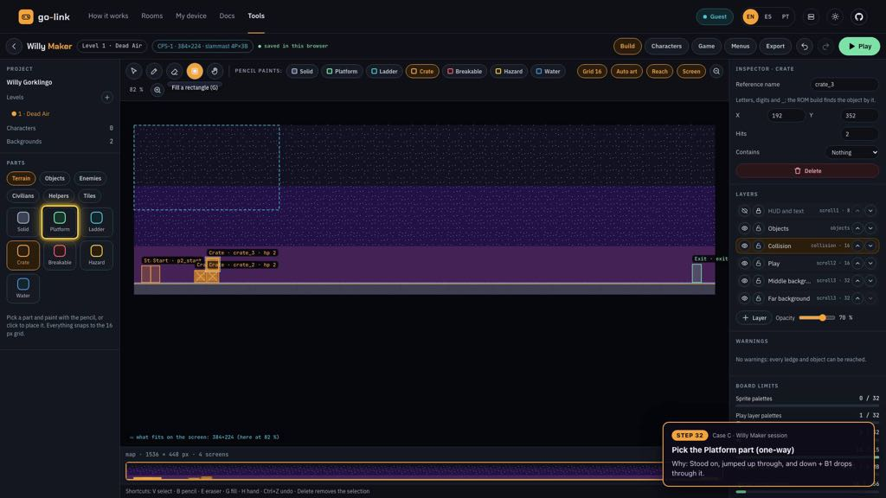</a> |
| 33 | 1:28 | **Draw the one-way ledge 64 px up, x 256-367**<br>Reached by a jump from the crate stack; down + B1 is its way down. | `canvas cells (16,22)-(22,22)` | <a href="evidence/session/shots/33.jpg">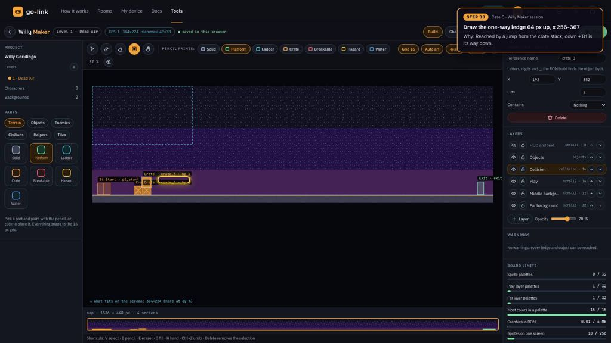</a> |
| 34 | 1:33 | **Pick the Ladder part**<br>The way up to the upper dock. | `.wm-part:has-text("Ladder")` | <a href="evidence/session/shots/34.jpg">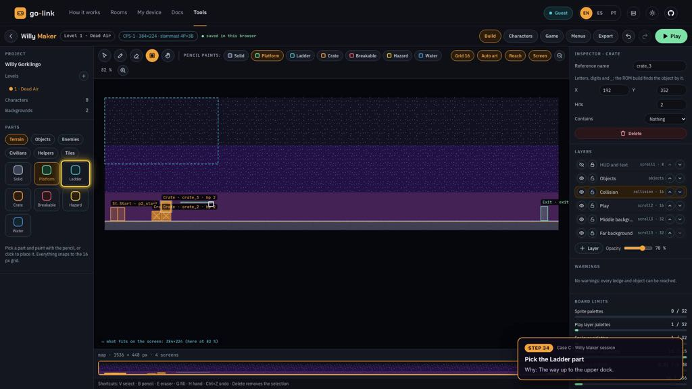</a> |
| 35 | 1:35 | **Draw the ladder at x 480, 160 px tall**<br>From the dock floor (y 416) up to the upper dock (y 256). | `canvas cells (30,16)-(30,25)` | <a href="evidence/session/shots/35.jpg">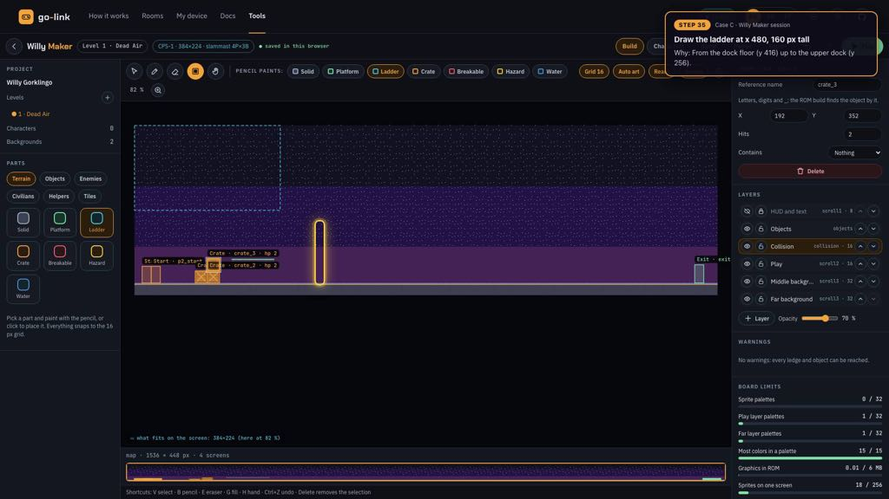</a> |
| 36 | 1:40 | **Pick the Solid part**<br>The upper dock is a solid floor. | `.wm-part:has-text("Solid")` | <a href="evidence/session/shots/36.jpg">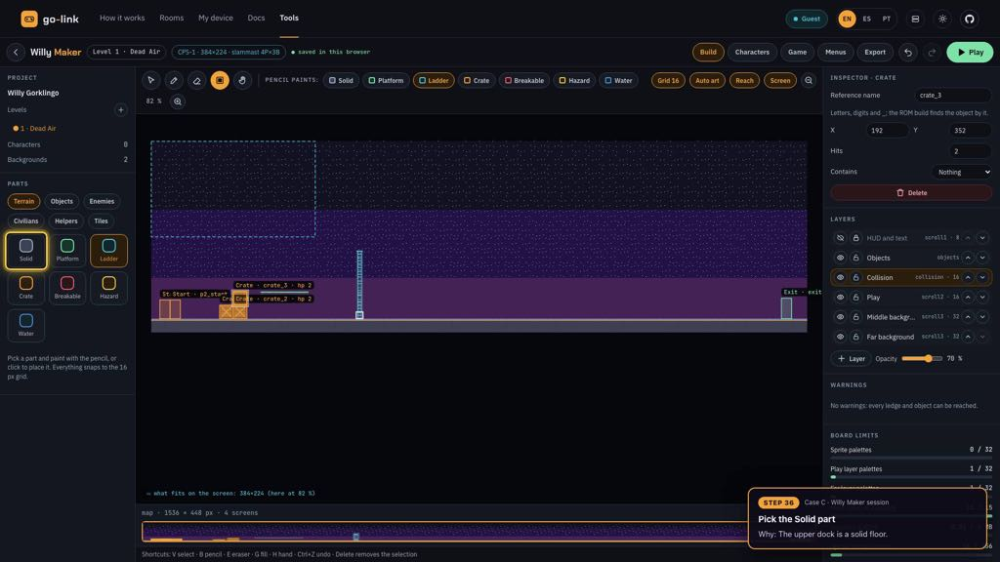</a> |
| 37 | 1:42 | **Draw the upper dock, x 496-1023 at y 256**<br>The second floor; its right end is open, so players drop back to the lower dock. | `canvas cells (31,16)-(63,16)` | <a href="evidence/session/shots/37.jpg">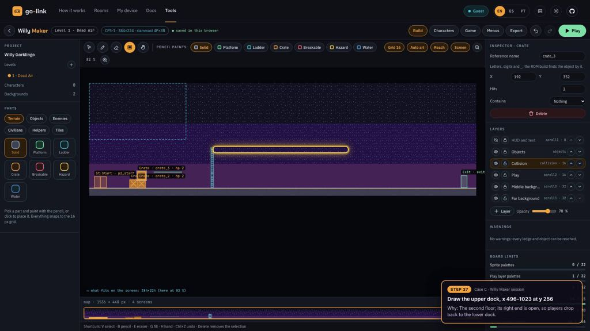</a> |

#### D. Troopers, civilians and the exit (steps 38-54, video 1:46-2:27, 41 s)

| # | Video | Do this | Control | Screenshot |
|---|---|---|---|---|
| 38 | 1:46 | **Pick the Pencil**<br>Enemies, civilians and the exit are placed by clicking. | `role=button[name="Pencil: paint the part (B)"]` | <a href="evidence/session/shots/38.jpg">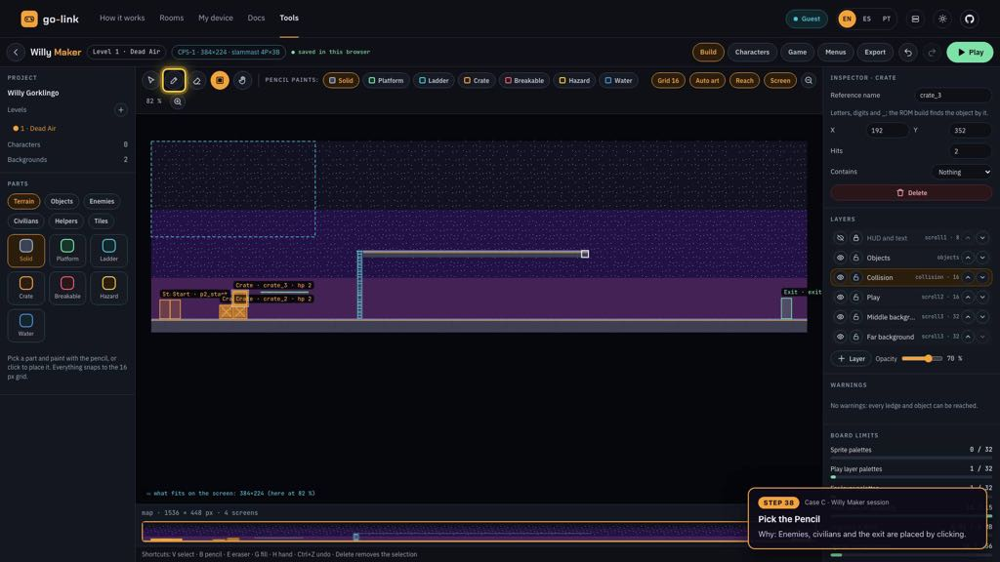</a> |
| 39 | 1:49 | **Open the Enemies parts**<br>The spec's enemy is the Trooper. | `button:has-text("Enemies")` | <a href="evidence/session/shots/39.jpg">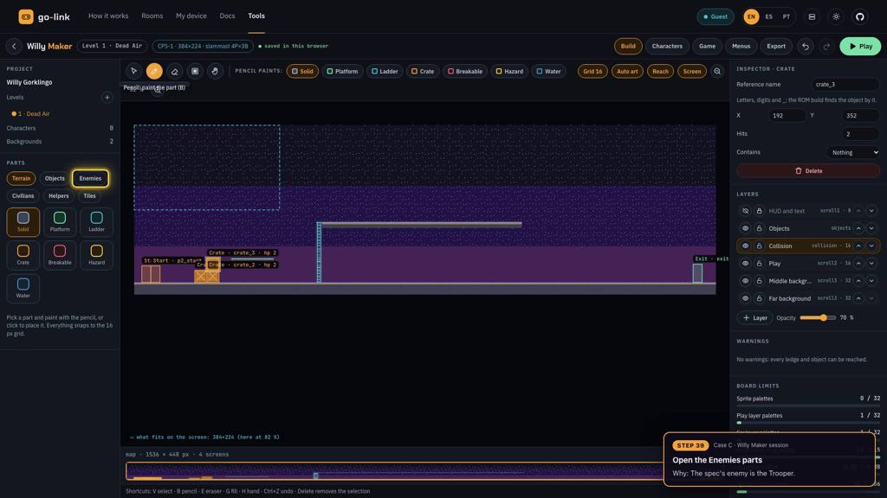</a> |
| 40 | 1:51 | **Pick the Trooper**<br>Each Trooper walks a 96 px patrol and turns at its ends. | `.wm-part:has-text("Trooper")` | <a href="evidence/session/shots/40.jpg">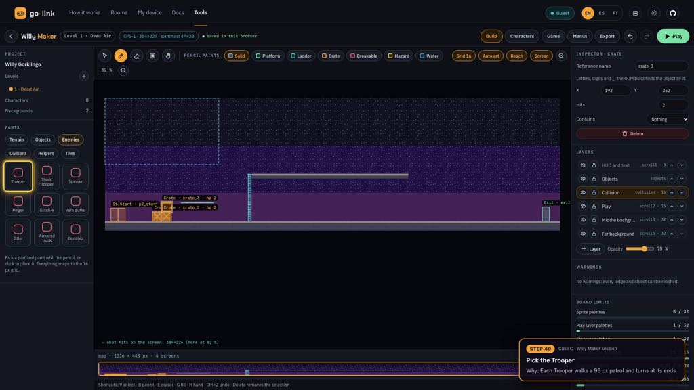</a> |
| 41 | 1:54 | **Place a Trooper at x 640, on the lower dock, under the upper dock**<br>The spec's three enemies: lower dock, upper dock, exit. | `canvas world (640,416)` | <a href="evidence/session/shots/41.jpg">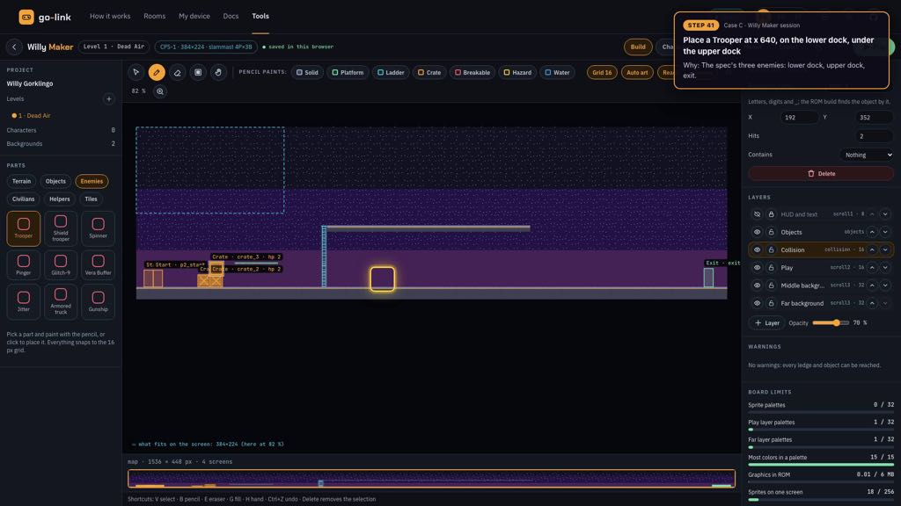</a> |
| 42 | 1:56 | **Place a Trooper at x 800, on the upper dock**<br>The spec's three enemies: lower dock, upper dock, exit. | `canvas world (800,256)` | <a href="evidence/session/shots/42.jpg">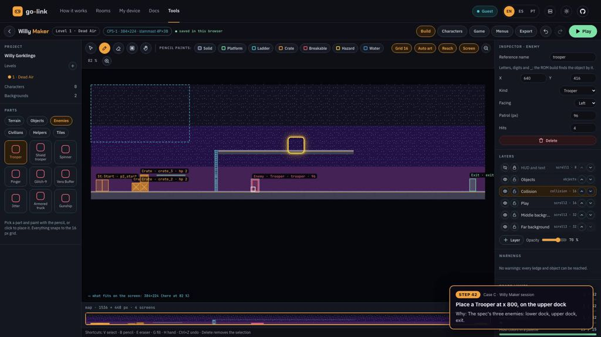</a> |
| 43 | 1:58 | **Place a Trooper at x 1360, guarding the exit**<br>The spec's three enemies: lower dock, upper dock, exit. | `canvas world (1360,416)` | <a href="evidence/session/shots/43.jpg">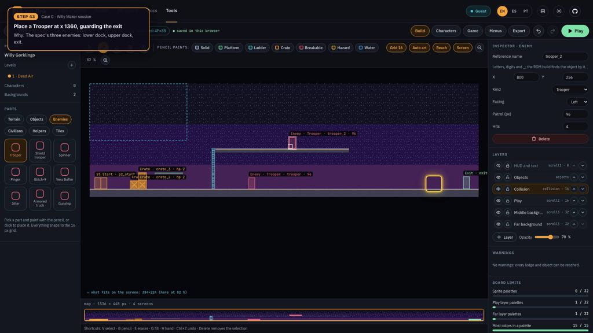</a> |
| 44 | 2:01 | **Open the Civilians parts**<br>Two civilians to rescue by touching them. | `button:has-text("Civilians")` | <a href="evidence/session/shots/44.jpg">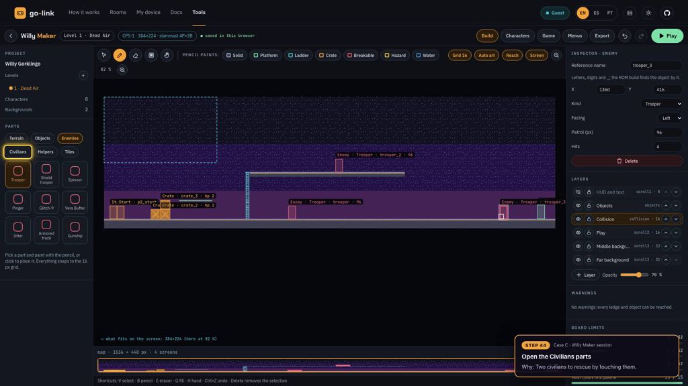</a> |
| 45 | 2:03 | **Pick the Woman**<br>The first civilian waits on the one-way ledge. | `.wm-part:has-text("Woman")` | <a href="evidence/session/shots/45.jpg">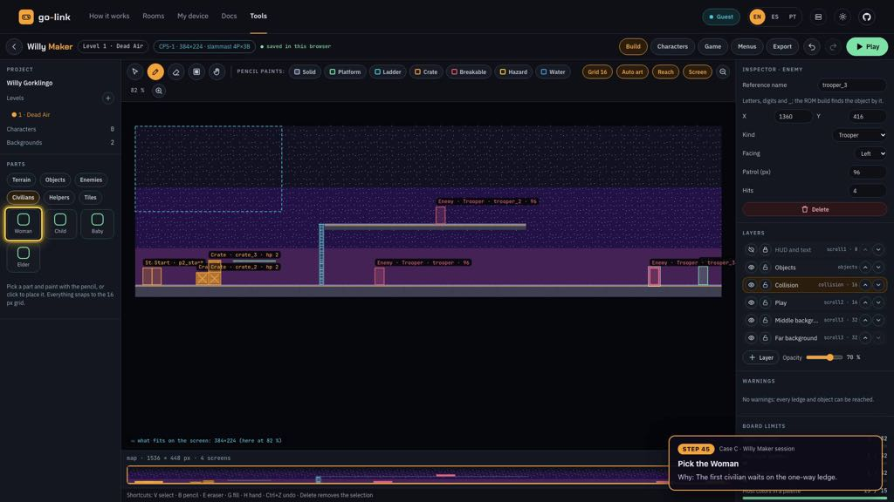</a> |
| 46 | 2:05 | **Place her on the ledge at x 320**<br>Rescued after the jump from the crates. | `canvas world (320,352)` | <a href="evidence/session/shots/46.jpg">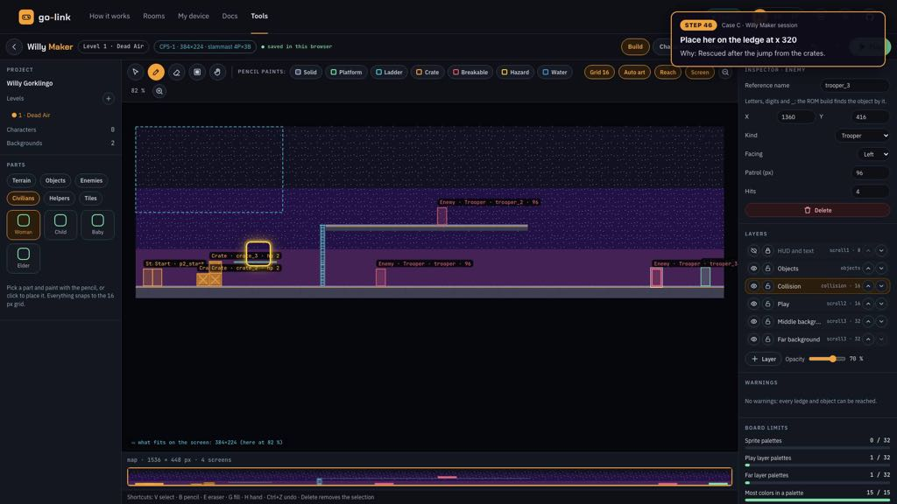</a> |
| 47 | 2:07 | **Pick the Child**<br>The second civilian waits on the upper dock. | `.wm-part:has-text("Child")` | <a href="evidence/session/shots/47.jpg">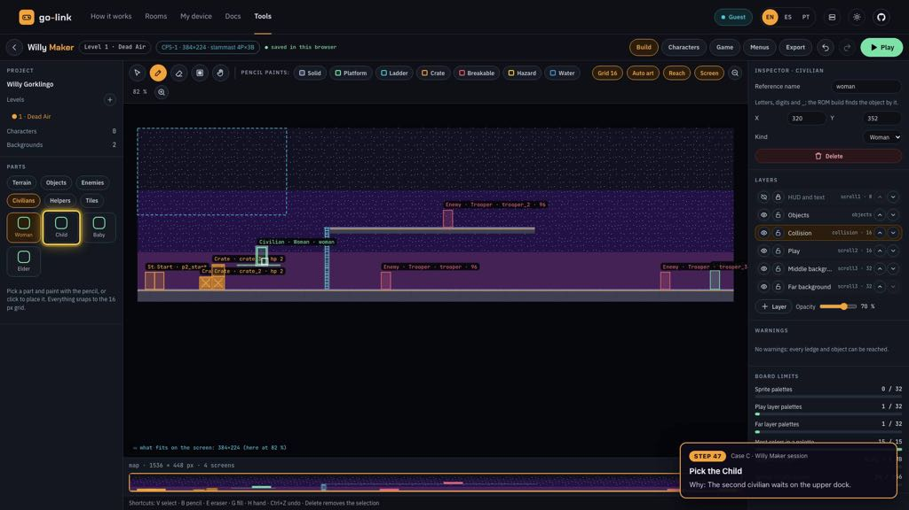</a> |
| 48 | 2:10 | **Place the child on the upper dock at x 960**<br>Past the upper dock's Trooper. | `canvas world (960,256)` | <a href="evidence/session/shots/48.jpg">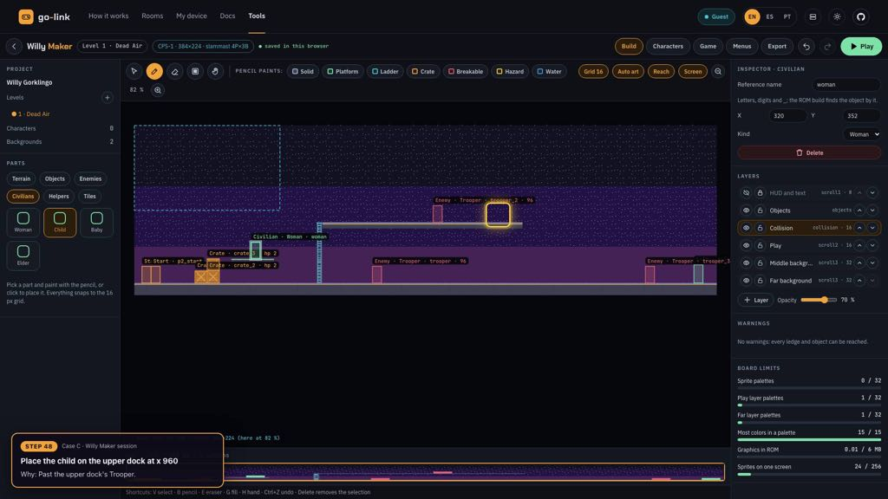</a> |
| 49 | 2:12 | **Open the Helpers parts**<br>Starts, checkpoints, camera locks and the exit. | `button:has-text("Helpers")` | <a href="evidence/session/shots/49.jpg">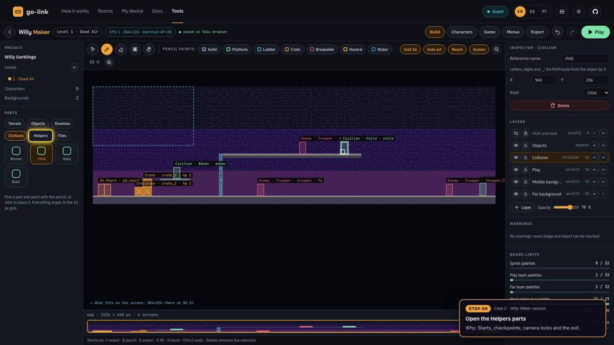</a> |
| 50 | 2:14 | **Pick the Exit**<br>The spec's exit is at x 1440-1504 on the lower dock. | `.wm-part:has-text("exit")` | <a href="evidence/session/shots/50.jpg">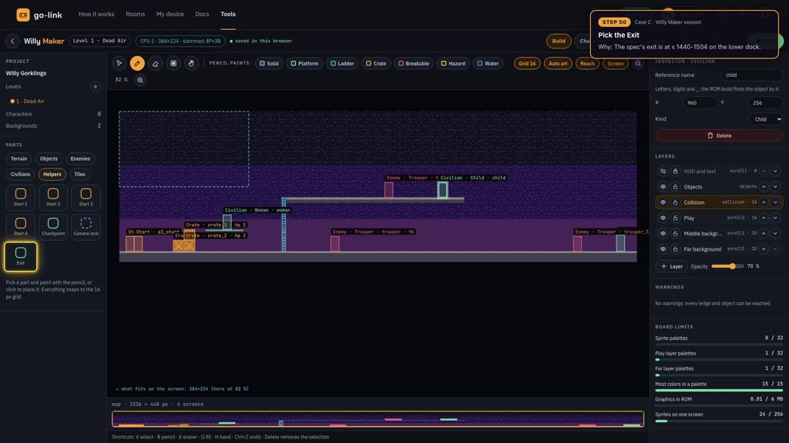</a> |
| 51 | 2:17 | **Place the exit at x 1440 on the lower dock**<br>A new exit replaces the one the template made at x 1488. | `canvas world (1440,416)` | <a href="evidence/session/shots/51.jpg">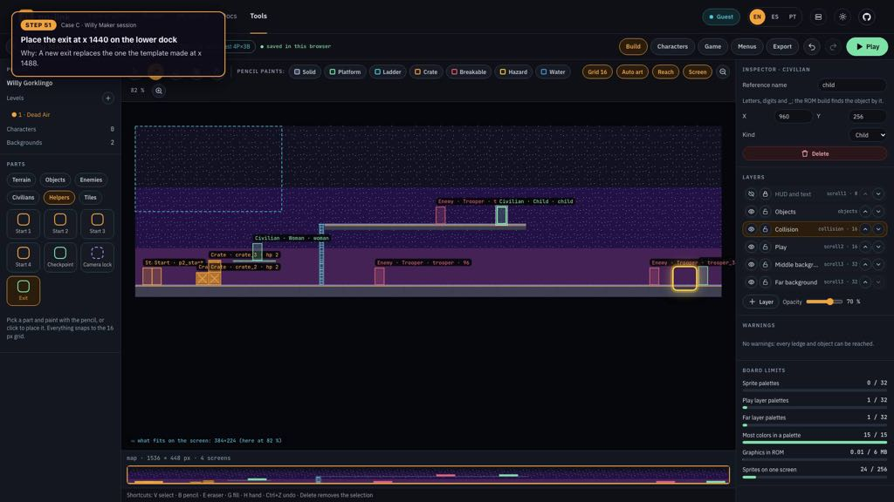</a> |
| 52 | 2:19 | **Make the exit 64 px wide in the inspector**<br>x 1440 to 1504, as the spec says. | `role=spinbutton[name="Width"]` | <a href="evidence/session/shots/52.jpg">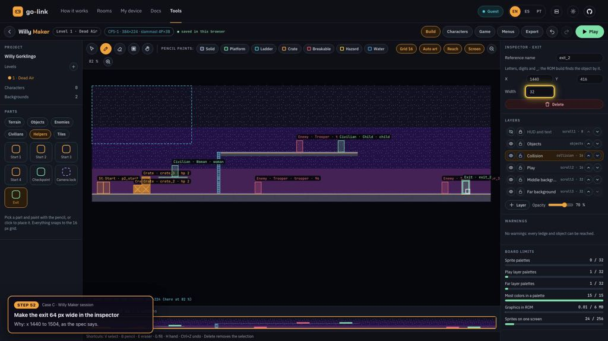</a> |
| 53 | 2:22 | **Check the level with Reach**<br>Willy Maker shades what players cannot get to; nothing should be left out. | `role=button[name="Reach"]` | <a href="evidence/session/shots/53.jpg">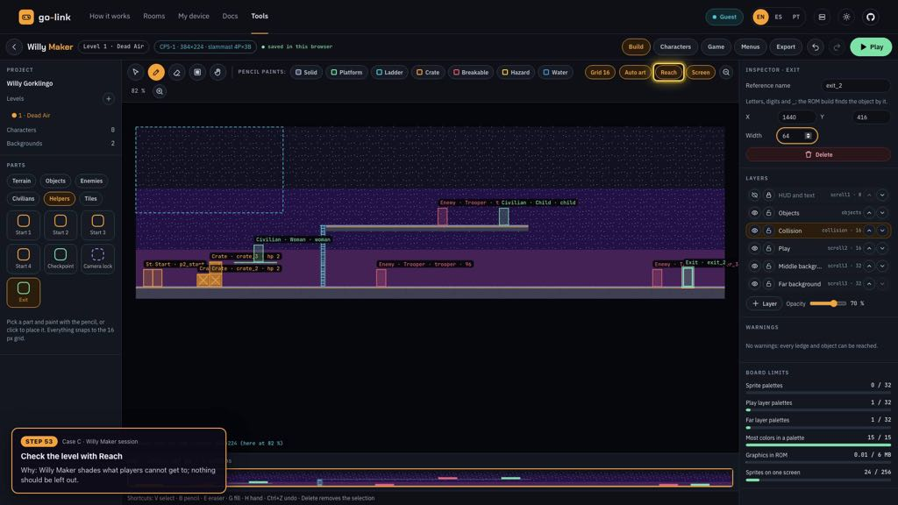</a> |
| 54 | 2:25 | **Turn Reach off again**<br>The level reads better without the shading. | `role=button[name="Reach"]` | <a href="evidence/session/shots/54.jpg">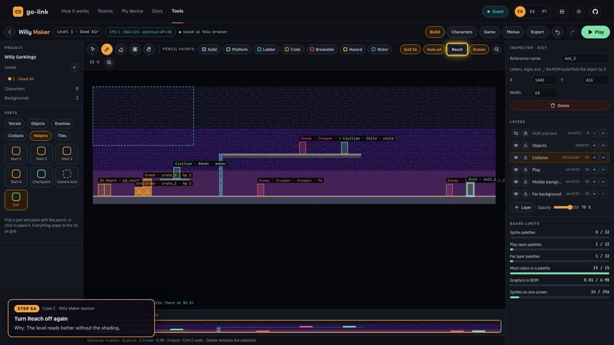</a> |

#### E. The rules (Game tab) (steps 55-65, video 2:27-2:54, 27 s)

| # | Video | Do this | Control | Screenshot |
|---|---|---|---|---|
| 55 | 2:27 | **Open the Game tab**<br>The spec's rules are set in the Rules card. | `button:has-text("Game")` | <a href="evidence/session/shots/55.jpg">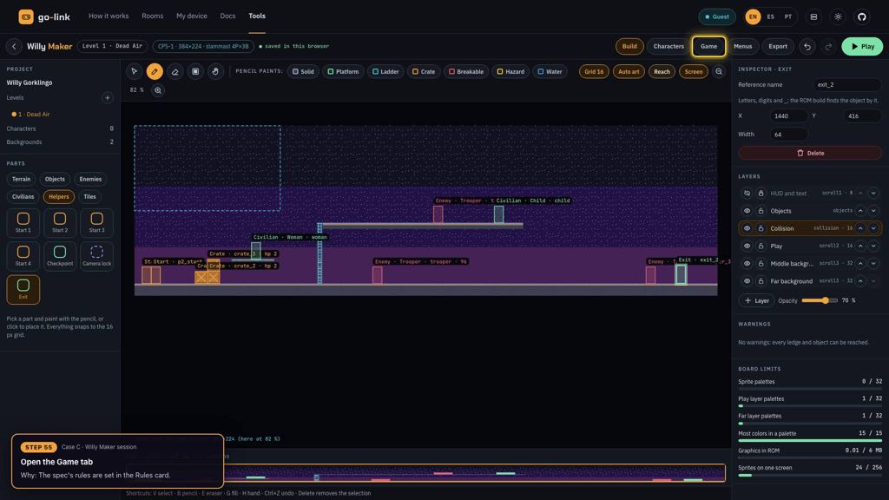</a> |
| 56 | 2:29 | **Enemies take 3 hits**<br>The spec: a Trooper takes 3 shots. | `role=spinbutton[name="Hits an enemy takes"]` | <a href="evidence/session/shots/56.jpg">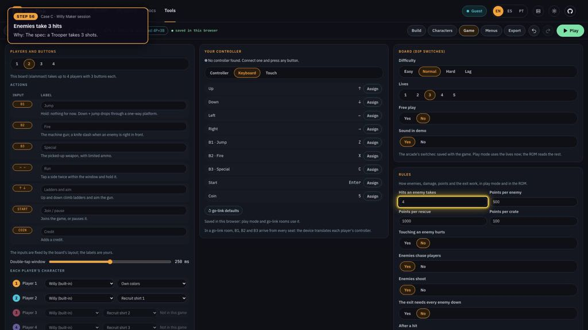</a> |
| 57 | 2:32 | **100 points per enemy**<br>The spec: each Trooper gives 100 points. | `role=spinbutton[name="Points per enemy"]` | <a href="evidence/session/shots/57.jpg">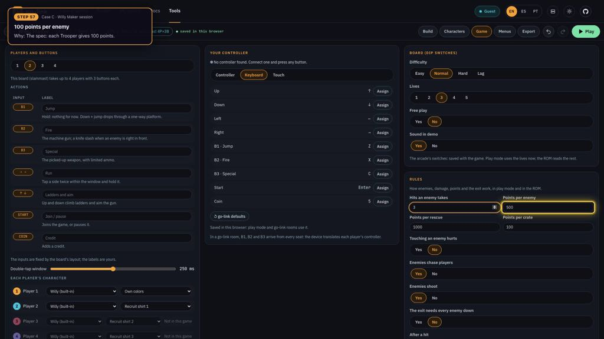</a> |
| 58 | 2:35 | **500 points per rescue**<br>The spec: each civilian gives 500 points. | `role=spinbutton[name="Points per rescue"]` | <a href="evidence/session/shots/58.jpg">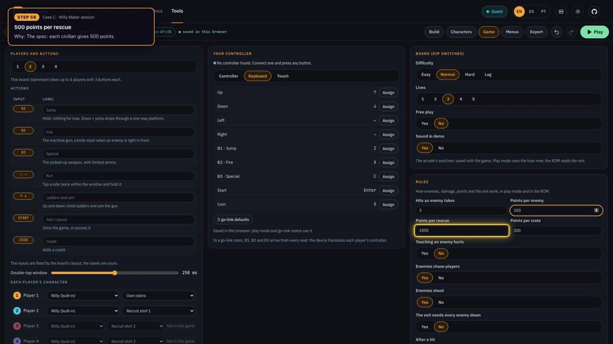</a> |
| 59 | 2:37 | **Touching an enemy hurts: Yes**<br>The spec: they hurt a player on touch. | `radiogroup "Touching an enemy hurts" > radio "Yes"` | <a href="evidence/session/shots/59.jpg">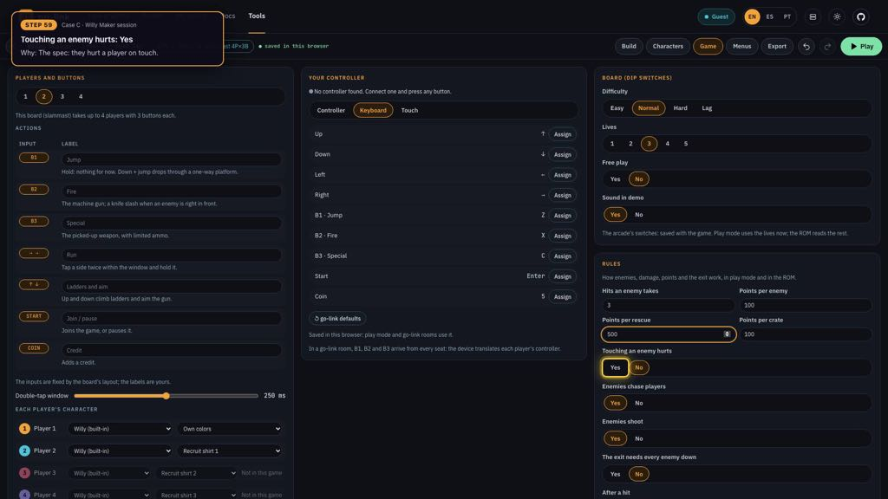</a> |
| 60 | 2:39 | **Enemies chase players: No**<br>The spec's Troopers walk their patrol and turn at its ends. | `radiogroup "Enemies chase players" > radio "No"` | <a href="evidence/session/shots/60.jpg">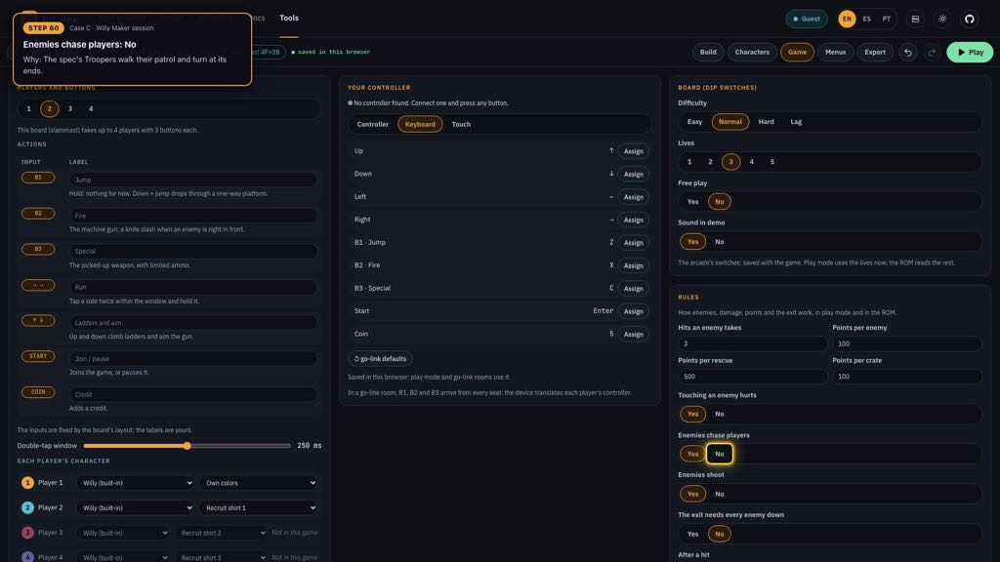</a> |
| 61 | 2:42 | **Enemies shoot: No**<br>The spec gives them touch damage only. | `radiogroup "Enemies shoot" > radio "No"` | <a href="evidence/session/shots/61.jpg">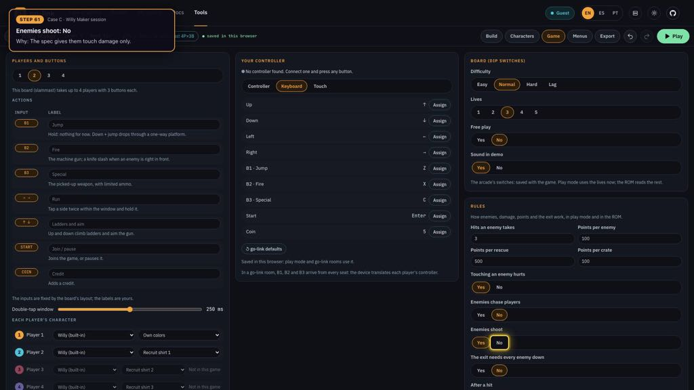</a> |
| 62 | 2:44 | **The exit needs every enemy down: Yes**<br>The spec: reaching the exit with all enemies down shows SECTION CLEAR. | `radiogroup "The exit needs every enemy down" > radio "Yes"` | <a href="evidence/session/shots/62.jpg">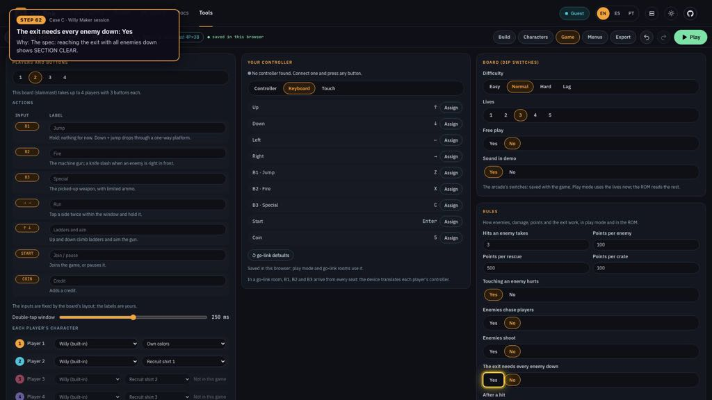</a> |
| 63 | 2:47 | **After a hit: blink in place**<br>The spec: the player blinks and loses 1 of 3 energy. | `radiogroup "After a hit" > radio "Blink in place"` | <a href="evidence/session/shots/63.jpg">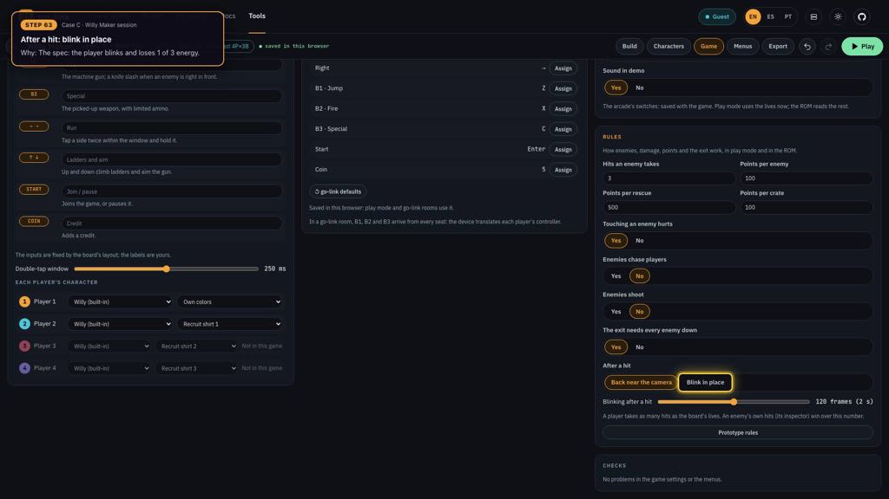</a> |
| 64 | 2:49 | **Blink for 1 s (60 frames)**<br>The spec: the player blinks 1 s. | `role=slider[name="Blinking after a hit"]` | <a href="evidence/session/shots/64.jpg">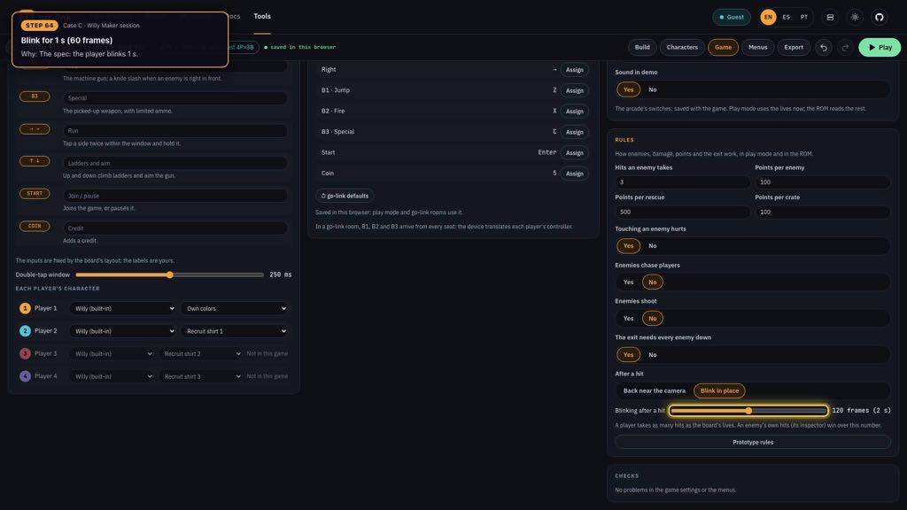</a> |
| 65 | 2:52 | **Keep 3 lives (energy 3)**<br>The spec: 1 of 3 energy per hit. | `radiogroup "Lives" > radio "3"` | <a href="evidence/session/shots/65.jpg">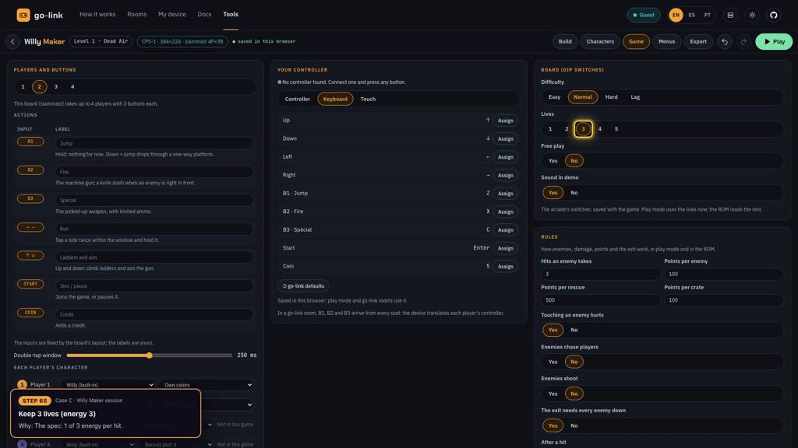</a> |

#### F. Try it in play mode (steps 66-68, video 2:54-3:05, 11 s)

| # | Video | Do this | Control | Screenshot |
|---|---|---|---|---|
| 66 | 2:54 | **Try it at once: Play**<br>Willy Maker runs the level in the browser with the same rules the ROM gets. | `role=button[name="Play"]` | <a href="evidence/session/shots/66.jpg">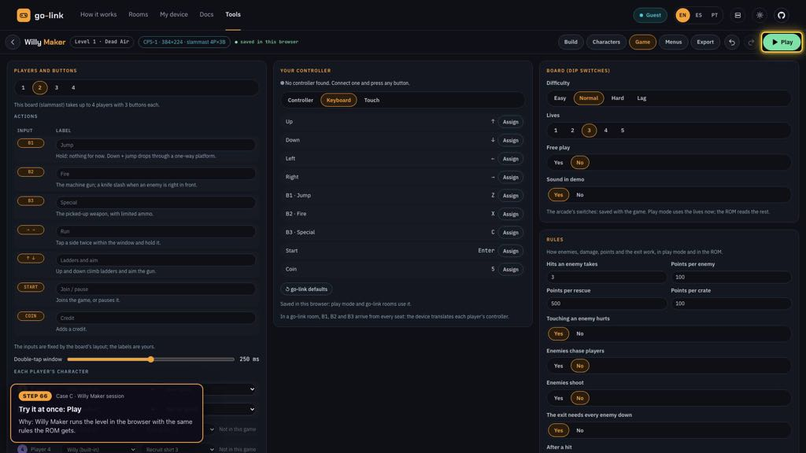</a> |
| 67 | 2:58 | **Walk right toward the crates (arrow key)**<br>A quick feel of the start before making the ROM. | `keyboard ArrowRight` | <a href="evidence/session/shots/67.jpg">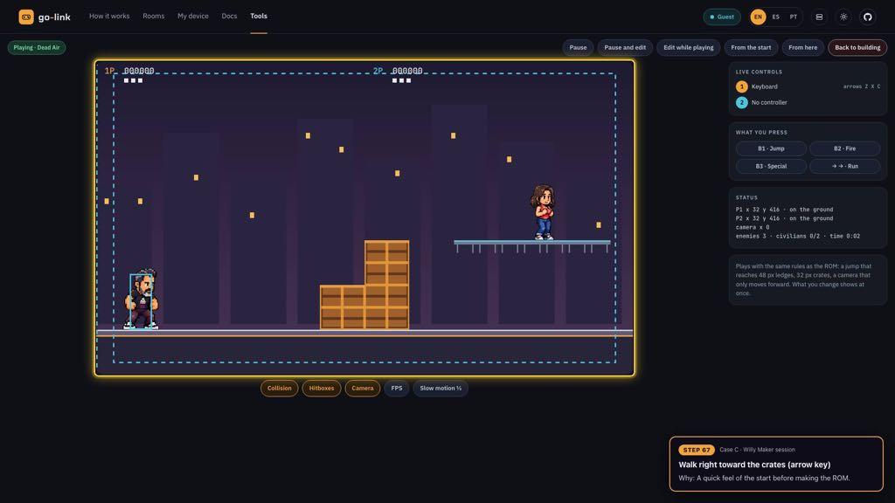</a> |
| 68 | 3:02 | **Back to building**<br>The texts are next. | `role=button[name="Back to building"]` | <a href="evidence/session/shots/68.jpg">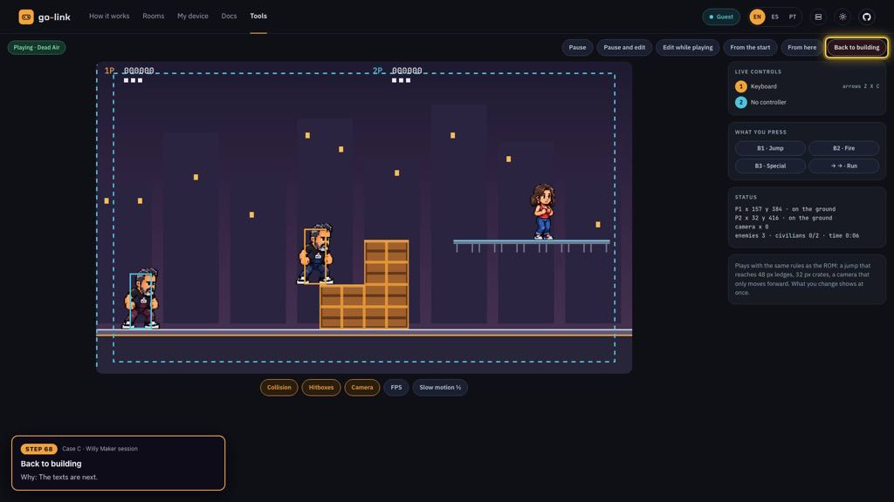</a> |

#### G. The texts (Menus tab) (steps 69-75, video 3:05-3:24, 19 s)

| # | Video | Do this | Control | Screenshot |
|---|---|---|---|---|
| 69 | 3:05 | **Open the Menus tab**<br>The title screen and the clear text come from here. | `button:has-text("Menus")` | <a href="evidence/session/shots/69.jpg">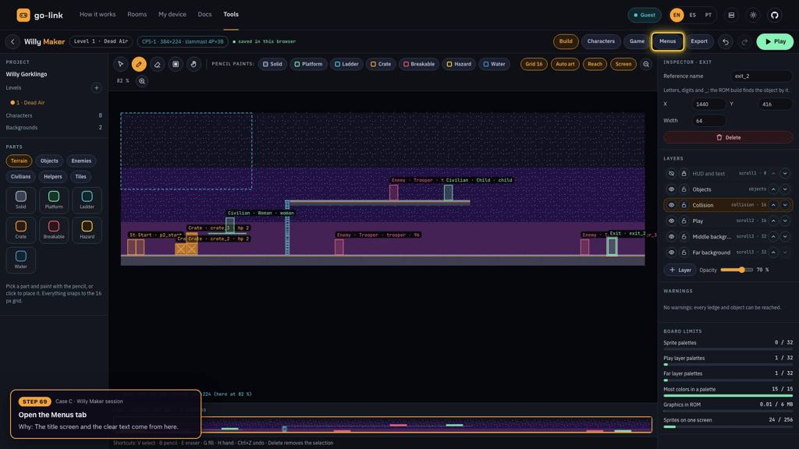</a> |
| 70 | 3:07 | **Title: WILLY GORKLINGO**<br>The spec's title screen. | `#wm-menu-field-title` | <a href="evidence/session/shots/70.jpg">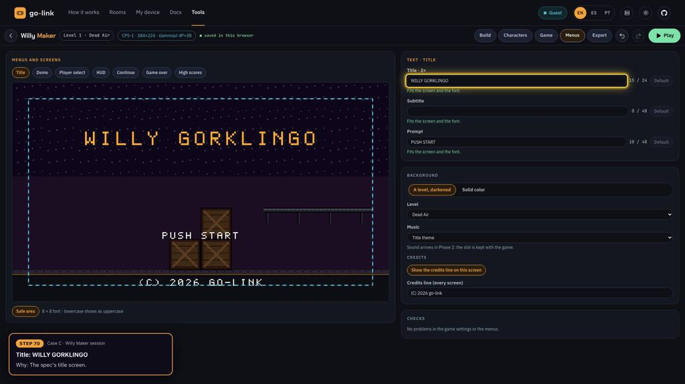</a> |
| 71 | 3:10 | **Subtitle: THE LAG PROTOCOL**<br>The spec's second line. | `#wm-menu-field-subtitle` | <a href="evidence/session/shots/71.jpg">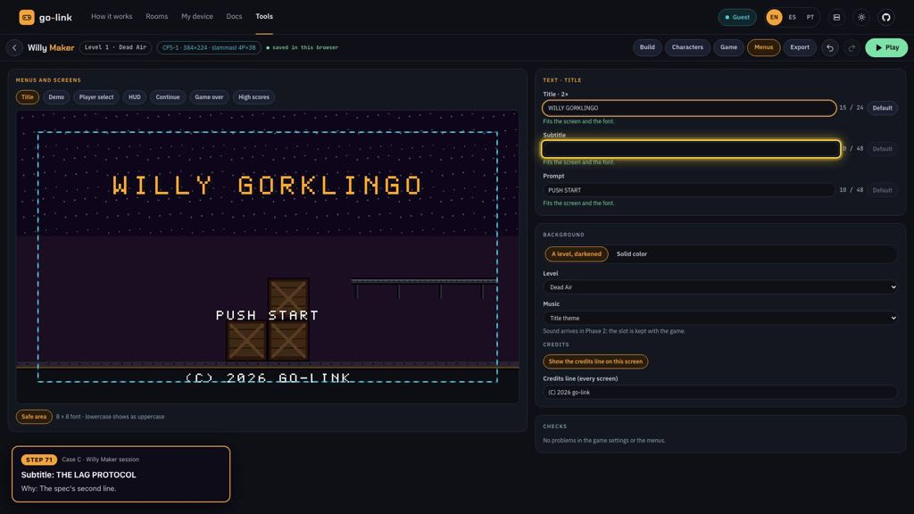</a> |
| 72 | 3:14 | **Check the prompt says PUSH START**<br>The spec's prompt; the credits line (C) 2026 GO-LINK is on by default. | `#wm-menu-field-prompt` | <a href="evidence/session/shots/72.jpg">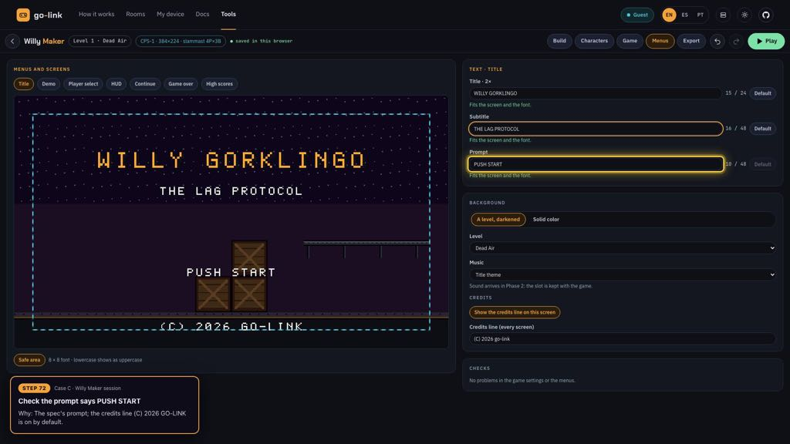</a> |
| 73 | 3:16 | **Open the HUD screen**<br>Its Level clear text is what the section shows at the exit. | `role=tab[name="HUD"]` | <a href="evidence/session/shots/73.jpg">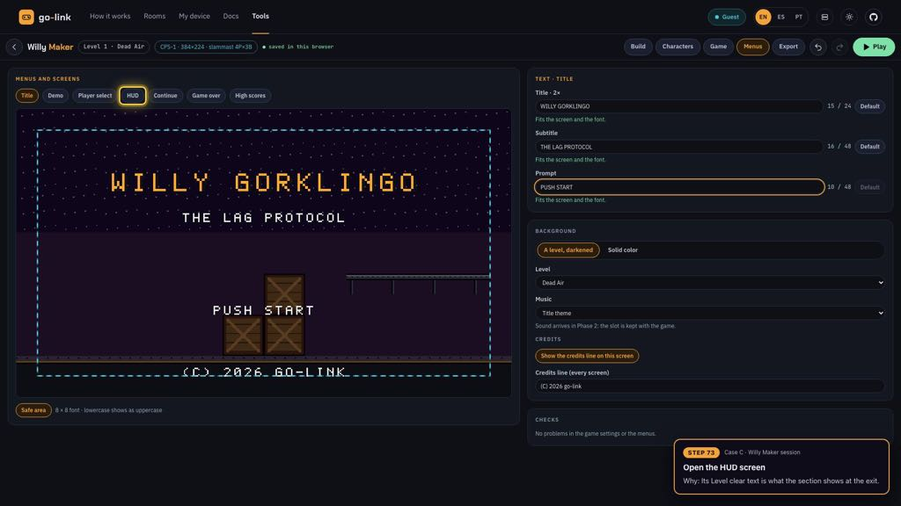</a> |
| 74 | 3:18 | **Level clear: SECTION CLEAR**<br>The spec's text at the exit. | `#wm-menu-field-cleared` | <a href="evidence/session/shots/74.jpg">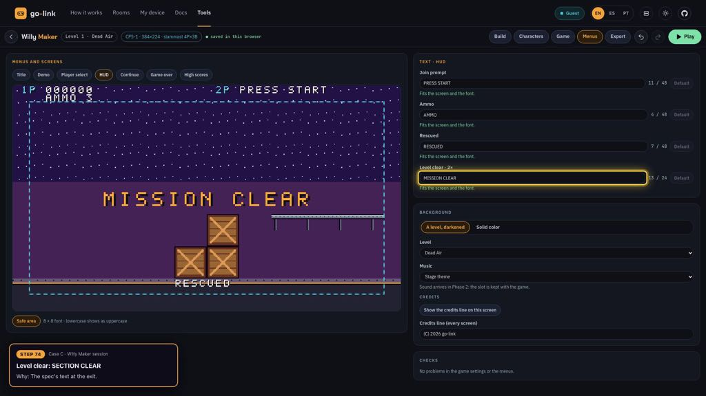</a> |
| 75 | 3:21 | **Look at the Game over screen**<br>GAME OVER shows when every player is out of energy and there is no credit. | `role=tab[name="Game over"]` | <a href="evidence/session/shots/75.jpg">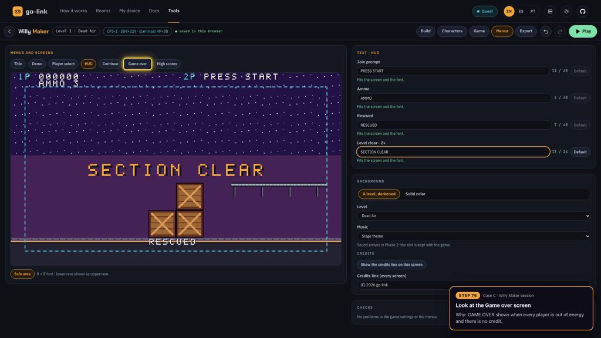</a> |

#### H. Create ROM and download (steps 76-82, video 3:24-3:47, 23 s)

| # | Video | Do this | Control | Screenshot |
|---|---|---|---|---|
| 76 | 3:24 | **Open the Export tab**<br>The review, then Create ROM. | `button:has-text("Export")` | <a href="evidence/session/shots/76.jpg">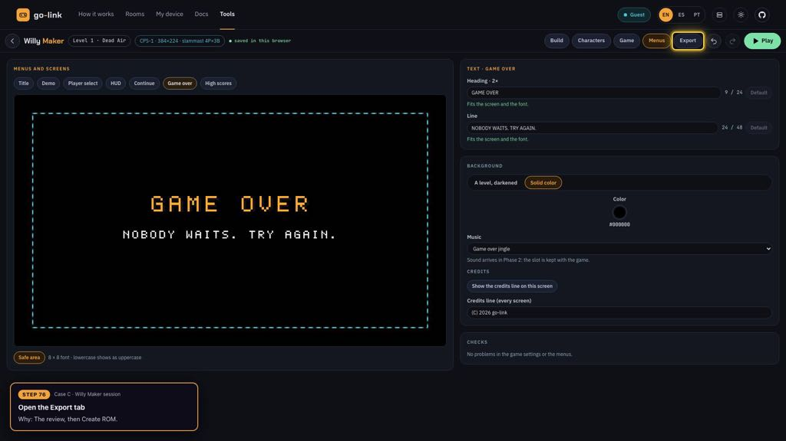</a> |
| 77 | 3:28 | **Create ROM**<br>Stage 2: the game is packed as data next to the prebuilt engine, as slammast's files, then powered on in the board model. | `role=button[name="Create ROM"]` | <a href="evidence/session/shots/77.jpg">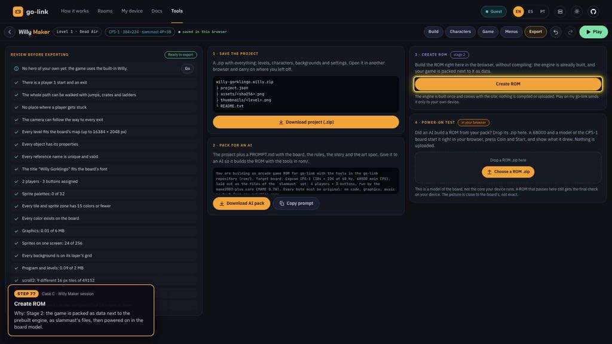</a> |
| 78 | 3:31 | **Read the result: every power-on step and the picture**<br>Validation level 3 ran by itself on the new ROM. | `.wm-rom-card` | <a href="evidence/session/shots/78.jpg">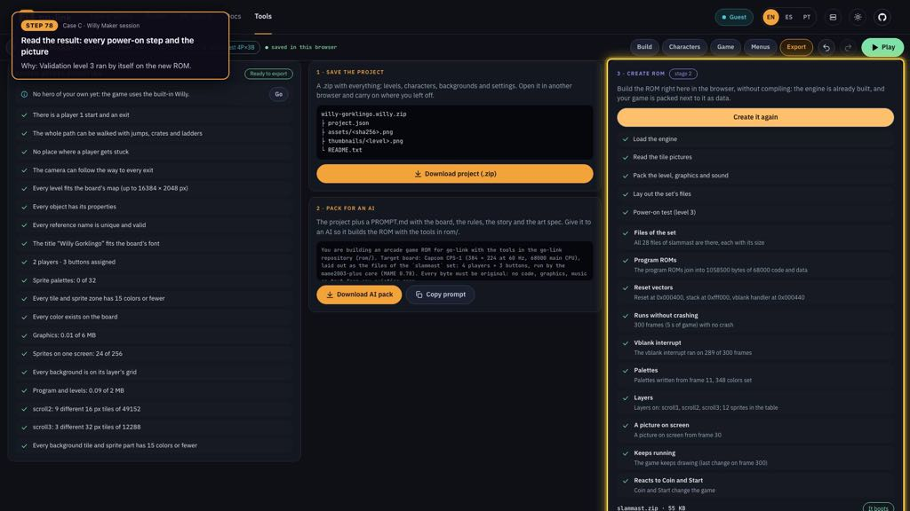</a> |
| 79 | 3:34 | **Download the ROM**<br>slammast.zip: the set the mame2003-plus core and a go-link room run. | `role=button[name~="Download ROM"]` | <a href="evidence/session/shots/79.jpg">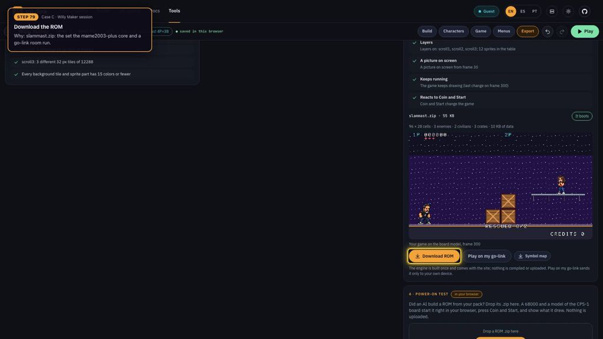</a> |
| 80 | 3:36 | **Download the symbol map**<br>symbols.json: where the game keeps its state, for the experiment's harness. | `role=button[name~="Symbol map"]` | <a href="evidence/session/shots/80.jpg">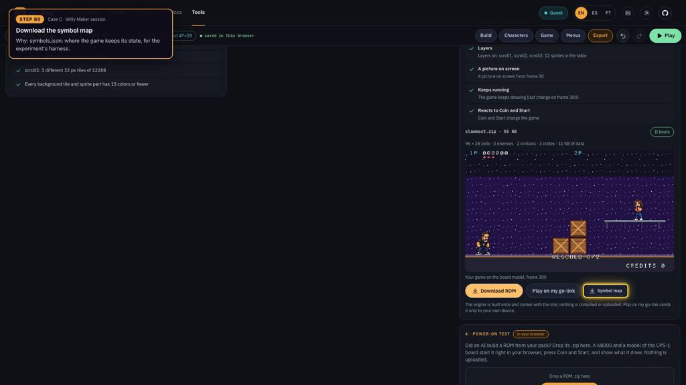</a> |
| 81 | 3:38 | **Play on my go-link**<br>It sends the ROM to the linked go-link; this recording has no device linked, so it says how to link one. | `role=button[name="Play on my go-link"]` | <a href="evidence/session/shots/81.jpg">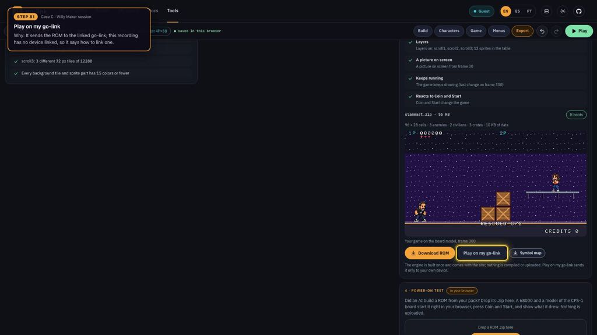</a> |
| 82 | 3:42 | **Done: the level is built, the ROM created, powered on and downloaded**<br>Next: the harness checks this exact zip (levels 3 and 4, the clear script, the real core). | `.wm-rom-card` | <a href="evidence/session/shots/82.jpg">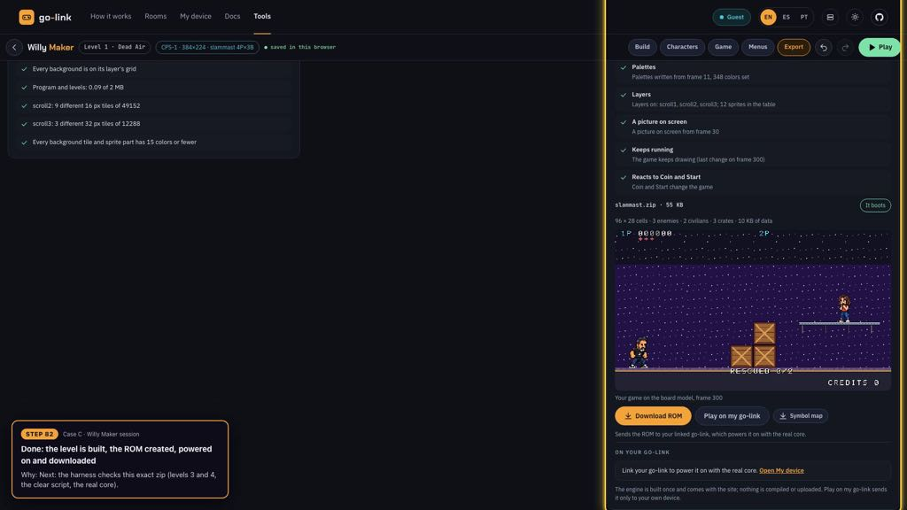</a> |

### After the download: the ROM on a go-link device

**Play on my go-link** (step 81) powers the created set on with the linked device's real core: validation level 4, the device's room core in a worker, without touching the ROM folder (D-011). The recording had no device linked, so the card says how to link one. With a device linked (**My device**, its 9-digit code) the same button runs the ten device steps. The same check from the device's CLI:

```sh
go-link.app/Contents/MacOS/go-link-device romtest ~/Downloads/slammast.zip
#   ok zip, set, identity ("not a go-link set: it shows as the core's original game"), core.loaded (384x224 at 60.00 Hz),
#   ok core.files (28 files differ from the original set: the core warns and runs them), video.picture, video.alive,
#   ok audio (silent), input.reacts (Coin at frame 300), time.realtime
# PASSED: the set powers on in this core.
```

**A room.** Case C did not open a room with this ROM: no device was linked to the recording, and Willy Maker's "Play on my go-link" stops at level 4 (checklist item 2, "partly"; [engine.md](../../willy-maker/engine.md#what-the-rom-leaves-out-for-now)). The device's ROM check does accept the set, though, under the original game's name (run on a separate folder at 22:49, never the user's ROM folder):

```sh
mkdir /tmp/wm-roms && cp ~/Downloads/slammast.zip /tmp/wm-roms/
go-link-device roms check --dir /tmp/wm-roms
# slammast  ok  Saturday Night Slam Masters (World 930713)
```

So the room path, **not run in case C**, is the device's normal one:

1. **My device › ROMs**: drop `slammast.zip` on "Drop ROM sets or pictures here, or click to choose". The device never overwrites: if the ROM folder already has a `slammast.zip` (the real game), the import is refused; move that one out first and put it back afterwards.
2. **Rooms › New game › Choose a game**: the set appears as *Saturday Night Slam Masters (World 930713)*, since a ROM is named by the core's game list.
3. Create the room, then **Invite** a second player (link or code plus a one-person PIN); P1 Willy and P2 the recruit play with B1 jump, B2 fire, Coin and Start.

## Acceptance (to compare with the case's results)

```sh
DEV=dist/device/darwin-universal/go-link.app/Contents/MacOS/go-link-device
ZIP=/tmp/session/slammast.zip       # or docs/experiments/case-c/build/slammast.zip
node rom/tools/lab/acceptance.mjs $ZIP --script docs/experiments/case-c/runs/clear.json \
  --out /tmp/case-c-acceptance --bot-games 5 --skip laya --device $DEV        # about 76 s
node rom/tools/lab/run.mjs $ZIP --out /tmp/damage --script docs/experiments/case-c/runs/damage.json
node rom/tools/lab/run.mjs $ZIP --out /tmp/odd    --script docs/experiments/case-c/runs/odd-inputs.json
```

Expected (and what the reproduction got): `level3`, `level4`, `scripted`, `sameAsCore` all `true`, `bot` "5/5 cleared"; the scripted run clears at frame **1883** with 18 of 18 expectations; the damage script ends in GAME OVER at frame **1273**; the odd-inputs script is still playing at frame **900**. With Laya (`--laya-games 3`, drop `--skip laya`) the case got 0 of 3 clears (it presses fire), at 1.6-2.0 s per decision: plan 15 minutes to over an hour. A clear script for a changed level: [harness.md](../harness.md) and `runs/route-player.mjs` + `runs/make-clear.mjs`.

## When it goes wrong

Each of these happened in the case ([journal.md](journal.md)) or in the reproduction of this guide.

| Symptom | Cause | What to do |
|---|---|---|
| No `rom/tools/lab/`, no `lab_state.h`, no `docs/experiments/` | The worktree was at `76cd798`, before the harness (journal 18:06) | Start from `23806b8` or later (D-001) |
| `engine.mjs --check` fails although you changed nothing | The engine's source was edited after its committed build (journal 19:00) | Put the source back or rebuild with `node rom/tools/engine.mjs` and redo every ROM made since; the committed binary is what Create ROM uses (D-016) |
| Your zip is `4b315b28…`, not `b1742aac…` | The engine before `091cc4c`: the title leaves a stray "I" from INSERT COIN under PUSH START (journal 19:16) | Use the branch's tip or all 15 patches (D-022) |
| The exit's width becomes **164** after typing 64 | Before `bda1433`, number fields clamped every keystroke: "6" became the minimum 16, then "4" was appended (session trial 2) | Use the fixed build; on an old one, check the field after typing and press Tab (D-017) |
| A script cannot find the sky tile buttons | They show only a picture; their name ("Tile 1") is only the accessible name (session trial 1) | Look them up by role, `getByRole("button", { name: "Tile 1" })`; by hand, they are the 1st, 3rd and 5th tiles of the night sky (screenshots 18, 20, 22) |
| The woman on the ledge cannot be rescued from the dock | The jump peaks at 61.9 px, so a ledge 64 px above the dock is out of reach (journal 18:25) | Climb the 64 px crate stack and jump across from it, as in steps 28-33 (D-015); Willy Maker's **Reach** now checks 48 px (D-021) |
| The route bot clears but rescues only the child | It never takes the jump from the stack to the ledge (journal 18:26) | Expected; `runs/route-player.mjs` follows the spec's route and rescues both |
| `npm run build` fails on a test file | A test literal not typed as `PowerOnStep` (journal 18:35) | Fixed in `35573e7`; run `npm run build` as well as the tests |
| An ExportView test expects Create ROM to be disabled | The old test of stage 1 (journal 18:35) | Replaced by `CreateRomCard.test.tsx` in `35573e7` |
| The AI pack round-trip test times out at 30 s | The machine was at load 68 (other cases' Laya players) | Run it again when the load drops; it passed in the full run (622 tests) |
| Laya takes hours | It runs on the CPU, 0.3-4 s per decision with the load | `--skip laya`, or run its games in parallel with `--seed` as the case did |
| The console shows the signaling server refusing the origin | Port 5302 (or 5401-5409) is not an allowed origin | Harmless while building; link a device from the site's normal origin |
| `session.mjs` cannot import Playwright | A worktree has no `e2e/node_modules` (reproduction) | `PLAYWRIGHT=/path/to/a/checkout/e2e/node_modules/playwright/index.mjs` |
| `session.mjs` cannot reach the site | It defaults to `http://localhost:5302` | `WM_URL=http://localhost:5401` (the port you used in 1.5) |
| `publish.mjs` cannot find ffmpeg | It defaults to `/usr/local/bin/ffmpeg` (Intel Homebrew) | `FFMPEG=$(command -v ffmpeg)` (Apple silicon: `/opt/homebrew/bin/ffmpeg`) |
| `romtest` fails to start | No core yet | `go-link-device core download` |
| Another zip hash after a session by hand | A click landed on another cell, or a typed value differs | Compare your screen with each screenshot; or run 1.6, which gives the exact zip |

## What you should get

`slammast.zip`: 55 854 bytes, SHA-256 `b1742aac038263f5f8323bdb64a99ce2c579c98192c699abab2f87c94f45d990`. Every entry is dated 2026-01-01 00:00 and sorted (D-009), so the same game gives the same zip. The files inside ([howto/slammast.sha256](howto/slammast.sha256), for `shasum -c`):

```sh
mkdir /tmp/wm-check && cd /tmp/wm-check && unzip -q ~/Downloads/slammast.zip
shasum -a 256 -c /path/to/docs/experiments/case-c/howto/slammast.sha256      # 28 x OK
```

| File | Bytes | CRC-32 | SHA-256 |
|---|---|---|---|
| `mb_05.bin` | 524 288 | `a87d0ba9` | `afa04d359524bc1102affa875436b7c8f3e6acb052289d53d1063a79ae85345b` |
| `mb_06.bin` | 524 288 | `f4d861fe` | `e2093b3484b88c3898afe695dca0a6ed163072c625864e94395e23832bf586bf` |
| `mb_07.bin` | 524 288 | `49b2a38e` | `ec895a6286af1b3db8f8ce80b9b47f15426da6ee95ed9df5de00f3bccfe82790` |
| `mb_08.bin` | 524 288 | `be5e885b` | `a414b13b3d25130525d63f928dcd98222325b78eb3f18015ae02c431df145795` |
| `mb_10.bin` | 524 288 | `504bf849` | `043e238a765f7cfbc62596a50e53c8ffb6b188a99357b0ebede251725d67589f` |
| `mb_11.bin` | 524 288 | `504bf849` | `043e238a765f7cfbc62596a50e53c8ffb6b188a99357b0ebede251725d67589f` |
| `mb_12.bin` | 524 288 | `504bf849` | `043e238a765f7cfbc62596a50e53c8ffb6b188a99357b0ebede251725d67589f` |
| `mb_13.bin` | 524 288 | `504bf849` | `043e238a765f7cfbc62596a50e53c8ffb6b188a99357b0ebede251725d67589f` |
| `mb_gfx01.rom` | 524 288 | `044c3c17` | `a6f3ede7729e62395f83546486b5ece10248022f78da77a170107ddeaa6ee6cf` |
| `mb_gfx02.rom` | 524 288 | `33130693` | `5f503668e8eaa0c40d7e8062a6839a2edb0f51e20f32339a8ebd494e0051c8ff` |
| `mb_gfx03.rom` | 524 288 | `7f02a016` | `11f60517bb2a3fccd03a99bb93acd3d24fdf8e7623953643c80b3b328ff7dbcf` |
| `mb_gfx04.rom` | 524 288 | `71ab2c39` | `ff560ae40cf96f3305e4b99eba1b5dd9254acaaa97d0a4611681b5fb380cdb2b` |
| `mb_q1.bin` | 524 288 | `75660aac` | `07854d2fef297a06ba81685e660c332de36d5d18d546927d30daad6d7fda1541` |
| `mb_q2.bin` | 524 288 | `75660aac` | `07854d2fef297a06ba81685e660c332de36d5d18d546927d30daad6d7fda1541` |
| `mb_q3.bin` | 524 288 | `75660aac` | `07854d2fef297a06ba81685e660c332de36d5d18d546927d30daad6d7fda1541` |
| `mb_q4.bin` | 524 288 | `75660aac` | `07854d2fef297a06ba81685e660c332de36d5d18d546927d30daad6d7fda1541` |
| `mb_q5.bin` | 524 288 | `75660aac` | `07854d2fef297a06ba81685e660c332de36d5d18d546927d30daad6d7fda1541` |
| `mb_q6.bin` | 524 288 | `75660aac` | `07854d2fef297a06ba81685e660c332de36d5d18d546927d30daad6d7fda1541` |
| `mb_q7.bin` | 524 288 | `75660aac` | `07854d2fef297a06ba81685e660c332de36d5d18d546927d30daad6d7fda1541` |
| `mb_q8.bin` | 524 288 | `75660aac` | `07854d2fef297a06ba81685e660c332de36d5d18d546927d30daad6d7fda1541` |
| `mb_qa.rom` | 131 072 | `fffe20ec` | `97aa20f433373110eb6c1a4cad8b2fa80eeaf275578c40326a5fca073abd4cb1` |
| `mbe_20a.rom` | 524 288 | `504bf849` | `043e238a765f7cfbc62596a50e53c8ffb6b188a99357b0ebede251725d67589f` |
| `mbe_21a.rom` | 524 288 | `99002cc2` | `5356e4e23d4c7f1ea46e8b537fe1074ed0f2acf8eaa30bfc91b27f033528f7fe` |
| `mbe_23e.rom` | 524 288 | `90b1d32e` | `5d242afc218b24e90b3bc8a93770fcc2d4a251d113014051bbd2e8237ea0c1b1` |
| `mbe_24b.rom` | 131 072 | `154803cc` | `b5a41c3758763bbec72769fab4a2533bf2db0b6312d93d25a695f9e4b9e02260` |
| `mbe_25b.rom` | 131 072 | `154803cc` | `b5a41c3758763bbec72769fab4a2533bf2db0b6312d93d25a695f9e4b9e02260` |
| `mbe_28b.rom` | 131 072 | `154803cc` | `b5a41c3758763bbec72769fab4a2533bf2db0b6312d93d25a695f9e4b9e02260` |
| `mbe_29b.rom` | 131 072 | `154803cc` | `b5a41c3758763bbec72769fab4a2533bf2db0b6312d93d25a695f9e4b9e02260` |

Where each file sits (`frontend/packages/cps1/src/sets.ts`): `mbe_23e.rom` is the 68000 program at 0x000000 (the prebuilt engine), `mbe_21a.rom` the program space at 0x100000 (the game as `wm_data`), `mbe_24b/28b/25b/29b.rom` (0x080000-0x0fffff) and `mbe_20a.rom` (0x180000) the unused program space; the graphics are three banks of four, `mb_gfx01-04.rom`, `mb_05-08.bin` and `mb_10-13.bin` (the last bank unused); `mb_qa.rom` is the Z80 sound program and `mb_q1-8.bin` the silent samples. That is why some hashes repeat: every unused 512 KB file has the same fill (`043e238a…`), the four unused 128 KB program files share `b5a41c37…`, and the eight samples share `07854d2f…`.

If only some files differ, they say where to look: `mbe_21a.rom` alone means a different project (a click, a typed value, a rule); `mbe_23e.rom` a different engine (see D-016 and D-022 above); `mb_gfx*`/`mb_05-08` the tiles drawn (for example another sky tile on the far layer) or the engine's sprites; `mb_qa.rom` the packer's Z80 program or its encryption.

## Evidence of the recorded session

- [evidence/session/guide.html](evidence/session/guide.html): the 82 steps with time, what, why, selector and screenshot.
- [evidence/session/timeline.json](evidence/session/timeline.json): the same as data; `t` is seconds from the start of the browser's video.
- [evidence/README.md](evidence/README.md): the acceptance reports and the simulator | core | difference frames.
- [checklist.md](checklist.md): the 30 items of Game Spec v1 with their evidence and the gaps (the Trooper drawn as the Lag android, the jump's 61.9 px, the room).
