# Lab journal: go-link's own CPS-1 ROM

A step-by-step record of the prototype, meant to become a guide. Every step lists the goal, what was read, the exact commands, the files, the result, what failed and what was learned. Dead ends stay in, marked **Dead end**. Hardware facts confirmed along the way are collected in [hardware.md](hardware.md).

## How to reproduce from zero

Machine used: an Intel Mac on macOS 15.7.3, with Homebrew. Tool versions:
- m68k-elf-gcc 16.2.0;
- GNU binutils 2.47 (m68k-elf);
- z80asm 1.8;
- Node 22.12.0, Go 1.25.3 (go1.26.8 toolchain), Info-ZIP 3.0;
- macOS `sips` (sips-316) to read the WebP sprite sheets, Playwright 1.63.0 (from `e2e/`) for the room test.

1. Install the tools:
   ```sh
   brew install m68k-elf-binutils m68k-elf-gcc z80asm
   ```
2. Get the mame2003-plus core the device uses:
   ```sh
   device core download
   ```
   The core lands at `~/go-link/cores/mame2003_plus_libretro.dylib`; the core reported Git version `3141930`.
3. Build the ROM set. This compiles the 68000 and Z80 programs, converts the sprites, draws the background and writes the set:
   ```sh
   node rom/tools/build.mjs              # rom/build/slammast.zip (4 players x 3 buttons, the chosen layout)
   node rom/tools/build.mjs captcomm     # rom/build/captcomm.zip (4 x 2, steps 1 and 2)
   node rom/tools/quality.mjs            # optional: before/after pictures of the sprites (rom/build/quality/)
   ```
4. Build the frame capture tool. It runs a core exactly like a go-link room does:
   ```sh
   (cd backend-device && go build -o /tmp/framelab ./cmd/framelab)
   ```
5. Run the set in the core and save pictures:
   ```sh
   /tmp/framelab capture -log -core ~/go-link/cores/mame2003_plus_libretro.dylib \
     -rom rom/build/slammast.zip -out /tmp/rom-run -frames 860 \
     -script "60-63:coin 110-113:start 140-180:right 190-192:right 196-235:right 245-262:right+b2 300-385:right 395-397:b2 500-502:right 506-560:right 570-572:b3 640-642:right 646-760:right" \
     -stills 95,225,258,398,585,800
   ```
   The pictures land in `/tmp/rom-run/stills/`. For the step 4 level, the two scripts are in [step 4](#step-4--a-metal-slug-style-level) (one player through the whole route, and two players). `ROM_DEBUG=1 node rom/tools/build.mjs` prints each player's position on screen, which helps to time new scripts.
6. Test in go-link: a throwaway stack (local signalhub, headless device whose ROM folder holds only our set, Chromium on the device's local panel) creates a game room, plays it from the keyboard and saves frames of the room's WebRTC video:
   ```sh
   (cd e2e && npm ci)          # Playwright 1.63.0, once
   node rom/tools/room-test.mjs          # the slammast set; `room-test.mjs captcomm` for the other
   ```
   It needs the signalhub repository next to go-link (or `SIGNALING_DIR`). To play it on your own device, see [step 4, "In your own go-link"](#in-your-own-go-link). The pictures land in `rom/build/room/shots/` and the logs in `rom/build/room/`. See [step 3](#step-3--a-go-link-room).

---

## Step 0 — Research

*2026-10-01*

**Goal:** choose the CPS-1 set to lay our files out as, learn the board from the driver, and find out how both the core and the device treat a set whose files are not the original ones.

**What was read:** the core's source, [libretro/mame2003-plus-libretro](https://github.com/libretro/mame2003-plus-libretro) at commit `0d9a325c` (2026-09-28). Only these files were checked out:
```sh
git clone --depth 1 --filter=blob:none --sparse https://github.com/libretro/mame2003-plus-libretro.git m2k3
cd m2k3
git sparse-checkout set --no-cone /src/drivers/cps1.c /src/vidhrdw/cps1_vidhrdw.c /src/includes/cps1.h /src/common.c
```
- `src/drivers/cps1.c`: game list (L8111-8222), memory maps (L327-385), the vblank interrupt (L160), the `cps1` machine (L3969), graphics layouts (L3885-3925), the `captcomm` ROMs (L6219) and inputs (L2452).
- `src/vidhrdw/cps1_vidhrdw.c`: the CPS-B configs (L194-266) and the per-game table (L270-443), register bases, tilemaps, palette, sprites and the graphics decode.
- `src/common.c`: the ROM loader's verdicts (L1301-1385).
- go-link's `backend-device/pkg/romcheck/romcheck.go` (`Check`, `has`).

**Choosing the set.** Candidates with a plain CPS-1 board (no QSound, no encryption):

| Set | CPS-B config | Players | Notes |
|---|---|---|---|
| `strider` | B-01 | 2 | Uses tile banks (`1,0,1`); its own IRQ4 |
| `ghouls` | B-01 | 2 | Sprite kludge 1 |
| `mercs` | B-12 | 3 | Tile gaps (kludge 4), uses port 0x74 |
| **`captcomm`** | BATTRY_3 | **4** | No ID check, no banks, no kludge, full tile ranges |
| `knights` | BATTRY_4 | 3 | — |

**`captcomm` wins.** It has four players, like go-link's four seats, and the fewest special cases. Its limit is two buttons per player.

**Findings** (all in [hardware.md](hardware.md)):
- **The core only warns on a wrong file.** It looks a set up by its short name (`captcomm`). A file with the right name but the wrong CRC is a *warning* ("WRONG CHECKSUMS", `common.c` L1331-1335), and the game still runs; only a *missing* file is an error (L1351-1385).
- **The device works the same way.** go-link's checker accepts a file when its name is there ("a wrong size or CRC only gives a warning", `romcheck.go` `has`). So a set with our own bytes and the right names should pass both the core and the device unchanged.
- **The board.** Video registers at 0x800100, graphics RAM at 0x900000, inputs at 0x800000/0x800018/0x800176/0x800178, vblank interrupt at level 2, a 384×224 screen, 4-bit tiles with pen 15 transparent, and 12-bit color with brightness.

**Learned:** the "impersonation" route (option A in the [project README](README.md)) is possible on paper, with no change to the core or to the device's checker.

---

## Step 0b — Rethinking the set: buttons

*2026-10-01*

**Goal:** the game needs at least three action buttons per player (jump, fire, special) and should keep *Destroy this page*'s move set. `captcomm` declares two, and MAME only passes a button the set declares, so a third button would never reach our program. Find the CPS-1 set that best gives, in this order: (1) three or more buttons; (2) as many players as possible, ideally 4 like go-link's seats; (3) the simplest board.

**What was read:**
- every `INPUT_PORTS_START` block and `GAME` line of [`cps1.c`](https://github.com/libretro/mame2003-plus-libretro/blob/0d9a325c96aa96460be7b2fe4310a7096981ff75/src/drivers/cps1.c), counted by a script (players × highest `IPT_BUTTONn` per player);
- the CPS-B table of [`cps1_vidhrdw.c`](https://github.com/libretro/mame2003-plus-libretro/blob/0d9a325c96aa96460be7b2fe4310a7096981ff75/src/vidhrdw/cps1_vidhrdw.c#L194-L443);
- the QSound machine ([`cps1.c` L4060-4080](https://github.com/libretro/mame2003-plus-libretro/blob/0d9a325c96aa96460be7b2fe4310a7096981ff75/src/drivers/cps1.c#L4060-L4080)), its Z80 map (L385-401), the `slammast` inputs (L3002-3062) and ROMs (L7542-7578);
- the Kabuki decoder, [`src/machine/kabuki.c`](https://github.com/libretro/mame2003-plus-libretro/blob/0d9a325c96aa96460be7b2fe4310a7096981ff75/src/machine/kabuki.c) (added to the sparse checkout: `git sparse-checkout add /src/machine/kabuki.c`).

**CPS-1 sets in mame2003-plus by players and buttons** (parents; clones share the ports):

| Set | Players × buttons | Board | Z80 encryption | CPS-B | Notes |
|---|---|---|---|---|---|
| `captcomm` | 4 × 2 | CPS-1 (YM2151 + OKI) | no | BATTRY_3, no ID | Steps 1-2 |
| `slammast`, `mbombrd` | **4 × 3** | QSound | **Kabuki** | QSOUND_4/5 (ID 0x0c01/0x0c02 at 0x6e/0x5e) | The only 4-player sets with 3 buttons; P3/P4 button 3 sit in the P1/P2 word (bits 7 and 15) |
| `kod`, `knights`, `mercs` | 3 × 2 | CPS-1 | no | various | |
| `wof`, `dino` | 3 × 2 | QSound | Kabuki | | |
| `ffight` | 2 × 3 (a 3-player hack exists) | CPS-1 | no | CPS_B_04 | |
| `dw`, `mtwins`, `3wonders`, `megaman`, `pang3`, `pnickj` | 2 × 3 | CPS-1 | no (pang3: 68000 encryption) | | |
| `cworld2j`, `qad`, `qtono2` | 2 × 4 | CPS-1 | no | | quiz games |
| `sf2` family | 2 × 6 | CPS-1 | no | | |
| `punisher` | 2 × 2 | QSound | Kabuki | | |

**The pick: `slammast`** (Saturday Night Slam Masters, World), the only layout that meets priorities 1 and 2 together. Its costs, checked one by one:
- **The CPS-B-21 ID check** (0x0c01 read at 0x80016e) only matters to a program that reads it; ours does not. Other register offsets: layer control 0x56, priority masks 0x40/0x42/0x68/0x6a, control 0x6c, enable bits 0x04 scroll1, 0x08 scroll2, 0x10 scroll3. No kludge.
- **Kabuki.** The board decrypts the first 0x8000 bytes of the Z80 ROM at start (`cps1_decode`), with one table for opcode fetches and another for data and operands, both depending on the address. Each table is a bijection of 0-255, so our own Z80 program can be stored "encrypted" by searching, for each byte, the ROM byte that decodes to it (256 tries). This uses only the public algorithm and the keys in the core's source; no Capcom byte. `rom/tools/kabuki.mjs` does it. The prototype's Z80 is `di; halt` (one-byte opcodes, so only the opcode table matters). A real sound driver can be written the same way: operands then go through the data table.
- **"slammast requires the Z80 for protection"** (comment on the QSound machine): the original game's 68000 checks its Z80. Our 68000 does not, so an idle Z80 is fine.
- **QSound sound** instead of YM2151 + OKI: 16 channels of PCM samples from 4 MB of sample ROM. For our music and effects that is an advantage (sampled sound, stereo), but the sound driver must speak QSound (later work).
- **A bigger set:** 28 files (7 program, 12 graphics with 6 MB of tile space, the Z80 ROM, 8 sample ROMs). Empty files compress to almost nothing: the zip is about 85 KB.
- **No DIP switches** (EEPROM): settings would go in our own NVRAM menu.
- Inputs: P1/P2 at 0x800000 as before with button 3 at bit 6; P3 at 0xf1c000, P4 at 0xf1c002 (bits 0-5 + coin 6 + start 7); button 3 of P3/P4 at bits 7/15 of 0x800000.

**go-link's mapping:** the device maps the RetroPad B, A, Y, X, L, R to MAME buttons 1-6 on every seat (`backend-device/internal/services/game_core.go`, `retroButton`), and mame2003-plus routes `BUTTON3 | PLAYERn` to seat n wherever the bit lives, so button 3 reaches us from all four seats (Y on a gamepad, C on the website's keyboard).

**Options if 4 × 3 had not existed** (kept for the record): 2 players × 3 buttons (`ffight` layout, plain board, but half of go-link's seats), or 4 players × 2 buttons with the special as button 1 + button 2 together (`captcomm`; the prototype still supports it: `node rom/tools/build.mjs captcomm`).

**Learned:** the button count is a property of the set's input ports, not of the board. Picking a layout is picking an input map, so it must come before any game code.

---

## Step 1 — Toolchain and "hello world"

*2026-10-01*

**Goal:** our own 68000 program boots on the CPS-1 board in the stock core: it sets up the video, paints a color, prints text with our own font and counts vblanks.

**Commands:**
```sh
brew install m68k-elf-binutils z80asm
brew install m68k-elf-gcc        # to write the game in C
node rom/tools/build.mjs
(cd backend-device && go build -o /tmp/framelab ./cmd/framelab)
/tmp/framelab capture -log -core ~/go-link/cores/mame2003_plus_libretro.dylib \
  -rom rom/build/captcomm.zip -out /tmp/rom-run -frames 300 -stills 10,120,299
```

**Files created:**
- `rom/src/crt0.s`: the vector table (stack, reset, the level 2 vblank handler at vector 26), the `.data` copy and the `.bss` clear.
- `rom/src/link.ld`: program at 0x000000, variables in work RAM at 0xff0000.
- `rom/src/hw.h`: the board's registers for the `captcomm` config.
- `rom/src/main.c`:
  - sets the base registers (sprites 0x920000, scroll1/2/3 0x900000/0x904000/0x908000, palette 0x90c000);
  - sets the layer order scroll3, scroll2, sprites, scroll1;
  - fills the tilemaps and writes the palette, including entry 4095, the background;
  - prints text and the vblank counter.
- `rom/src/sound.z80`: the Z80 waits forever.
- `rom/tools/font.mjs`: our own 5×7 font in 8×8 cells, with a drop shadow.
- `rom/tools/cps1gfx.mjs`: writes 8×8, 16×16 and 32×32 tiles into the CPS-1 graphics format, and splits the region into the eight `gfx_0N.rom` files.
- `rom/tools/build.mjs`: compiles everything and lays out the 15 files of the set.
- `backend-device/cmd/framelab/capture.go`: a new `-log` flag that prints the core's log.

**Dead end 1: the picture stays black and the core crashes after about 32 frames.**


- Without a log there was no clue, so `framelab capture` got the `-log` flag.
- The core's log showed the 68000 at `PC=00004806`, piling exception frames onto the stack (`unmapped memory word write to 00F2xxxx = 2700 / 4804`). Our program is only 2102 bytes long, and `0x4804` is `0x0448` (our `default_handler`) with its two bytes swapped.
- **Cause:** the loader's `ROM_LOAD16_WORD_SWAP` (`reverse=1` in the log) swaps the bytes of every word as it loads, so the program files must hold each word byte-swapped. A plain big-endian file reaches the CPU scrambled: the reset vector points nowhere, and the core eventually crashes.
- **Fix:** `build.mjs` swaps every 16-bit word (`Buffer.swap16`) before writing `cce_23d.rom` and `cc_22d.rom`.
- A second detail: with a folder named `captcomm` next to `captcomm.zip`, the core reads the folder. The build now keeps only the zip, as go-link would.

**Result after the fix:** 300 frames with no crash.

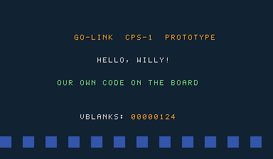

*Frame 299: our font on scroll1 in three palettes, a row of test blocks on scroll2 (16×16), the night-blue background (palette entry 4095), and the vblank counter at 0x124 = 292 after 300 frames, so the level 2 interrupt arrives every frame.*

The core logs "WRONG CHECKSUMS" for every file and keeps going. The 180-frame warning message goes to the frontend (go-link does not draw it), so nothing covers the picture.

**Learned:**
- The stock mame2003-plus core runs our own CPS-1 program, with no patch.
- The graphics bit order is right: pixel j is bit (7 − j) of each bitplane byte, and 8×8 tiles use the right half of each 8-byte row.
- The program files must be word-swapped.

---

## Step 2 — A mini level

*2026-10-01*

**Goal:** go-link's own characters on the board: Willy idle, running, jumping and shooting on player 1's inputs, two civilians to rescue, an invented night city on two scrolling layers, and Coin/Start like an arcade board.

**What was read:** the sprite renderer and the layer order in `cps1_vidhrdw.c`:
- [`cps1_render_sprites`](https://github.com/libretro/mame2003-plus-libretro/blob/0d9a325c96aa96460be7b2fe4310a7096981ff75/src/vidhrdw/cps1_vidhrdw.c#L1345-L1500) (block sprites, flips, the `code < total_elements` check);
- [`cps1_find_last_sprite`](https://github.com/libretro/mame2003-plus-libretro/blob/0d9a325c96aa96460be7b2fe4310a7096981ff75/src/vidhrdw/cps1_vidhrdw.c#L1325-L1342) (the 0xff00 end marker must sit in an attribute word);
- [`VIDEO_UPDATE( cps1 )`](https://github.com/libretro/mame2003-plus-libretro/blob/0d9a325c96aa96460be7b2fe4310a7096981ff75/src/vidhrdw/cps1_vidhrdw.c#L1845-L1915) (layer order, priority masks) and [`VIDEO_EOF( cps1 )`](https://github.com/libretro/mame2003-plus-libretro/blob/0d9a325c96aa96460be7b2fe4310a7096981ff75/src/vidhrdw/cps1_vidhrdw.c#L1975-L1985) (the one-frame sprite delay);
- the sprite sheets of *Destroy this page*: `frontend/apps/web/public/destroy/player.webp|json` and `npcs.webp|json` (frames with `x, y, w, h, px, py`, animations with `fps`).

**Commands:**
```sh
node rom/tools/build.mjs
/tmp/framelab capture -log -core ~/go-link/cores/mame2003_plus_libretro.dylib \
  -rom rom/build/captcomm.zip -out /tmp/rom-run -frames 820 \
  -script "60-63:coin 110-113:start 140-260:right 200-250:right+b1 262-266:b2 270-330:right 340-345:right+b2 346-640:right 641-700:b1" \
  -stills 95,230,275,390,560,660
```
The `-script` steps hold buttons for a range of frames on player 1, in the device's own input bits (`backend-device/pkg/framelab/script.go`): `coin` is the RetroPad Select, `start` Start, `b1` button 1 (shoot), `b2` button 2 (jump).

**Files created or changed:**
- `rom/tools/png.mjs`: a minimal PNG reader and writer (Node's zlib); WebP sheets go through macOS `sips -s format png` first.
- `rom/tools/art.mjs`:
  - **characters:** Willy (idle, run, jump, machine gun), the woman and the child (worried, happy), scaled to arcade size (76, 66 and 54 px tall) with a box filter;
  - **palette:** one median-cut palette of 15 colors per character, as `0xFRGB` words, plus pen 15 transparent;
  - **tiles:** each frame is cut into 16×16 tiles laid out for block sprites (tile x, y at `code + x + 16 × y`), with its feet at the bottom row;
  - **background:** a night sky with stars and a moon (scroll3, 32×32 tiles) and a skyline with lit windows, neon strips and a street (scroll2, 16×16 tiles), both drawn by code from a fixed seed, deduplicated (71 and 494 tiles), with their own palettes;
  - **output:** `rom/build/gen/art_data.c` (frames, animations, palettes, tilemaps), the defines in `rom/build/gen/gfx.h`, and previews (`preview-*.png`).
- `rom/src/main.c`: the attract screen (title, INSERT COIN / PRESS 1P START, credits), Coin adds a credit, 1P Start spends one, then the level: walk (stick), shoot (button 1, up to 6 bullets), jump (button 2, with gravity), the camera scrolls scroll2 at full speed and scroll3 at half, the civilians switch from worried to happy when Willy reaches them (+1000 each), and MISSION COMPLETE returns to the attract screen.
- `rom/tools/build.mjs`: generated sources go to `rom/build/gen/` and `art_data.c` is compiled with the rest.

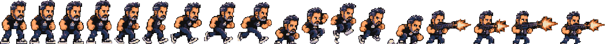

*Willy's 17 frames (idle, run, jump, machine gun) reduced to one 15-color palette.*

**Dead end 2: Willy's T-shirt came out white.**
- The first preview showed a white chest on most frames. The pixels told why: the published atlas has the shirt **transparent** (alpha 0), because its background was near black and the atlas cutter keyed the black shirt out with it. On the website the shirt shows the page behind.
- **Fix:** `art.mjs` paints back every transparent pixel that cannot reach the frame's border through a gap at least 5 px wide (erode, flood fill from the border, grow back), with the shirt's dark color. The first try (any enclosed pixel) missed shirts open to the side through a thin gap.

**Dead end 3: no sprite on screen at all**, while the city, the text and the scrolling all worked.
- Changing the layer order did nothing, and even one plain 16×16 test block did not show up. So the sprite table was the problem, not the art.
- The disassembly (`m68k-elf-objdump -d rom/build/obj/program.elf`) showed gcc had turned the RAM-to-graphics-RAM copy into one instruction, `move.w (a0)+,(0,a0,d5.l)`, with `d5 = 0x920000 − buffer`. gcc assumes the destination is computed **before** the source's post-increment. The emulated 68000 (Musashi) computes it **after**, so every word landed 2 bytes late. The end marker 0xff00 then never sat in an attribute word, so the driver scanned all 256 entries of garbage.
- Rewriting the loop with two pointers made gcc emit the same instruction again.
- **Fix:** no RAM buffer: `put_sprite` writes each entry straight into the table at 0x920000 through a `volatile` pointer. The board copies the table at the end of each frame (`VIDEO_EOF`), and we write it right after vblank, long before that copy.

**Result:** 820 frames in the stock core, played by the script.

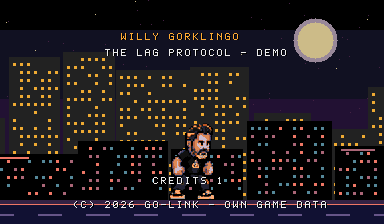

*Frame 95: the attract screen after one coin, with the title on scroll1, Willy (a 3×5 block sprite) and the city on scroll3 and scroll2.*

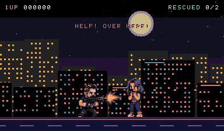

*Frame 230: Willy runs right while shooting (the machine gun animation, the bullets are sprites), next to the woman, who asks for help.*

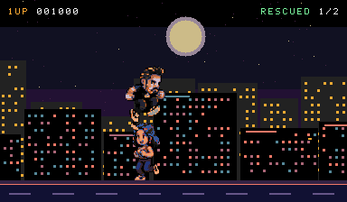

*Frame 275: the jump, with one rescue done (+1000). The scroll3 sky moves at half the speed of the city.*

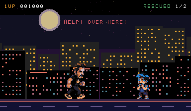

*Frame 390: the child, worried, ahead.*

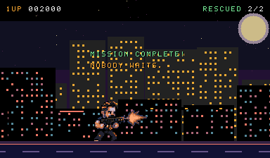

*Frame 660: both rescued, MISSION COMPLETE.*

**Learned:**
- **Sprites:** block sprites, X flip, 15-color palettes per character and the sprite/scroll layer order all behave as the driver says.
- **Graphics format:** the 32×32 format is right too.
- **Inputs:** player 1, coin 1 and start 1 arrive at 0x800000 and 0x800018 exactly as go-link's device sends them.
- **Hand-check the compiler:** for anything that writes to the hardware, check gcc's output. An addressing mode whose order the CPU core defines differently breaks silently. Writing hardware tables through `volatile` pointers avoids this.
- **The atlas lost the black shirt:** the published atlas has transparency holes wherever the original was black. A new converter (or the atlas cutter itself) should key the background by connectivity, not by color.

---

## Step 2a — Three buttons: the slammast layout and the controls

*2026-10-01*

**Goal:** move the prototype to the `slammast` layout ([step 0b](#step-0b--rethinking-the-set-buttons)) without losing `captcomm`, check that our encrypted Z80 and the CPS-B-21 registers work, and play the controls the design asks for ([story.md, Controls and weapons](story.md#controls-and-weapons)): walk, run with a double tap, jump on button 1, machine gun on button 2 with an automatic knife up close, the special on button 3 (a picked-up bazooka with 3 rockets).

**Commands:**
```sh
node rom/tools/build.mjs                 # slammast
node rom/tools/build.mjs captcomm
/tmp/framelab capture -log -core ~/go-link/cores/mame2003_plus_libretro.dylib \
  -rom rom/build/slammast.zip -out /tmp/rom-run -frames 860 \
  -script "60-63:coin 110-113:start 140-180:right 190-192:right 196-235:right 245-262:right+b2 300-385:right 395-397:b2 500-502:right 506-560:right 570-572:b3 640-642:right 646-760:right" \
  -stills 95,225,258,398,585,800
```
`190-192:right 196-235:right` is the double tap (two presses 6 frames apart); `b3` is button 3.

**Files created or changed:**
- `rom/tools/build.mjs`: a table of set layouts (`SETS.slammast`, `SETS.captcomm`): program files (`swap` for `ROM_LOAD16_WORD_SWAP`, `even`/`odd` for `ROM_LOAD16_BYTE`), graphics banks, the Z80 file, the sample files. It passes `-DSET_SLAMMAST` or `-DSET_CAPTCOMM` to gcc. It only removes its own outputs.
- `rom/tools/kabuki.mjs`: the core's Kabuki decoder (`bytedecode`) and `encodeOpcodes`, which searches each byte's encrypted form; the `slammast` keys.
- `rom/src/sound-qsound.z80`: `di; halt`.
- `rom/src/hw.h`: the CPS-B registers, layer enable bits and P3/P4 addresses per set, `BTN_3`.
- `rom/src/main.c`:
  - **Controls:** walk 1 px a frame; run 3 px a frame after a double tap. A second press toward the same side within 15 frames (250 ms) runs until the stick is released.
  - **Fire:** the machine gun on a held button 2. If an enemy is within 44 px in front of Willy at the moment of the press, it is a knife slash instead (2 damage).
  - **Special:** button 3, or button 1 + 2 together on `captcomm`. A crate on the street gives the bazooka with 3 rockets, and the HUD shows `SPECIAL BAZOOKA xN`.
  - **The enemy:** a Lag android with 4 hit points walks to Willy, flinches when hit and falls (+500); a second one comes later.
- `rom/tools/art.mjs`: Willy's `bazooka` and `knife`, the robot sheet (walk, hit, defeated), a rocket drawn by code.

**Result:** the stock core runs the `slammast` layout:
- the log names the machine (68000 10 MHz, Z80 6 MHz, QSound);
- our encrypted `di; halt` keeps the Z80 quiet;
- the CPS-B-21 layer control and enable bits work;
- button 3 reaches the game.

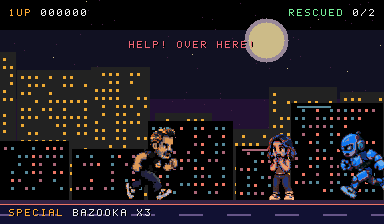

*Frame 225: Willy runs (double tap) and has walked over the crate: `SPECIAL BAZOOKA x3`.*

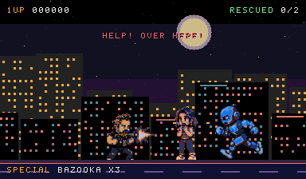 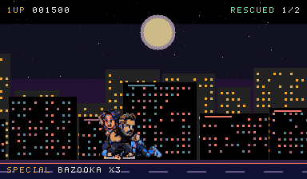

*Frames 258 and 398: the machine gun from a distance; the same button up close is the knife.*

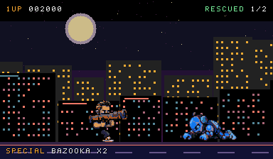

*Frame 585: button 3 fires a rocket; the second android falls.*

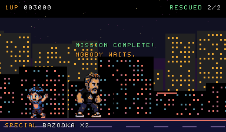

*Frame 800: both civilians rescued.*

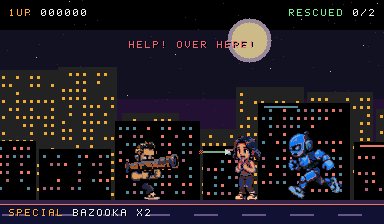

*The same program built as `captcomm`: button 1 + 2 together fire the bazooka (x2 left).*

**Dead end 4: two androids where there should be one.** The published atlas cuts the robot's `walk_0` and `walk_1` as frames that each hold **two** poses (148 and 166 px wide). The website shows them that way too, so it is a bug in the atlas regions (`frontend/apps/web/scripts/destroy-atlas.mjs`), to fix there. **Fix in the ROM:** `art.mjs` splits such frames at their fully transparent columns (`splitPoses`), which gives the five walking poses:


**Learned:**
- **Kabuki does not block homebrew:** an encrypted Z80 board only costs an encoder for our own code.
- **Controls work as designed:** the double-tap dash and the context knife are cheap on the 68000 (a timestamp and a distance check).

---

## Step 2b — Sprite quality

*2026-10-01*

**Goal:** the room test showed the sprites had lost a lot of quality in the first conversion. Find out why and fix it:
- downscale that respects the pixel art;
- several palettes per character, one per tile;
- colors chosen perceptually, keeping the key ones, and mapped honestly to the CPS-1's 12-bit color.

**What was read:**
- [`cps1_build_palette`](https://github.com/libretro/mame2003-plus-libretro/blob/0d9a325c96aa96460be7b2fe4310a7096981ff75/src/vidhrdw/cps1_vidhrdw.c#L1253-L1290): on CPS-1 a palette word `0xBRGB` gives each channel `value × (B + 2)` when B is not 0 (black when B is 0). So the board has 15 brightness steps, not only 4 bits per channel: low brightness values give finer dark shades.
- The sprite renderer again: the palette is in each entry's attribute word, so a block sprite has one palette, while separate entries can each have their own. The table holds 256 entries (0x800 bytes), and the core has no per-line sprite limit.

**Why the first conversion looked bad** (each a measurable cause):
1. **Box-filter downscale:** averaging the footprint blends neighbours into new in-between colors (mud), and outlines fade.
2. **One 15-color palette per character over all its frames:** hair, skin, shirt, logo, jeans and sneakers compete for 15 colors. Median cut in RGB spent them on the big areas: Willy's dark grey hair became orange and the woman's brown hair blue.
3. **Rounding to 4 bits at full brightness** (`value × 17`) ignored the board's brightness steps.

**Commands:**
```sh
node rom/tools/quality.mjs      # comparisons in rom/build/quality/, errors per character
node rom/tools/build.mjs
```

**Files created or changed:**
- `rom/tools/color.mjs`:
  - sRGB↔OKLab;
  - every color the CPS-1 can show: 15 brightness steps × 4096, 56 402 distinct colors, each with its cheapest palette word;
  - `toCps1` (the nearest one, with its error);
  - a weighted k-means with a deterministic start: the heaviest color, then each next center maximizes √weight × distance², so small but distinct accents get a center of their own.
- `rom/tools/sprites.mjs`:
  - `gridScore` (the pixel grid test);
  - `downscaleDominant`: each output pixel takes the **most present color** of its footprint, ties go to the darker one, and the result is transparent below 50 % coverage; never an average;
  - `convertCharacter`, see below;
  - `renderFrame`.
- `rom/tools/quality.mjs`: the comparisons below.
- `rom/tools/art.mjs`: uses the new pipeline. Every sprite palette goes into one `obj_palettes` table: Willy 4, woman 2, child 2, android 3, bullet 1, rocket 1 = **13 of the 32 sprite palettes**.
- `rom/src/main.c`: a frame is a list of tiles `{ code, dx, dy, palette }`, one sprite entry each, mirrored per tile when the character faces left. The sprite limit went from 64 to 200 entries.

**How `convertCharacter` works:**
1. It cuts every frame into 16×16 tiles (feet on the bottom row) and keeps the ones with pixels.
2. **Outline:** the darkest color covering at least 1 % of the pixels is fixed in every palette.
3. **Tile groups:** a 32-color k-means of all pixels, then each tile's histogram over those 32 colors. The tiles are clustered into N groups (N = the character's palette budget) from a deterministic start: the biggest tile, then the farthest ones. The groups come out as hair and skin, shirt and logo, jeans and sneakers, weapons and muzzle flash.
4. **Palettes:** one per group, 15 colors from a weighted k-means in OKLab (weights count^0.6), each snapped to the nearest real CPS-1 color.
5. **Reassignment:** every tile moves to the palette that draws it with the least error, and steps 4-5 repeat 3 times.
6. **Pens:** each pixel takes the nearest color of its tile's palette. No dithering.
7. **Duplicates:** identical tiles share one tile code.

**Is there a native pixel grid?** No. `gridScore` checks whether color changes line up on a period p. An exact p-pixel grid scores ≈ p, no grid ≈ 1.0. On Willy's sheet it gives 1.00, 1.02, 1.01, 1.02, 1.04, 1.02 for p = 2, 3, 4, 5, 6, 8. The original sheets in `raw/` give the same. The art is painted in pixel style without an exact grid, so exact block sampling is impossible. Taking the dominant color of each footprint is the closest equivalent, and it keeps flat areas and edges clean. **Dead end 5:** exact block downsampling, abandoned for that reason.

**Errors** (OKLab ΔE × 100, about 1 = just visible; the reference is the downscaled picture):

| Character | Height | Palettes | Tiles | Mean ΔE | Max ΔE | 12-bit snap: mean / max |
|---|---|---|---|---|---|---|
| Willy | 76 px | 4 | 325 | 3.37 | 15.1 | 0.66 / 1.68 |
| Woman | 66 px | 2 | 56 | 2.88 | 12.8 | 0.67 / 1.88 |
| Child | 54 px | 2 | 56 | 3.47 | 13.4 | 0.65 / 1.78 |
| Android | 74 px | 3 | 227 | 4.33 | 20.6 | 0.64 / 1.83 |

Snapping to the board's real colors costs under 2 ΔE for any palette entry, thanks to the brightness steps. Nearly all the remaining error is the 15-colors-per-tile limit on the most detailed tiles (the android's chest lights, the muzzle flash).

**Before and after** (each row: the atlas frame, the first conversion, the new one, at the same displayed size):

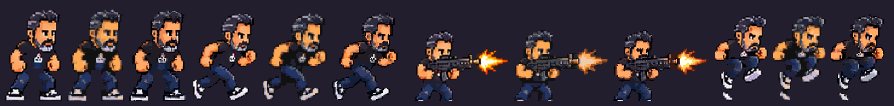
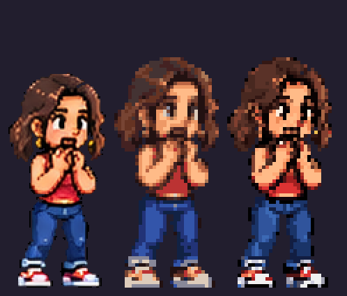
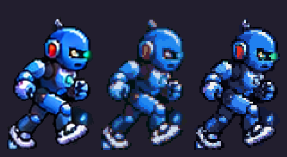

In the game, frame 225 of the same run before (left) and after (right), at 3×:

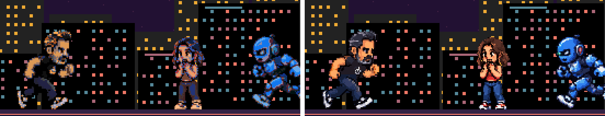

**Size on screen:** Willy at 64, 76 and 88 px tall (idle and firing), at 2× of the 384×224 screen:

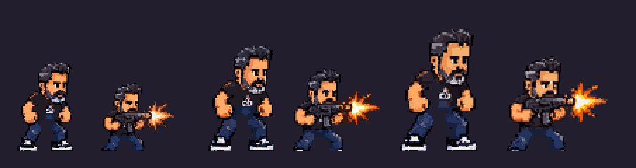

64 px loses the face; 88 px reads best, but four players plus enemies and civilians crowd a 224-line screen. **76 px stays** (a third of the screen height, the scale of the classic 4-player brawlers). The civilians follow at 66 and 54 px.

**Palette budget for the full game** (32 sprite palettes):
- 4 players × 4 = 16 (players 2-4 start as palette swaps of Willy, so they share tiles);
- civilians 2 × 2 = 4 on screen at once;
- enemies 3 + 3 for two kinds at a time;
- weapons, effects and pickups 3.

That makes 29: it fits, with level-specific sets loaded between scenes. Bosses would take the players' palettes in solo scenes, or 2 palettes each with simpler art.

**Learned:**
- **Quality depends on the method, not the board:** most of the loss came from averaging and from one shared palette, not from the hardware. The CPS-1's per-entry palettes and its brightness steps leave room for much richer sprites.
- **The cost is sprite entries:** about 15 per character instead of 1, which is far from the 256 the table holds.
- **The background:** it is drawn by code with flat colors, so it gains nothing from this. A painted stage (the `06_stage_neon_city` sheet) would use the same per-tile palettes on scroll2/scroll3.

---

## Step 3 — A go-link room

*2026-10-01 (run again with `slammast` and the new sprites)*

**Goal:** the set in a device's ROM library, a game room started from the website like any game, its video checked as a guest's browser receives it, and the device's own check of the set.

**What was read:** `backend-device/cmd/device/cli.go` (`roms check`), `e2e/global-setup.ts` (how the e2e stack starts a signalhub and a headless device with a throwaway HOME), `e2e/tests/go-link.spec.ts` (the panel login), `frontend/apps/web/src/pages/CreateRoomPage.tsx`, and the room's keyboard map in `frontend/packages/shared/src/stream.ts` (5 Coin, Enter Start, arrows, Z button 1, X button 2, C button 3).

**Commands:**
```sh
# the device's own check, read only
(cd backend-device && go build -tags headless -o /tmp/device ./cmd/device)
mkdir -p /tmp/romdir && cp rom/build/slammast.zip /tmp/romdir/
/tmp/device roms check --dir /tmp/romdir --json

# a real room, end to end
node rom/tools/room-test.mjs
```

**The device's check:**
```json
[{ "name": "slammast", "title": "Saturday Night Slam Masters (World 930713)", "check": { "status": "ok" } }]
```
(`captcomm` gave the same: `ok`, as "Captain Commando (World 911014)".) `pkg/romcheck` accepts the set as it is: every file name is in the core's list, and like the core it only warns on a wrong CRC. **No device change was needed to run it.** The flip side is that the library, the New game page and the room all show the original game's title, year and maker.

**Files created:**
- `rom/tools/room-test.mjs`:
  - builds and starts a signalhub (port 8192) and a headless device (panel on 7392), with HOME in `rom/build/room/home`, which holds a copy of the core and only our zip;
  - opens the device's local panel in Playwright's Chromium with the panel token and goes to New game;
  - starts the game, waits for the room's `<video>` to play, and saves frames of it through a canvas;
  - plays from the keyboard: 5, Enter, a double tap right, X, C, Z.
- `rom/.gitignore` (`build/`).

**Result:** the room starts like any game: the device starts a `device emulate` worker for the zip. Its log lists every file as `WRONG CHECKSUMS` (warnings) and then streams. The room shows **"1 of 4 playing"**, since the device reads four players from the core's game list, and the owner takes seat P1.
- **Video:** the browser gets the WebRTC video at 768×448 (the device's 2× of 384×224). In about 15 s it decoded 944 frames and dropped 71.
- **Input:** coin, start, the double-tap run, machine gun (X = button 2), bazooka (C = button 3) and jump (Z = button 1) from the browser's keyboard all reach our program.

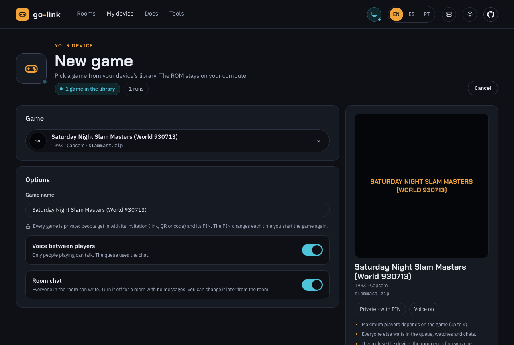

*The New game page of the device's panel: the library holds one set, which runs, shown as the original game.*

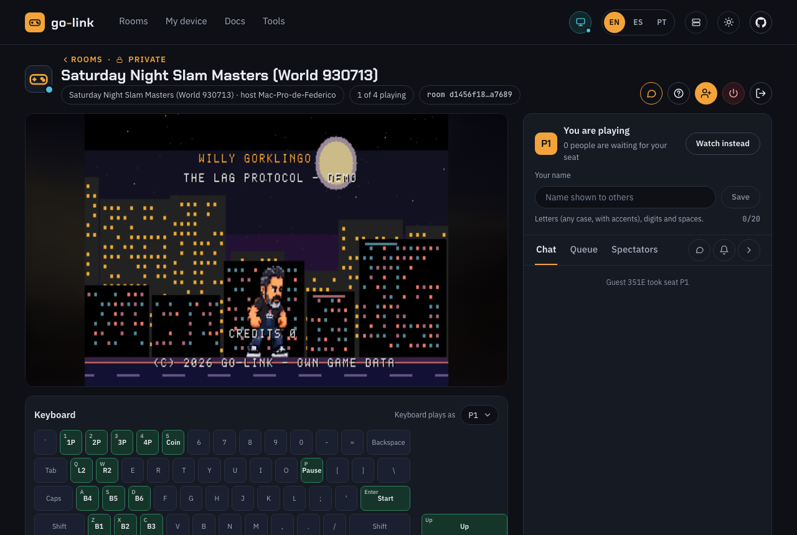

*The game room: our attract screen in the room's video, the owner in seat P1, the keyboard map with B1-B3.*

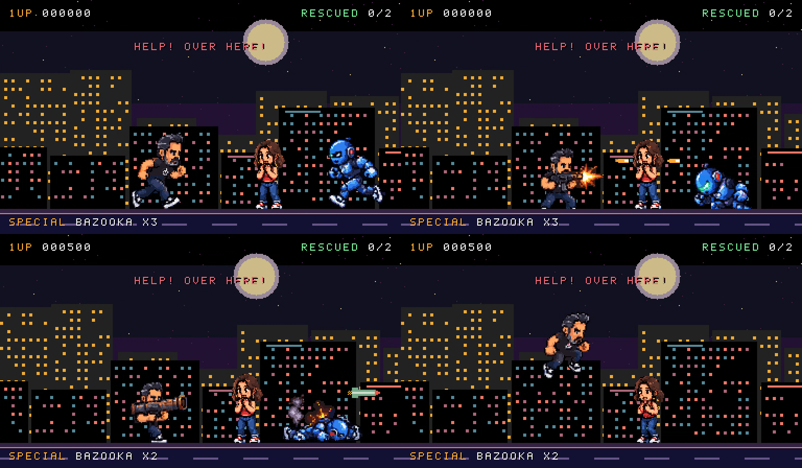

*Four frames of the room's WebRTC video, played from the browser's keyboard: the run, the machine gun, the bazooka, a jump.*

**Learned:**
- **Nothing in go-link had to change.** The whole path (library, check, New game, worker, WebRTC, four seats, three buttons) works with a set that is ours byte for byte.
- **What production needs** (not built in this prototype):
  - a list of go-link-owned sets, identified by the SHA-256 of our zip or files, so the library shows our title, maker and art instead of the original game's;
  - a way to tell our `slammast.zip` from a real one in the same folder (one ROM folder cannot hold both under the same name).
  - Nothing is weakened: our list only renames, and every other set still goes through `romcheck` as today.

---

## Step 4 — A Metal Slug-style level

*2026-10-01*

**Goal:** stay on CPS-1 at 384×224 (`slammast` layout) and make the game play like Metal Slug:
- characters at Metal Slug scale (about 44 px tall);
- a wider and taller level that scrolls both ways, with a street route and an upper route (rooftops, fire escapes), crates to climb, a ladder and one-way platforms;
- a layered background;
- two players on screen at once;
- a camera that only moves forward.

Verified in the core and in a go-link room, then installed in the user's own library.

**What was read:**
- The tilemap code again ([`get_tile1_info`](https://github.com/libretro/mame2003-plus-libretro/blob/0d9a325c96aa96460be7b2fe4310a7096981ff75/src/vidhrdw/cps1_vidhrdw.c#L1074-L1100), the tilemap sizes at L1159-1161, `palette_basecolor` at L1220-1225).
- go-link's `LibraryService` (`SetDir`, `Scan`, `Import`) to find how a new zip reaches a running device.

**Commands:**
```sh
node rom/tools/build.mjs                  # ROM_DEBUG=1 to show positions
node rom/tools/quality.mjs                # sizes 40/44/48 and the before/after at 44
# one player through the whole route
/tmp/framelab capture -core ~/go-link/cores/mame2003_plus_libretro.dylib -rom rom/build/slammast.zip \
  -out /tmp/rom-p1 -frames 1100 \
  -script "60-63:coin 110-113:start 140-142:right 146-470:right 362-364:right+b1 435-437:right+b1 490-492:down+b1 520-522:b3 540-580:left+b2 600-760:right 765-900:up 905-925:right 926-990:right+b2 995-1050:right" \
  -stills 345,400,470,527,560,820,935,1060
# two players (port 2 with @2)
/tmp/framelab capture -core ~/go-link/cores/mame2003_plus_libretro.dylib -rom rom/build/slammast.zip \
  -out /tmp/rom-2p -frames 700 \
  -script "60-63:coin 70-73:coin 110-113:start 130-133:start@2 140-310:right@2 320-420:up@2 425-445:right@2 446-500:right+b2@2 505-600:right@2 620-622:right 626-690:right" \
  -stills 150,360,470,540
node rom/tools/room-test.mjs
```

**Files created or changed:**
- `rom/tools/level.mjs`: the level.
  - A 64×28-cell map (1024×448 px) built from rectangles: the street, two buildings, two fire escapes, two ladders, five crates (a step, a stack of two, a step), street props (lamps, hydrants, bins, a fence).
  - Every cell is drawn by code with one fixed 15-color palette (28 tiles after dedupe).
  - A collision map: `EMPTY`, `SOLID` (the street), `ONEWAY` (fire escapes and **roofs**), `LADDER`, `CRATE`.
  - The objects: civilians, android patrols, the bazooka crate.
- `rom/tools/art.mjs`:
  - **Sizes:** characters at 44 px (Willy), 38/31 (woman, child) and 43 (android).
  - **The recruit:** player 2's palettes are Willy's 4, with the shirt color swapped for green (`RECRUIT_PAL_OFFSET`). The shirt is painted back in a color of its own (`SHIRT`) and kept exact in the palettes, so the swap can find it.
  - **The backdrop:** sky, far skyline, and mid buildings with water tanks, antennas and neon billboards, 1024×384 on scroll3 (268 tiles).
  - **Output:** the level tables go to `art_data.c`.
- `rom/src/main.c` (the game part, rewritten):
  - **Two players**, each with its own input (P2 is the high byte of 0x800000). P2 joins any time with a credit and 2P Start.
  - **Physics in world pixels:** feet in 1/16 px; walking one pixel at a time against the collision map. Falling checks every pixel row for a floor: solid always, one-way and ladder tops only from above and not while dropping.
  - **Crates:** pushing against an edge up to 32 px high (one crate) for 10 frames climbs it. A stack of two needs a jump.
  - **Ladders:** up in front of one, or down on its top, with 6 px of grace; 1.5 px a frame. Over the top you stand on it; jump lets go.
  - **Platforms:** down + jump drops through a one-way platform or roof.
  - **Destructible crates:** 3 bullets, or one rocket (+100).
  - **Androids** patrol their floor and chase a player on the same floor.
  - **The camera** follows both players on X and Y. It aims a third of a screen ahead of their middle, **never goes back more than 48 px** from the farthest point reached, and keeps players inside the screen's sides.
  - **Sprites** off the screen are dropped (see dead end 7).
  - **The HUD:** 1UP/2UP scores, INSERT COIN / PRESS START for the free seat, each player's weapon, SAVED.
- `rom/tools/build.mjs`: `ROM_DEBUG=1` (positions on screen), and a check that refuses a program with the copy pattern of dead end 6.

### Scale: 40, 44 or 48 px

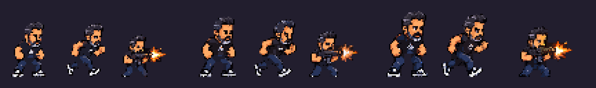

At 40 px the face and the logo turn into a few pixels. 48 px reads well but leaves little room on a 224-line screen with two floors. **44 px** keeps the face, the logo and the sneakers, and leaves about five character heights of height. That is Metal Slug's proportion: soldiers around 40 px of 224. The same pipeline as step 2b (dominant color, per-tile palettes, OKLab):

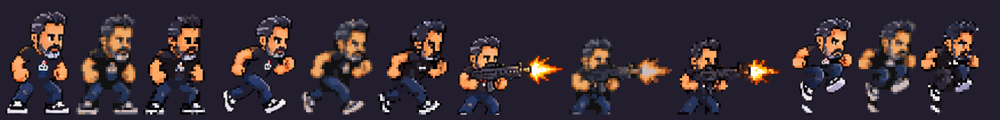

**What redrawn production sprites need** (a spec to commission or generate them):
- **Native size:** drawn at the final size, 44 px tall for the heroes (sheet frames 48×48 or 64×48 for wide poses), at 1:1 pixels, no anti-aliasing against the background, a 1 px dark outline, feet on the frame's bottom row with a fixed anchor (the feet's center).
- **Colors per zone:** each 16×16 tile row has its own 15-color palette, so the artist should paint by zones:
  - head (skin ramp 4, hair 3, eyes/beard 2);
  - torso (shirt ramp 3 + logo 3 + skin 2);
  - legs and feet (jeans ramp 3, sneakers 3);
  - weapons and muzzle flash (metal 3, fire 4).
  - Every zone shares the outline color. 4 palettes per hero, 2-3 per civilian or enemy.
- **Palette swaps:** the shirt in its own exact color, so players 2-4 are palette swaps.
- **Frame list per hero:**

  | Pose | Frames |
  |---|---|
  | idle | 4 |
  | walk | 8 |
  | run | 6 |
  | jump | 3: up, apex, down |
  | land | 1 |
  | climb ladder | 4 |
  | crouch | 1 |
  | crouch walk | 4 |
  | shoot (straight, up, diagonal up, down in the air) | 3 each |
  | knife | 4 |
  | throw grenade | 4 |
  | bazooka | 2 |
  | hit | 2 |
  | death | 6 |
  | rescue thumbs-up | 3 |
  | victory | 4 |

- **Enemies:** walk 6, shoot 3, melee 4, hit 2, death 6.
- **Civilians:** worried 3, follow 6, thanks 3.

### Results in the core

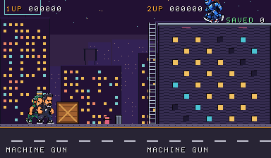

*Frame 150: Willy (P1) and an Uplink recruit (P2, the green-shirt palette swap) together on the street, at 44 px. Behind: the street props, a facade (scenery, the players walk in front of it), the mid buildings and the far skyline on scroll3.*

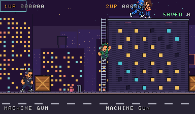 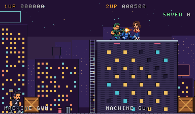

*Frames 360 and 470: P2 climbs building A's ladder. On the roof (a one-way ledge), P2 shoots the android. The camera rises to keep both players in view, so P1 is at the bottom edge.*

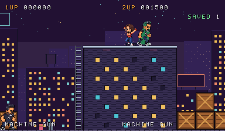

*Frame 540: the woman rescued on the roof (SAVED 1, +1000).*

One player through the whole route:

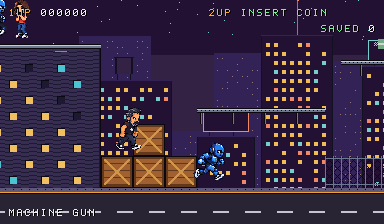 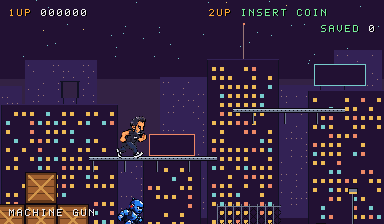

*Frames 345 and 400: pushing against the crates climbs them (a step, then the stack of two); a jump from the stack lands on the fire escape (a one-way platform).*

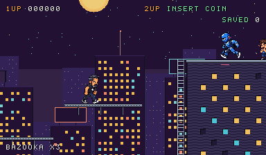 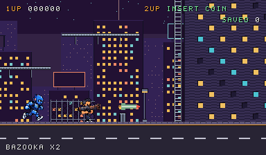

*Frames 470 and 527: a jump to the upper platform picks up the bazooka (`BAZOOKA x3`); down + jump drops through it to the street, and the rocket stops the street android.*

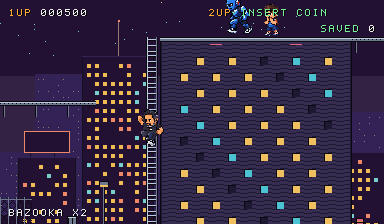 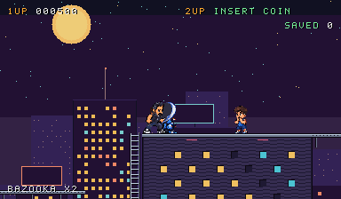 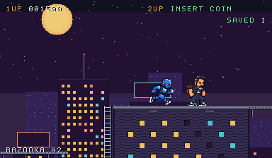

*Frames 820, 935, 1060: up building B's ladder; the knife when the android is right in front; the child rescued on the roof.*

### In a go-link room

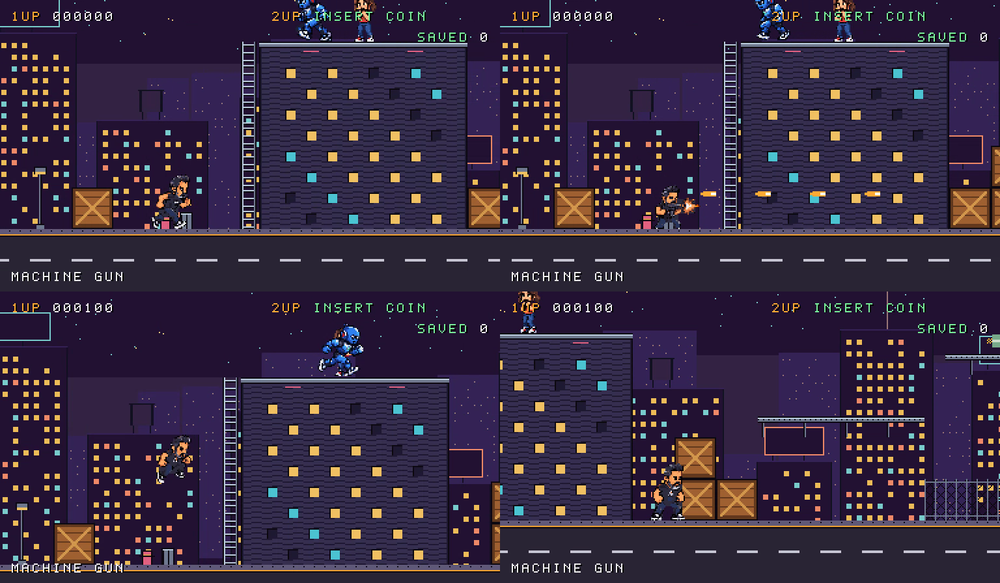

*Four frames of the room's WebRTC video (768×448, the device's 2× of the 384×224 frames above), played from the browser's keyboard: the run, the machine gun breaking a crate (+100), a jump, the crates further on. In about 15 s the browser decoded 952 frames and dropped 34.*

### In your own go-link

How the build reaches the user's library:
1. **The folder:** the running device reads `roms_dir` from `~/Library/Application Support/go-link/device.json`, here `/Volumes/HD12TB/ROMS/roms/MAME-2003-Plus` (when empty, `~/go-link/roms`).
2. **No overwrite:** first check that the folder has no `slammast.zip`. If it had one, nothing would be copied: a real set must never be overwritten.
3. **The copy:** `cp -n rom/build/slammast.zip <roms_dir>/slammast.zip`. Same SHA-256 on both sides; no other file in the folder is touched.
4. **The library refresh without a restart:** the device rescans its folder when it changes (`LibraryService.SetDir` → `Scan`), so the least invasive way is **My device › ROMs**, field *ROM folder on the device's computer*: the same path, then **Use this folder** (control `set_roms_dir`). Otherwise quit and reopen the app. Dropping the zip on My device › ROMs is the device's own import (`Import`, never overwrites, rescans) and works too, when the file is not already there.
5. **Play:** **My device › New game › "Saturday Night Slam Masters (World 930713)"** (our game shows under the layout's original title until go-link has a list of its own sets) › Start the game. Controls on the keyboard:
   - 5 = coin, Enter = start;
   - arrows; a double tap runs; up/down on ladders;
   - Z = jump (down + Z drops through), X = fire (knife up close), C = special.
   - A second player joins with their own seat and Start.

**Dead end 6: the level's colors were shifted by one.** The facades came out amber instead of purple. A test tile with the 16 pens side by side showed that pen p drew palette word p − 1. The cause was the same compiler pitfall as dead end 3: `load_palette` compiled to `move.w (a0)+,(0,a0,d0.l)`, which writes every word one word late on the emulated 68000. The object palettes happened to compile another way. **Fix:**
- `copy_words` passes each word through a data register (an empty `asm` with a `"+d"` operand), so gcc cannot fuse the load and the store.
- `build.mjs` disassembles the program and **refuses** any instruction with a post-increment source and an indexed destination on the same address register, so the bug cannot come back silently.

**Dead end 7: sprites at the top of the screen that did not belong there.** Androids and civilians far to the right appeared at the top: sprite X and Y are 9 bits and wrap at 512, so an object 500 px away is drawn on screen. **Fix:** `put_sprite` drops entries outside the screen (with a 64 px margin).

**Dead end 8: the buildings blocked the street.** Solid building cells walled off the street route. In Metal Slug the player walks in front of the scenery and climbs onto it. **Fix:** facades are scenery; only the roof row is a one-way ledge.

**Dead end 9: the ladder that could not be reached.** The first ladders stood one cell away from the roof, and a player standing a pixel off the ladder's column could not grab it. **Fix:** ladders touch their roof, and the grab looks 6 px either side.

**Choices made:**
- **Camera:** the players' middle, ahead by a third of a screen; at most 48 px back from the farthest point. The players stay inside the screen sides, and the trailing player is pulled forward: Metal Slug blocks the leader instead. Pulling keeps a solo-paced player from being stuck; a "wait for your partner" arrow can come later.
- **Vertically,** when the players are more than a screen apart, the lower one may leave the bottom.
- **The scroll registers:** the tilemap pixel at the screen's top-left is (scroll X + 64, scroll Y + 16). Hence `scroll = camera − (64, 16)`, and the backdrop uses half the camera.
- **Layers:** CPS-1 has three tilemaps and the text needs scroll1, so the far skyline and the mid buildings share scroll3 (one parallax speed). Row scroll on scroll2 (`other` RAM) could give the mid buildings their own speed later.

**Learned:**
- **The board handles a Metal Slug-style level with room to spare:** a 1024×448 world uses 28 of scroll2's 64×64 cells and 28 level tiles. Two players plus enemies use about 60 of the 256 sprite entries, and 17 of the 32 sprite palettes.
- **Data copies to the board are the riskiest code in this project:** a checker in the build is cheaper than finding the next one by its symptoms.

---

## Verdict

**Feasible with the stock core, and no core patch is needed.**
- **Core and device:** mame2003-plus runs a CPS-1 game that is entirely ours, laid out as `slammast`'s files: word-swapped program files, the documented graphics format, and a Z80 program encrypted with the public Kabuki algorithm. go-link's device accepts the set and plays it in a room unchanged, with **4 players × 3 buttons**.
- **The cost of option A** (the replacement set): the game takes the name `slammast` inside the core.
  - Device side, fixed by our own allow-list by hash: our title and art in the library, and no clash with a real `slammast.zip`.
  - Core side, with no fix: its own messages and saved files (cfg, nvram, save states) use `slammast`.
- **A core patch (option B, a `willy` driver entry in a fork)** is only needed to have our own set name inside the core, at the price of shipping and maintaining a core build.
- **What the `slammast` board means for the game:** QSound for sound (sampled, stereo, a sound driver of our own to write and encrypt), no DIP switches (settings in our own EEPROM menu), and 6 MB of tile space.
- **A Metal Slug-style level fits** ([step 4](#step-4--a-metal-slug-style-level)): 44 px characters, two routes with crates, ladders and one-way platforms, two players, a forward camera on both axes, and a layered background; playable in a go-link room.
- **Sprite quality is not a hardware limit:** with dominant-color downscaling and per-tile palettes (13 of 32 palettes for the prototype's cast), the characters stay close to the sheets ([step 2b](#step-2b--sprite-quality)).
